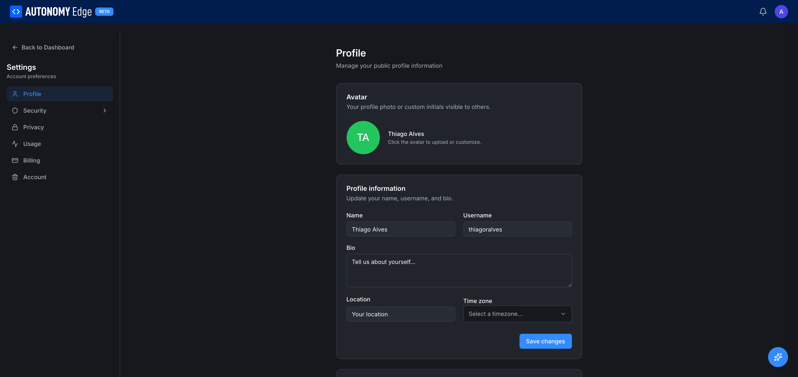

# Editing your profile

The **Edit Profile** button on your profile takes you to **Settings → Profile**, where you change your name, username, bio, avatar, location, and time zone.

URL: `edge.autonomylogic.com/profile/settings?tab=profile`.

## Avatar

A circle with your initials by default. To change it:

1. Click the avatar to open the upload dialog.
2. Pick a square image (PNG, JPG, or GIF). The platform will crop to a circle.
3. Confirm. The new avatar appears immediately everywhere you're shown.

Max file size: 2 MB. For best quality, upload at least 400×400 px.

To remove a custom avatar and go back to initials, use the **Remove** action in the upload dialog.

## Name

Free-text field. This is your **display name**, what most of the platform shows.

- Up to 80 characters.
- Real names work fine but aren't required.
- Visible publicly on your profile, commits, forum posts, DMs.

## Username

The handle in your URLs (`/profile/{userId}` shows the ID, but your username also shows everywhere a user is mentioned).

- 3–30 characters.
- Allowed: lowercase letters, digits, hyphens, underscores.
- Must be unique across the platform.
- Changing it will break links to your forum posts and old project URLs **if** people referenced them by username (though IDs continue to resolve). Use the change sparingly.

## Bio

A short description of yourself.

- Up to 500 characters.
- Plain text only (no markdown today).
- Shown on your profile card and may appear in forum hover-cards.

## Location

Free text. City and country are the convention but it's not validated. Visible on your profile.

## Time zone

A dropdown of standard time zones. Pick yours so timestamps elsewhere (commit times, forum post times) can be shown in your local zone where applicable.

## Saving changes

Each section has a **Save changes** button at the bottom. The platform autosaves nothing, make a change, click **Save**, and the change is persisted. If you navigate away with unsaved changes, the platform warns you.

## Updating your email

Email is *not* in this tab. It lives in **[Settings → Security → Email](settings/security-email)**. Changing your email has a 7-day cooldown for security.

## Updating your password

Also not here. **[Settings → Security → Password](settings/security-password)**.

## Removing your account

The **[Settings → Account](settings/account)** tab has the danger-zone delete action. Read that page before clicking, deletion is permanent.

## Where to next

- **Back to your profile** → click **Back to Dashboard** in the top-left of the settings page, then **Profile** in the user menu. Or use the URL `edge.autonomylogic.com/profile`.
- **Tune privacy** → **[Settings → Privacy](settings/privacy)**.
- **Manage your account** → **[Settings → Account](settings/account)**.
