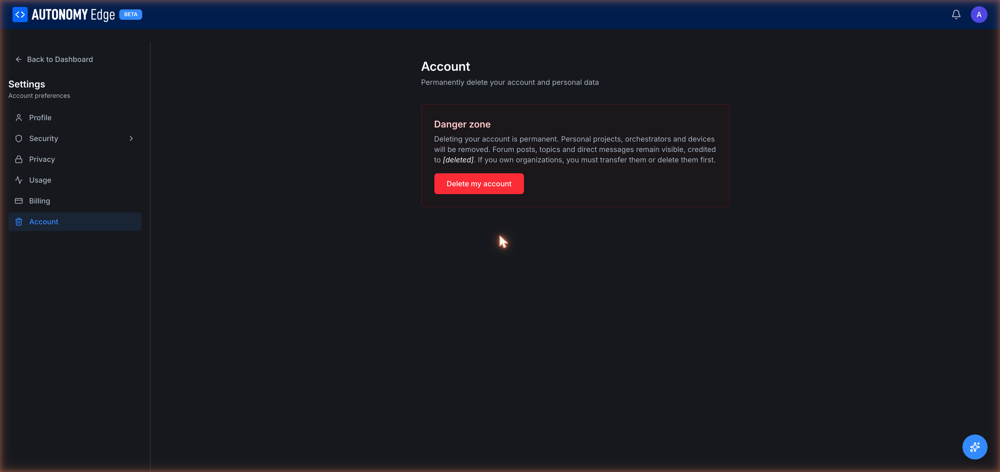

# Settings → Account

The Account section is for deleting your account. There's nothing else here — it's intentionally a single-purpose page so the destructive action stays separate from everyday settings.

URL: `edge.autonomylogic.com/profile/settings?tab=account`.

## Danger zone

The page contains one section, labeled **Danger zone** in red, with the following copy:

> Deleting your account is permanent. Personal projects, orchestrators and devices will be removed. Forum posts, topics and direct messages remain visible, credited to **[deleted]**. If you own organizations, you must transfer them or delete them first.

A red **Delete my account** button below the description.

## What happens when you delete

**Removed permanently:**

- Your personal projects (public and private).
- Your orchestrators and their vPLC devices.
- Your stored payment methods.
- Your active subscription (canceled immediately; no refunds for unused time).
- Your profile fields (name, bio, avatar, location, time zone).
- Your follows and stars.
- Your notification history.
- Your DM threads as a participant — the thread stays for the other participant, but your side shows `[deleted]`.

**Kept but attributed to `[deleted]`:**

- Forum topics you started.
- Forum replies you made.
- Commits you authored on projects that still exist (e.g. on someone else's fork of your project).
- Pull request descriptions and review comments on projects you didn't own.

**You cannot delete if:**

- You own an organization. The platform forces you to either transfer ownership (promote another Owner first, then leave) or delete the organization before you can delete your account. See **[Leaving and deleting](../../platform/organizations/leaving-and-deleting)**.

## The flow

1. Click **Delete my account**.
2. A confirmation dialog appears asking you to type your username or email to confirm.
3. The platform may ask you to re-enter your password as a final check.
4. Confirm.
5. Your account is queued for deletion. You're signed out immediately.

There's a short grace period (typically 7 days) during which the account is soft-deleted and can be restored by contacting support. After that, deletion is final.

## Reasons people consider this

- **Switching jobs / accounts.** Better to keep the existing account and just edit your email/profile, unless you really want a clean break.
- **Closing a personal account to use only an org's slug.** Doesn't quite work — you need a user account to be an org member. Demote yourself to Member instead.
- **Privacy/GDPR.** Legitimate reason. The deletion will permanently remove personally identifying fields.

## Recovering after deletion (within the grace period)

Contact platform support (via the Feedback action in the user menu, or whichever support channel the platform exposes) with proof you own the email. If we're inside the grace window, the account can be restored to its pre-delete state.

## Where to next

- **Just want to log out, not delete?** Click **Sign out** in the user menu instead.
- **Just want to leave one org?** **[Leaving and deleting](../../platform/organizations/leaving-and-deleting)**.
- **Concerned about data privacy?** Email the privacy address on the platform's terms-of-use page for a personal data export request.
