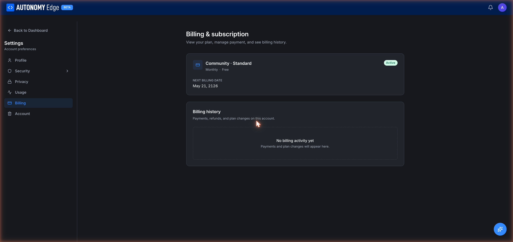

# Settings → Billing

The Billing section shows your **personal** subscription and billing history. (Organization plans are managed separately on each org's Billing tab.)

URL: `edge.autonomylogic.com/profile/settings?tab=billing`.

## Current plan card

The top card shows the plan you're on and its key metadata:

| Field | Description |
|---|---|
| Icon + **{Plan name} · {Tier}** | e.g. *Community · Standard*, *Pro · Annual*. |
| **Status badge** | **Active**, **Trialing**, **Past due**, **Canceled**. |
| **Billing cycle** | *Monthly* or *Annual*. Free plans show *Monthly · Free*. |
| **Next billing date** | When your plan renews (or trial ends). Free plans show a placeholder date. |

Actions available depending on plan and status:

- **Change plan** — opens the pricing page to upgrade or downgrade.
- **Cancel subscription** — paid plans only. Cancels at the end of the current billing cycle.
- **Manage payment method** — paid plans only. Add, remove, or change default card.
- **Update billing address** — paid plans only.

## Billing history

Below the current plan card, a section labeled **Billing history**.

For Community (free) accounts: *No billing activity yet — Payments and plan changes will appear here.*

For paid accounts, each row is one event:

- **Date.**
- **Description** — e.g. *Pro plan annual renewal*, *ACU top-up 10,000*, *Plan downgrade to Community*.
- **Amount.**
- **Status** — Paid, Refunded, Failed.
- **Invoice** — download icon to grab the PDF.

## Payment methods

When you have a paid plan, a Payment methods section appears with:

- A list of stored cards (last 4 digits, brand, expiration).
- **Default** marker on one card.
- **Add card** action.
- Per-card actions: **Set as default**, **Remove**.

The platform uses a PCI-compliant payment processor; card numbers are never stored on Autonomy Edge's servers directly.

## Personal vs organization billing

This page is for your **personal plan only**. Your personal plan governs:

- What you can create in your own slug (`/{your-username}/...`).
- Your AI Credit Units (separate from any org's ACU pool).
- Whether you can create private projects on your slug.

Organization plans are separate:

- Each org has its own subscription, paid by the org's owners.
- An org plan does not extend your personal plan.
- Your role in an org doesn't depend on what you pay personally; it's set by the org.

See **[Org billing](../../platform/organizations/billing)** for org-level subscription management.

## Trialing

Pro and Teams plans offer 14-day trials. While trialing:

- The platform behaves as if you're on the plan.
- You're not charged until the trial ends.
- A reminder email is sent 3 days before the trial expires.
- If you don't add a payment method, the plan automatically downgrades back to Community when the trial ends.

## Upgrading

1. Click **Change plan** (or visit **[Pricing](../../plans-and-billing/pricing)**).
2. Pick the new plan and billing cycle.
3. Enter payment details if you don't have one on file.
4. Confirm. The new plan activates immediately; any prorated charge is added.

## Downgrading

1. Click **Change plan**.
2. Pick a smaller plan.
3. Confirm. The downgrade takes effect at the next billing cycle (so you keep the higher tier for what you've paid).
4. After downgrade, anything that exceeds the new plan's limits is grandfathered but blocks new creations.

## Canceling

Click **Cancel subscription**. You'll see:

- The exact date your plan ends.
- A summary of what you'll lose.
- A confirmation button.

After confirmation, the plan continues until the end of the current cycle, then drops to Community.

## Where to next

- **Plan comparison** → **[Pricing](../../plans-and-billing/pricing)**.
- **What gets unlocked per plan** → **[Plan limits](../../plans-and-billing/plan-limits)**.
- **AI credit balance** → **[Settings → Usage](usage)**.
