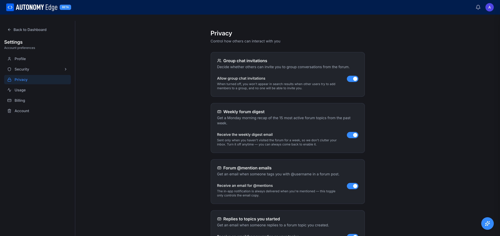

# Settings → Privacy

The Privacy section controls how others interact with you and which email notifications you receive.

To open it, click your avatar in the top-right, choose **Settings**, then **Privacy** in the left side-nav.

## Group chat invitations

**Allow group chat invitations** *(toggle, default on)*

- **On**: anyone on the platform can include you in a new group chat in the forum messaging UI.
- **Off**: when turned off, you don't appear in search results when someone tries to add members to a group chat. New group chats can't include you. Existing group chats are unaffected.

1:1 DMs are always allowed.

## Weekly forum digest

**Receive the weekly digest email** *(toggle, default on)*

A Monday-morning email summary of the 15 most active forum topics from the past week.

- Sent **only when you haven't visited the forum recently** (so it doesn't clutter your inbox when you're already engaged).
- Turn it off anytime; you can always come back to the forum directly.

## Forum @mention emails

**Receive an email for @mentions** *(toggle, default on)*

When someone tags you with `@username` in a forum post.

The in-app notification is always delivered. This toggle controls the email copy only.

## Replies to topics you started

**Receive an email for new replies on your topics** *(toggle, default on)*

When somebody posts in a thread you started, you get an email.

The first reply triggers an email; subsequent replies are batched into a single follow-up email per topic per day, to avoid flooding your inbox on busy threads.

## Replies to your posts

**Receive an email when someone directly replies to your post** *(toggle, default on)*

Distinct from the above, this fires for replies to *any* of your posts, not just the topic opener.

## Direct message notifications

**Email me about new direct messages** *(toggle, default on)*

When you receive a new DM and you haven't opened the platform recently. If you're actively online, no email is sent (the in-app notification is enough).

## Marketing emails

**Receive product updates and announcements** *(toggle, default on)*

Occasional emails about new features, platform changes, community events. Lower frequency than the forum digest.

You can also unsubscribe from these emails via the link in the email footer; that link toggles this setting.

## Activity visibility

A future-friendly section for fine-tuning what shows up on your public profile. Today this is limited; expect more toggles over time.

## Saving

Most toggles save instantly with no separate Save button. If any section has an explicit Save button, it's right below the section.

## Where to next

- **Set your initial email preferences** → click the toggles above.
- **Manage DM behavior in detail** → **[Messaging](../../platform/forum/messaging)**.
- **Unsubscribe from all emails at once** → check the **[unsubscribe page](https://edge.autonomylogic.com/unsubscribe)** or click *Unsubscribe* in any platform email.
