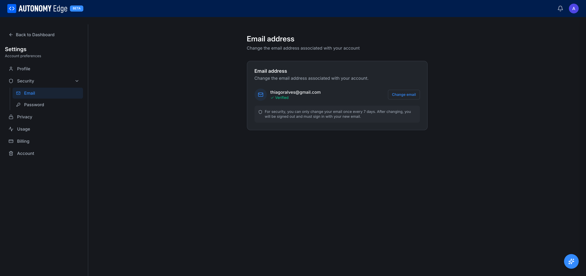

# Settings → Security → Email

The Email section lets you change the email address associated with your account.

URL: `edge.autonomylogic.com/profile/settings?tab=security-email`.

## What you see

- **Current email**: your verified email with a green **✓ Verified** check.
- **Change email** button: opens the change-email flow.

A notice below the email box reminds you of the security rule:

> *For security, you can only change your email once every 7 days. After changing, you will be signed out and must sign in with your new email.*

## Changing your email

1. Click **Change email**.
2. Enter the new email address and your current password (for re-authentication).
3. The platform sends a verification email to the **new** address.
4. Open that email and click the verification link (or enter the 6-digit code).
5. The change takes effect.

Side effects of a successful email change:

- All active sessions on every device are signed out. You'll need to sign in again with the new email.
- The 7-day cooldown clock starts. The next email change is blocked until 7 days pass.
- Past invitations and links sent to your old email continue to work for you, but new platform emails go to the new address.

## If verification fails or times out

- The new email isn't activated. Your account still uses the old one.
- You can retry by clicking **Change email** again. (You may need to wait until any session-level rate-limit clears.)

## Why the 7-day cooldown

Frequent email changes are a common pattern in account-takeover attacks. The cooldown gives you (and the platform) a window to detect and reverse a malicious change before the attacker can lock you out.

## What if I lose access to my old email and need to change?

If you can sign in with your password (or SSO), you can change emails normally. The verification goes to the *new* address, not the old one.

If you've lost access to both your old email *and* your password/SSO, contact support, there's a manual recovery process.

## Where to next

- **Change your password** → **[Security → Password](security-password)**.
- **Delete your account** → **[Account](account)**.
- **Manage email-based notification opt-ins** → **[Privacy](privacy)**.
