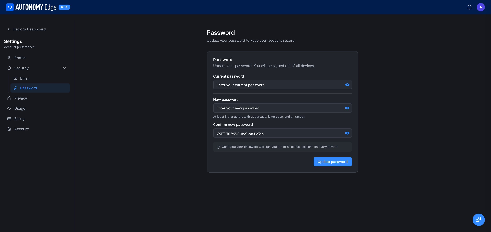

# Settings → Security → Password

The Password section lets you change your account password.

URL: `edge.autonomylogic.com/profile/settings?tab=security-password`.

## What you see

Three password fields and a notice:

- **Current password**: your existing password. Required for re-authentication.
- **New password**: what you want to change to.
- **Confirm new password**: type it again to catch typos.

Notice: *Changing your password will sign you out of all active sessions on every device.*

## Password requirements

- Minimum **8 characters**.
- At least one **uppercase letter**.
- At least one **lowercase letter**.
- At least one **number**.

The platform doesn't require symbols, but they're allowed and recommended. The "show password" eye icon next to each field lets you reveal the field while typing.

## Changing your password

1. Type the current password.
2. Type the new password.
3. Confirm it.
4. Click **Update password**.

If all fields validate, the platform:

- Hashes and stores the new password.
- **Signs you out of every active session, including the one you're on right now.**
- Returns you to the sign-in screen.

Sign in with the new password to continue.

## Forgot your password instead?

If you can't sign in because you don't remember your password:

1. Sign-out (if you're somehow signed in but want to reset).
2. Visit `edge.autonomylogic.com/forgot-password`.
3. Enter your email.
4. Open the reset email, click the link, set a new password.
5. You'll be signed in automatically.

This flow does not require knowing the current password, so it's the right path when you've actually forgotten.

## SSO users

If you signed up through Apple, Google, or Microsoft SSO, you may not have a password at all. The Password tab in that case shows a notice that your account is managed through your SSO provider; password changes are made on their side, not here.

You can add a password to an SSO account from the Security section if you want fallback access, useful if you ever lose access to your SSO provider.

## Where to next

- **Change your email** → **[Security → Email](security-email)**.
- **Manage active sessions** (when shipped) → look for a *Sessions* sub-tab under Security in a future release.
- **Delete your account** → **[Account](account)**.
