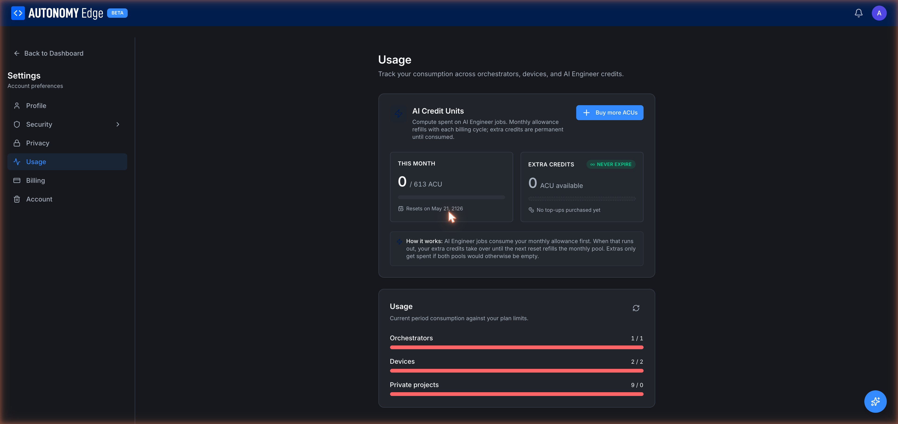

# Settings → Usage

The Usage section shows your AI Credit Units (ACUs) and your current consumption against plan limits.

URL: `edge.autonomylogic.com/profile/settings?tab=usage`.

## AI Credit Units (ACUs)

ACUs power the **AI Engineer** features — multi-step automation jobs, deeper code generation, longer context windows. They don't apply to the free **AI Chat** assistant.

Two pools:

### This month

Your monthly allowance. Refills at the start of every billing cycle.

- **{used} / {total} ACU** — current consumption.
- **Resets on {date}** — next refill date.
- Progress bar shows percent consumed.

Unused monthly ACUs do **not** carry over. If you don't use them this cycle, they're gone.

### Extra credits — never expire

A separate balance you've topped up with one-time purchases.

- **{amount} ACU available** — total extra credits.
- "Never expire" badge.
- "No top-ups purchased yet" if you haven't bought any.

Extra credits are consumed only after the monthly allowance is exhausted, so a casual user with a small monthly allowance + a stash of extras can pace themselves without surprises.

A **+ Buy more ACUs** button (top right of the ACU card) opens a checkout dialog with packs of ACUs (typical packs: 1k, 5k, 10k, 50k).

### How AI Engineer jobs consume ACUs

When you run an AI Engineer job:

1. The job estimates how many ACUs it will need and shows you the estimate before running.
2. On approval, ACUs are drained from **This month** first.
3. If This month is depleted mid-job, the remaining cost comes from **Extra credits**.
4. If neither pool covers the cost, the job is blocked with a "Plan limit reached" message.

## Plan usage

Below the ACU card, a **Usage** section shows your consumption against plan-imposed quotas. Three bars:

- **Orchestrators** — N / M used.
- **Devices** — N / M used.
- **Private projects** — N / M used.

A bar turns **red** when you've reached or exceeded the limit. If you exceed (typically because of a recent downgrade), existing items continue working but you can't create new ones until you're back under the limit.

A small **refresh icon** at the top-right of the Usage card forces a recount.

## What the numbers mean

| Limit | Counts |
|---|---|
| **Orchestrators** | The number of orchestrator entries in your workspace (Active + Inactive). |
| **Devices** | The number of vPLC entries across all your orchestrators. |
| **Private projects** | Projects marked Private. Public projects don't count. |

## Increasing limits

The fastest way to lift a limit is upgrading the plan.

- For your personal slug, upgrade your personal plan in **[Settings → Billing](billing)** or via **[Pricing](../../plans-and-billing/pricing)**.
- For an organization slug, the org needs its own plan; upgrade in the org's **[Billing tab](../../platform/organizations/billing)**.

## Where to next

- **Buy more ACUs** → button at the top of the ACU card.
- **Plan comparison** → **[Pricing](../../plans-and-billing/pricing)**.
- **What each plan limits** → **[Plan limits](../../plans-and-billing/plan-limits)**.
- **Subscription management** → **[Settings → Billing](billing)**.
