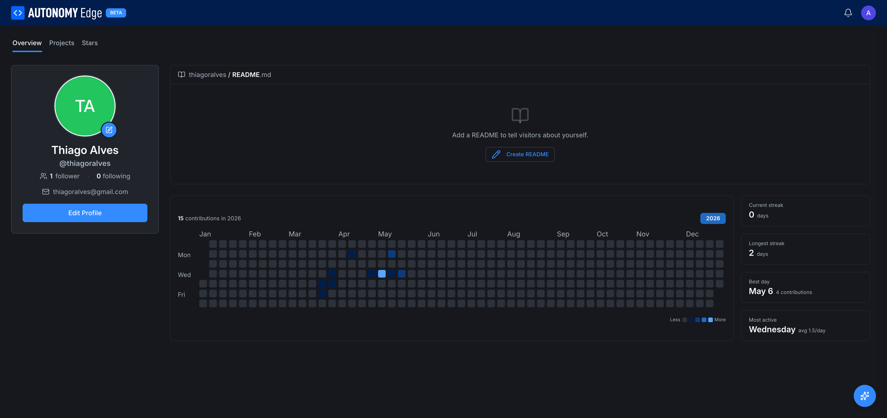

# Your user profile

Your user profile is your public-facing page on Autonomy Edge. Everyone (including people without an account) can visit it and see your projects, your activity, and your contribution graph.

URL for your own profile: `edge.autonomylogic.com/profile`. URL for another user's profile: `edge.autonomylogic.com/profile/{userId}`.

## Left column, identity

- **Avatar**: a circle with your initials by default. Click the small pencil to upload an image. See **[Editing your profile](editing-your-profile)**.
- **Display name**: bold under the avatar.
- **@username**: your handle, also used in URLs.
- **Followers / Following counts**: clickable to expand the lists.
- **Email**: visible only on your own profile (not other people's).
- **Edit Profile** button: opens **[Settings → Profile](settings/profile)** in the same window. Visible only on your own profile.

## Top, tabs

Across the top of the right side:

- **Overview** *(default)*: the contribution graph and pinned README.
- **Projects**: your public projects (and your private ones, when viewing your own profile).
- **Stars**: projects you've starred.

## Right column, overview

- **`{username} / README.md`**: if you've added a README to your profile, it renders here. If not, you see a placeholder *Add a README to tell visitors about yourself.* with a **Create README** button. The README is a public markdown document that you can use to introduce yourself.
- **Contributions graph**: a year-view heatmap, similar to GitHub. Each tile is one day; darker = more contributions that day. The legend at the bottom right runs from *Less* to *More*. Hover any tile for the exact count.
- **Year selector**: top right of the graph. Pick which year to view; defaults to the current year.

## Stats panel (right of the contribution graph)

Four metrics:

- **Current streak**: days in a row with at least one contribution.
- **Longest streak**: your all-time longest run.
- **Best day**: the day with the most contributions.
- **Most active**: your most active day of the week.

These give a sense of your patterns. They're public, like everything else on the profile.

## Projects tab

Lists your projects. For your own profile this includes both public and private projects (with privacy badges); for someone else's profile only their public projects appear.

Each project is shown as a card identical to those on the **[projects list](../platform/projects/projects-list)**, name, ID, last-modified, action icons.

You can star and unstar from this view.

## Stars tab

Every project you've starred, in reverse chronological order. A useful "reading list" you've curated.

## Activity attribution

Your profile is the canonical identity attached to:

- **Commits**: your name and avatar appear next to commits you authored.
- **Pull requests**: listed under "Created by me" everywhere, and tagged with your name in reviewers.
- **Forum posts and DMs**: every post and message you write.
- **Organization memberships**: the orgs you belong to. Visible to the public unless the org has private membership listings.

Deleting an account leaves these in place but credits them to `[deleted]`. See **[Settings → Account](settings/account)**.

## Visiting other users' profiles

When you visit `edge.autonomylogic.com/profile/{userId}`:

- The Edit Profile button is replaced by **Follow** / **Following** and (if their privacy allows) **Message**.
- Email and private profile data are hidden.
- Their public projects, contribution graph, and stars are visible.

## Where to next

- **Update your profile information** → **[Editing your profile](editing-your-profile)**.
- **Add a README to your profile** → click **Create README** on the Overview tab, then write markdown in the editor that opens.
- **Manage account settings** → **[Settings overview](settings/profile)**.
- **Adjust who can see what** → **[Settings → Privacy](settings/privacy)**.
