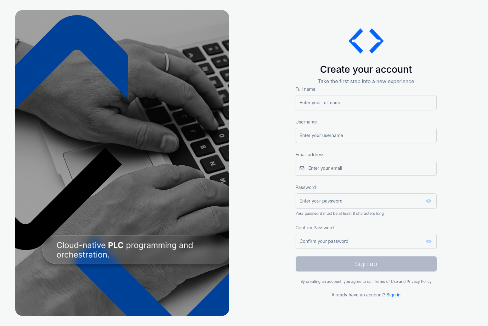
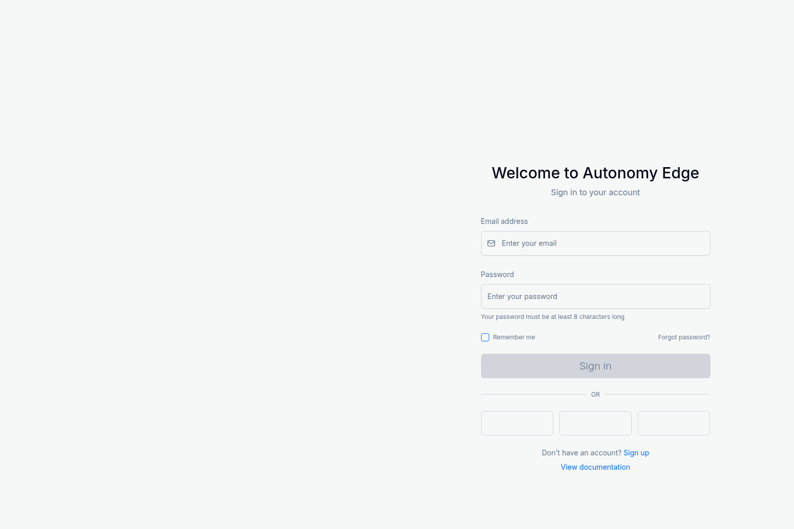
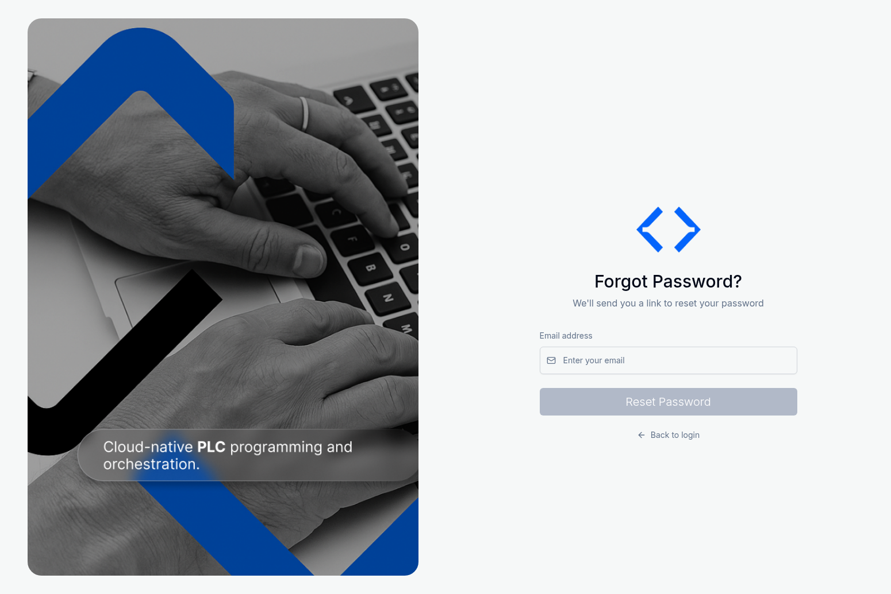

# 1.2 Account Setup and Authentication

This section will guide you through creating your Autonomy Edge account and managing your authentication credentials. The platform uses a secure email-based authentication system with support for password recovery and social login options.

## Creating a New Account

To get started with Autonomy Edge, you'll need to create an account. Follow these steps:

### Step 1: Navigate to the Signup Page

1. Open your web browser and go to [https://autonomy-edge.com](https://autonomy-edge.com)
2. You'll be directed to the login page
3. Click the **Sign up** link at the bottom of the login form

### Step 2: Fill in Your Information

The signup form requires the following information:

1. **Full Name**: Enter your complete name (e.g., "John Smith")
   - This will be displayed on your profile and visible to other users

2. **Username**: Choose a unique username (e.g., "john-smith")
   - Usernames must be unique across the platform
   - Use lowercase letters, numbers, and hyphens
   - The system will validate availability as you type

3. **Email Address**: Provide a valid email address
   - This will be used for account verification and password recovery
   - The system will check if the email is already registered
   - A verification email will be sent to this address

4. **Password**: Create a secure password
   - Must be at least 8 characters long
   - Use a combination of letters, numbers, and special characters for better security
   - Click the eye icon to toggle password visibility

5. **Confirm Password**: Re-enter your password to confirm
   - Must match the password entered above

### Step 3: Submit the Form

1. Review the Terms of Use and Privacy Policy notice at the bottom
2. Click the **Sign up** button to create your account
3. The button will be disabled until all required fields are filled correctly

### Step 4: Email Verification

After successful registration:

1. A verification modal will appear confirming your account creation
2. Check your email inbox for a verification message from Autonomy Edge
3. Click the verification link in the email to activate your account
4. If you don't receive the email within a few minutes:
   - Check your spam/junk folder
   - Click the "Resend verification email" option in the modal

Once your email is verified, you can proceed to log in to the platform.

## Logging In

After creating and verifying your account, you can log in to access the platform.

### Step 1: Access the Login Page

Navigate to [https://autonomy-edge.com/login](https://autonomy-edge.com/login) or click **Sign in** from the signup page.

### Step 2: Enter Your Credentials

1. **Email Address**: Enter the email address you used during registration
2. **Password**: Enter your account password
   - Click the eye icon to show/hide your password as you type

### Step 3: Optional Settings

- **Remember Me**: Check this box to stay logged in on this device
  - Your session will persist even after closing the browser
  - Only use this option on personal, secure devices

### Step 4: Sign In

1. Click the **Sign in** button to access your account
2. If your credentials are correct, you'll be redirected to the Dashboard
3. If there's an error, you'll see a message indicating the issue:
   - "Incorrect email or password" - Check your credentials and try again
   - "Please verify your email" - Check your inbox for the verification email

## Alternative Login Methods

Autonomy Edge supports social login options for convenience:

- **Google**: Sign in using your Google account
- **Microsoft**: Sign in using your Microsoft account
- **Apple**: Sign in using your Apple ID

To use social login, simply click the corresponding icon on the login page. You'll be redirected to the provider's authentication page and then back to Autonomy Edge.

## Password Recovery

If you forget your password, you can reset it using the password recovery feature.

### Step 1: Access Password Reset

1. From the login page, click **Forgot password?**
2. You'll be directed to the password reset page

### Step 2: Request Password Reset

1. Enter the email address associated with your account
2. Click the **Reset Password** button
3. Check your email inbox for a password reset link

### Step 3: Create a New Password

1. Click the link in the password reset email
2. You'll be directed to a page where you can create a new password
3. Enter your new password (must be at least 8 characters)
4. Confirm your new password
5. Click **Update Password** to save your changes

### Step 4: Log In with New Password

After successfully resetting your password, return to the login page and sign in with your new credentials.

## Security Best Practices

To keep your Autonomy Edge account secure:

1. **Use a Strong Password**: 
   - Combine uppercase and lowercase letters, numbers, and special characters
   - Avoid using common words or personal information
   - Use a unique password that you don't use for other services

2. **Enable Two-Factor Authentication** (if available):
   - Add an extra layer of security to your account
   - Check your account settings for 2FA options

3. **Keep Your Email Secure**:
   - Your email is the primary recovery method for your account
   - Use a strong password for your email account
   - Enable two-factor authentication on your email if available

4. **Be Cautious with "Remember Me"**:
   - Only use this feature on personal devices
   - Always log out when using shared or public computers

5. **Regular Password Updates**:
   - Consider changing your password periodically
   - Update your password immediately if you suspect unauthorized access

## Troubleshooting Authentication Issues

### I didn't receive the verification email

- Check your spam/junk folder
- Verify you entered the correct email address
- Wait a few minutes and check again
- Use the "Resend verification email" option if available
- Contact support if the issue persists

### I can't log in with my credentials

- Verify you're using the correct email address
- Check that Caps Lock is not enabled
- Try resetting your password using the "Forgot password?" link
- Clear your browser cache and cookies
- Try using a different browser

### My password reset link expired

- Password reset links are typically valid for 24 hours
- Request a new password reset link from the login page
- Complete the password reset process promptly after receiving the email

### I'm locked out of my account

- If you've made multiple failed login attempts, your account may be temporarily locked for security
- Wait 15-30 minutes before trying again
- If the issue persists, contact Autonomy Logic support

## Next Steps

Once you've successfully created your account and logged in, you'll be directed to the Dashboard, which is covered in the next section. The Dashboard is your central hub for managing projects, accessing the IDE, and navigating the platform's features.
