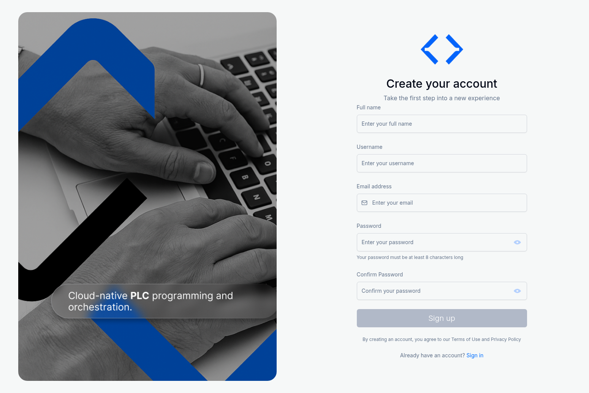
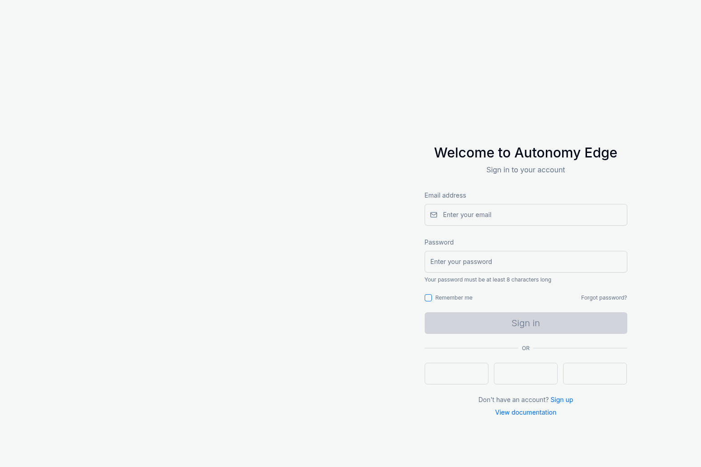
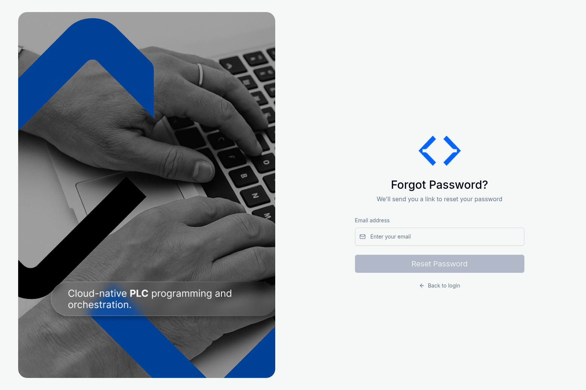

# Account Setup

Learn how to create your Autonomy Edge account, verify your email, sign in, and recover your password.

---

## Creating an Account

You can create an account in two ways: with email and password, or with a social login provider.

### Option A: Email and Password

1. Go to [edge.autonomylogic.com](https://edge.autonomylogic.com).
2. Click the **Sign up** link on the sign-in page.
3. Fill in the form:
   - **Full Name**: The name other users will see.
   - **Username**: A unique identifier (letters, numbers, and underscores only).
   - **Email**: A valid email address for verification.
   - **Password**: At least 8 characters, with one uppercase letter, one lowercase letter, and one number.
   - **Confirm Password**: Type your password again.
4. Accept the **Terms of Use**.
5. Click **Sign up**.

You'll be redirected to the email verification screen.

### Option B: Social Login

Instead of filling out the form, click one of the provider buttons at the top of the signup page:

- **Google**
- **Microsoft**
- **Apple**

You'll be redirected to the provider's login page. After you authorize, your account is created automatically and you're taken into the platform.

> **Tip:** Social login skips email verification. The provider has already verified your email.

---

## Email Verification

If you signed up with email and password, you need to verify your email before you can use the platform.

1. Check your inbox for a message from Autonomy Edge with a **6-digit code**.
2. Enter the code on the verification page.
3. Click **Verify**.

That's it. You're in.

**Didn't receive the code?**
- Check your spam or junk folder.
- Click **Resend code** on the verification page to get a new one.

---

## Signing In

1. Go to [edge.autonomylogic.com](https://edge.autonomylogic.com).
2. Enter your **email** and **password** (or click a social login button).
3. Optionally check **Remember Me** to save your email for next time.
4. Click **Sign in**.

> **Tip:** Only use "Remember Me" on personal devices you trust.

---

## Forgot Your Password?

If you can't remember your password, you can reset it in a few steps:

1. On the sign-in page, click **Forgot password?**

2. Enter your email address and submit.
3. Check your inbox for a **6-digit reset code**.
4. Enter the code on the verification page.
5. Choose a new password and confirm it.
6. Sign in with your new password.

> **Tip:** If the code doesn't arrive, check spam or click **Resend code** to request a new one.

---

## What's Next?

Your account is ready. Let's take a look at what you'll see when you log in.

➡️ Continue to the **[Dashboard Overview](./dashboard-overview)** to learn your way around.
