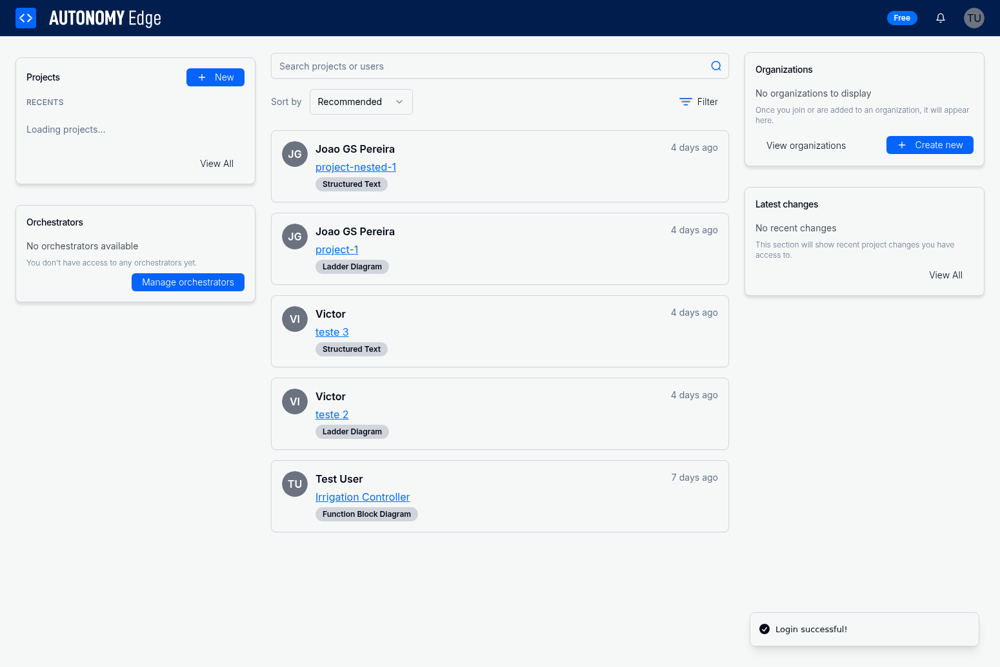

# 1.3 Dashboard Overview

The Dashboard is your central hub for accessing all features of the Autonomy Edge platform. After logging in, you'll be directed to the Dashboard, which provides quick access to your projects, the activity feed, search functionality, and platform navigation.

## Dashboard Layout

The Dashboard is organized into three main sections:

### 1. Header Bar

Located at the top of the screen, the header bar provides:

- **Autonomy Edge Logo**: Click to return to the Dashboard from anywhere in the platform
- **Free Badge**: Displays your current subscription tier
- **Notifications Bell**: Access platform notifications and updates
- **User Avatar**: Opens a dropdown menu with quick access to:
  - Profile settings
  - Documentation
  - Theme switcher (light/dark mode)
  - Logout option

### 2. Left Sidebar

The left sidebar contains quick access to your personal resources:

#### Projects Section

- **New Button**: Create a new project quickly
- **Recents List**: Shows your 4 most recently accessed projects
  - Each project displays its name (with folder path if applicable)
  - Time since last modification (e.g., "about 1 hour ago", "3 days ago")
  - Click any project to open it in the IDE
- **View All Button**: Navigate to the full Projects page for complete project management

#### Orchestrators Section

- Displays available orchestrators for managing PLC runtime environments
- Shows "No orchestrators available" if you don't have access to any
- **Manage Orchestrators Button**: Navigate to the Orchestrators management page

### 3. Main Content Area

The center of the Dashboard displays the **Activity Feed**, which shows public projects and recent activity from the Autonomy Edge community.

#### Project Feed

Each project card in the feed displays:

- **User Avatar**: The project owner's profile picture or initials
- **User Name**: The name of the user who created the project
- **Project Name**: The title of the project (clickable to view details)
- **Programming Language Badge**: Indicates the primary language used:
  - "Structured Text" (ST)
  - "Ladder Diagram" (LD)
  - "Function Block Diagram" (FBD)
  - "Instruction List" (IL)
  - "Sequential Function Chart" (SFC)
- **Time Stamp**: When the project was last updated (e.g., "4 days ago")

#### Feed Controls

At the top of the feed, you'll find:

- **Search Bar**: Search for projects or users across the platform
  - Type to search in real-time
  - Results appear as you type
  - Search both project names and user names

- **Sort By Dropdown**: Organize the feed by different criteria
  - Recommended (default)
  - Most Recent
  - Most Popular
  - Alphabetical

- **Filter Button**: Apply filters to narrow down the feed
  - Filter by programming language
  - Filter by project visibility
  - Filter by date range

### 4. Right Sidebar

The right sidebar provides access to organizational features:

#### Organizations Section

- View organizations you're a member of
- Shows "No organizations to display" if you haven't joined any
- **View Organizations Button**: Browse available organizations
- **Create New Button**: Start a new organization

#### Latest Changes Section

- Displays recent changes to projects you have access to
- Shows updates from team members and collaborators
- Helps you stay informed about project modifications
- **View All Button**: See complete change history

## Using the Search Functionality

The search feature allows you to quickly find projects and users across the platform.

### Searching for Projects

1. Click in the search bar at the top of the main content area
2. Type your search query (e.g., "irrigation", "controller", "test")
3. Results appear in real-time as you type
4. Project results show:
   - Project name
   - Owner's name
   - Programming language
   - Last update time
5. Click any result to view the project details

### Searching for Users

1. Use the same search bar to find users
2. Type a username or full name
3. User results show:
   - Profile picture or initials
   - Full name
   - Username
4. Click a user result to view their public profile

### Search Tips

- Search is case-insensitive
- Partial matches are supported (e.g., "irrig" will find "irrigation")
- Use specific terms for better results
- Clear the search bar to return to the default feed

## Navigating Recent Projects

Your recent projects list in the left sidebar provides quick access to your work:

### Opening a Project

1. Locate the project in the "Recents" list
2. Click on the project name
3. The project will open in the browser-based IDE
4. You can immediately start editing your PLC program

### Understanding Project Display

Projects in the recents list may show:

- **Simple Name**: Just the project name (e.g., "Nexus_demo")
- **Folder Path**: Folder name followed by project name (e.g., "Some Folder / Irrigation Controller")
  - This indicates the project is organized within a folder
  - Helps you identify projects with similar names

### Accessing All Projects

If you need to see all your projects or perform management tasks:

1. Click the **View All** button in the Projects section
2. You'll be directed to the Projects page where you can:
   - View all projects in grid or list view
   - Create new projects
   - Organize projects into folders
   - Archive or delete projects
   - Duplicate projects
   - Download projects
   - Manage project visibility settings

## Understanding the Activity Feed

The activity feed keeps you connected with the Autonomy Edge community and helps you discover interesting projects.

### Feed Content

The feed displays:

- **Public Projects**: Projects that users have chosen to share publicly
- **Recent Updates**: Newly created or recently modified projects
- **Community Activity**: Projects from various users across the platform

### Interacting with Feed Items

For each project in the feed, you can:

1. **View Project Details**: Click on the project name to see more information
2. **View User Profile**: Click on the user's name or avatar to see their profile
3. **Identify Language**: Check the language badge to see what programming language is used
4. **Check Recency**: View the timestamp to see how recently the project was updated

### Discovering New Projects

Use the feed to:

- Learn from other users' projects
- Find inspiration for your own work
- Discover different programming approaches
- Connect with other automation engineers
- Clone public projects to use as templates

## Managing Orchestrators

The Orchestrators section provides quick access to your PLC runtime environments.

### When You Have Orchestrators

If you have orchestrators configured:

- They'll be listed in the left sidebar
- Click on an orchestrator name to view its details
- Manage devices associated with each orchestrator
- Monitor orchestrator status and health

### When You Don't Have Orchestrators

If you see "No orchestrators available":

1. Click **Manage Orchestrators** to access the Orchestrators page
2. You can create new orchestrators or request access to existing ones
3. Orchestrators are required for deploying and running PLC programs on physical or virtual devices

## Customizing Your Dashboard Experience

### Theme Selection

Switch between light and dark themes:

1. Click your user avatar in the top-right corner
2. Select **Change theme** from the dropdown menu
3. The theme will switch immediately
4. Your preference is saved for future sessions

### Notification Preferences

Stay informed about platform activity:

1. Click the bell icon in the header
2. View recent notifications
3. Configure notification preferences in your profile settings

## Dashboard Best Practices

To make the most of your Dashboard:

1. **Check Recent Projects Regularly**: Your most recent work is always one click away
2. **Use Search Effectively**: Find projects and users quickly instead of scrolling
3. **Explore the Feed**: Discover new techniques and approaches from the community
4. **Organize with Folders**: Keep your projects organized for easier access
5. **Monitor Orchestrators**: Keep track of your runtime environments
6. **Stay Updated**: Check the Latest Changes section for team activity

## Next Steps

Now that you're familiar with the Dashboard, you can:

- Create your first project using the **New** button
- Explore the Projects page for advanced project management
- Set up orchestrators for deploying your PLC programs
- Customize your user profile (covered in the next section)
- Browse the activity feed to discover community projects

The Dashboard is designed to provide quick access to everything you need while keeping you connected to the Autonomy Edge community. As you become more familiar with the platform, you'll develop your own workflow for navigating between the Dashboard, Projects page, and IDE.
