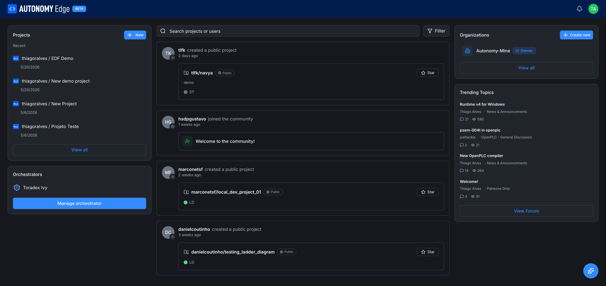
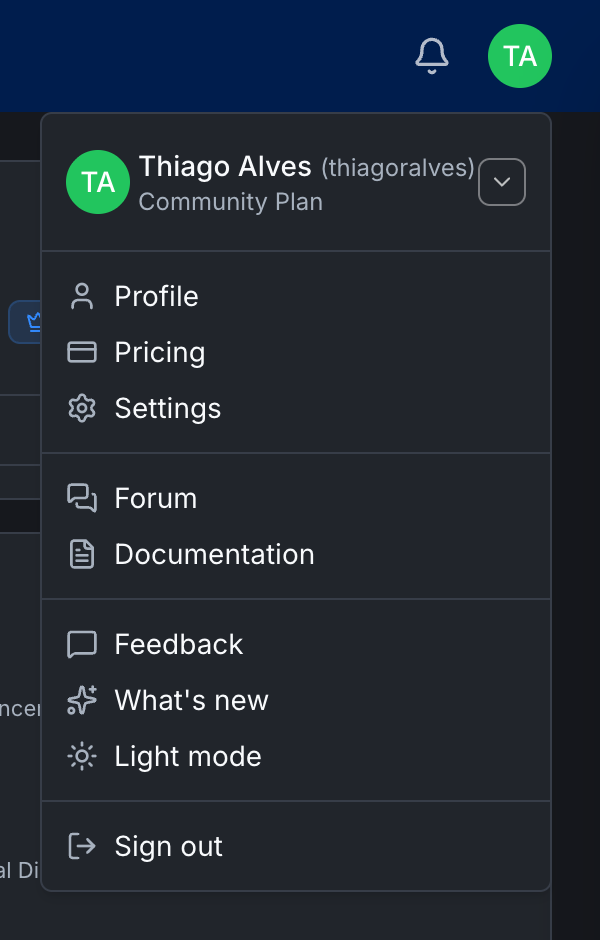

# Dashboard tour

The first screen you see after signing in is your **dashboard**. It's the home base for everything else on the platform: projects, orchestrators, community activity, and the user menu all start here.

If you switch to an organization's workspace the layout stays the same, with the organization's projects, orchestrators, and members in place of your personal ones.

There are five regions to know about.

## 1. The top header

Stretching across the screen at the very top:

- **AUTONOMY Edge BETA logo** (left): clicks back to this dashboard.
- **Bell icon**: opens **[Notifications](../platform/notifications)**. The icon shows an unread dot when new notifications arrive.
- **Avatar circle** (right edge, with your initials): opens the user menu (covered below).

## 2. Left column: your tools

This column lists the things that are yours in the current workspace.

- **Projects** card with a **+ New** button at the top. Below it, the four most recently modified projects, with a **View all** link at the bottom that takes you to **[your projects list](../platform/projects/projects-list)**.
- **Orchestrators** card. If you have one or more orchestrators set up, the first one is named here. The blue **Manage orchestrator** button takes you to the **[orchestrators list](../platform/orchestrators/orchestrators-list)**.

When you switch to an organization workspace, this column shows that organization's projects and orchestrators instead of yours.

## 3. Center column: the feed

The center is an activity stream of things people in the community are doing, creating public projects, joining the community, updating organization settings. It's a low-friction way to discover what others are building.

At the top of the feed:

- **Search projects or users**: a free-text search box. Results show project cards and user cards.
- **Filter** button: opens a dropdown to switch the feed source. Today: **Recents** (default). **Recommended** and **Popular** are listed as coming soon. If you belong to organizations, each one appears under **Organization Feeds** so you can scope the feed to that org.

See **[Feed](../platform/community/feed)** for the full breakdown.

## 4. Right column: organizations and trending

- **Organizations** card. Lists each organization you belong to with its role badge (**Owner**, **Admin**, **Member**). The **+ Create new** button at the top opens the **[Create organization modal](../platform/organizations/creating-an-org)**. The **View all** link goes to **[the organizations list](../platform/organizations/overview)**.
- **Trending Topics** card. The hottest threads in the **[forum](../platform/forum/overview)** right now, with comments and view counts. The **View Forum** button at the bottom jumps to the forum home.

## 5. The Autonomy AI button (bottom-right)

In the bottom-right corner of every protected page, there is a sparkle button. It opens the **[Autonomy AI assistant](../platform/autonomy-ai-assistant)**, a chat panel grounded on these docs. The shortcut **⌘J** (macOS) or **Ctrl+J** (Windows/Linux) toggles it from anywhere.

## The user menu

Clicking the avatar circle in the header opens the user menu:

The items, top to bottom:

- **Your name and plan badge** (e.g. *Thiago Alves · Community Plan*): clicks open your own profile.
- **Profile**: your public user profile page.
- **Pricing**: the public **[pricing page](../plans-and-billing/pricing)**.
- **Settings**: your **[account settings](../account/settings/profile)**.
- **Forum**: jumps to the **[forum home](../platform/forum/overview)**.
- **Documentation**: opens these docs.
- **Feedback**: opens an in-app feedback form for reporting issues or suggesting features.
- **What's new**: opens the **[Changelog](../platform/notifications)** of recent platform updates.
- **Light mode / Dark mode toggle**: switches the theme.
- **Sign out**: ends your session.

## Switching workspaces

To switch to an organization's workspace, click the organization's name in the **Organizations** card on the right. You land on that organization's dashboard, with the same layout but the org's projects, orchestrators, and members in place of your personal ones. The header, user menu, forum, and AI assistant stay the same since they're personal, not workspace-scoped.

## What's next

- **Start a project** → **[Creating a project](../platform/projects/creating-a-project)**.
- **Install your first orchestrator** → **[Installing the agent](../platform/orchestrators/installing-the-agent)** or follow the end-to-end **[Quick Start](quick-start)**.
- **Look around the community** → **[Forum overview](../platform/forum/overview)**.
