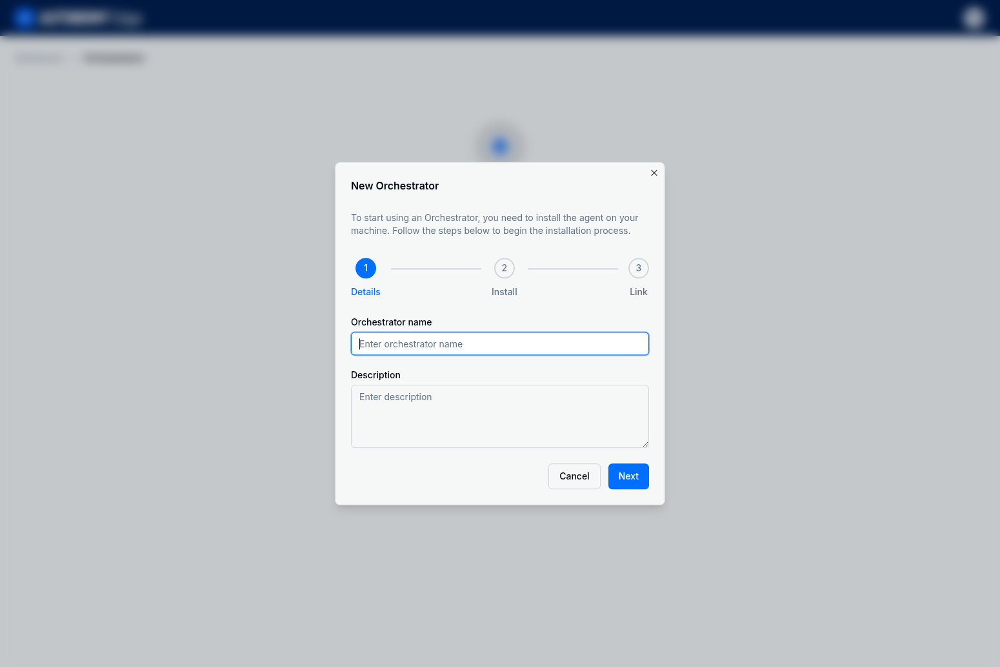
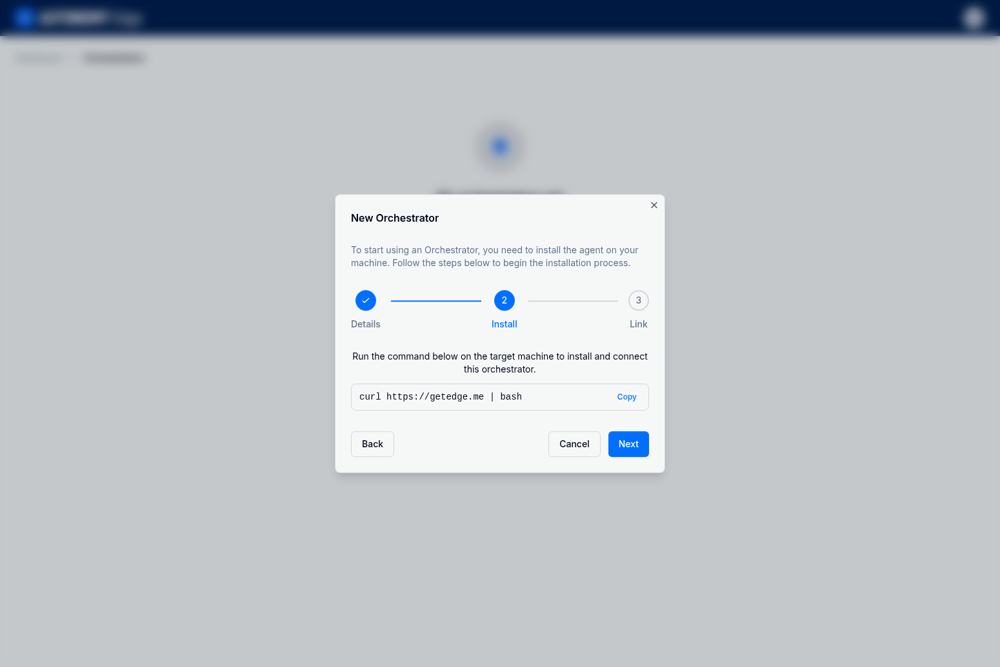
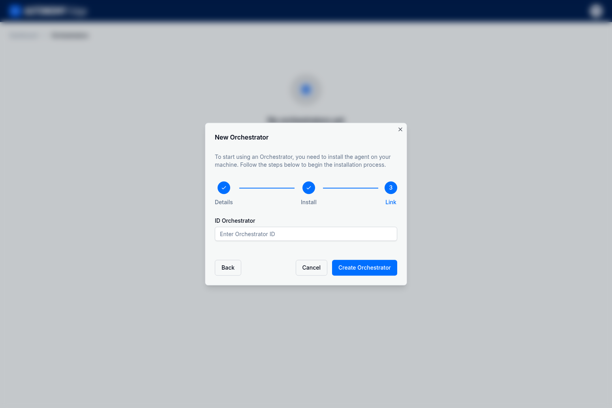
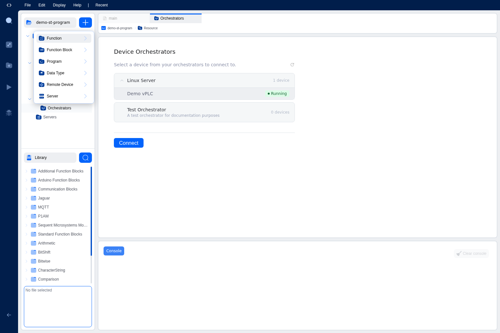
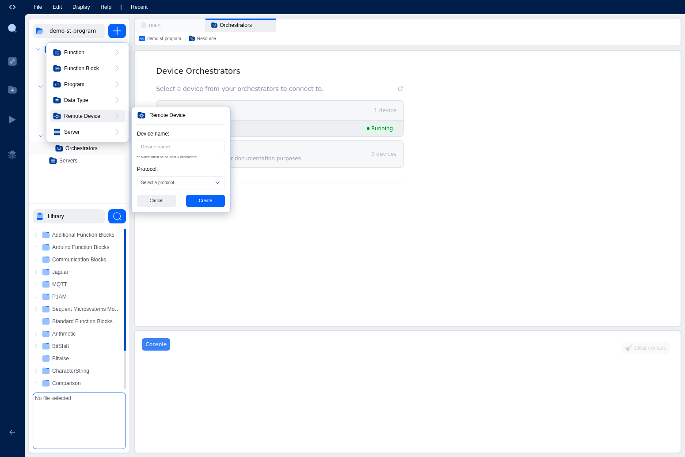
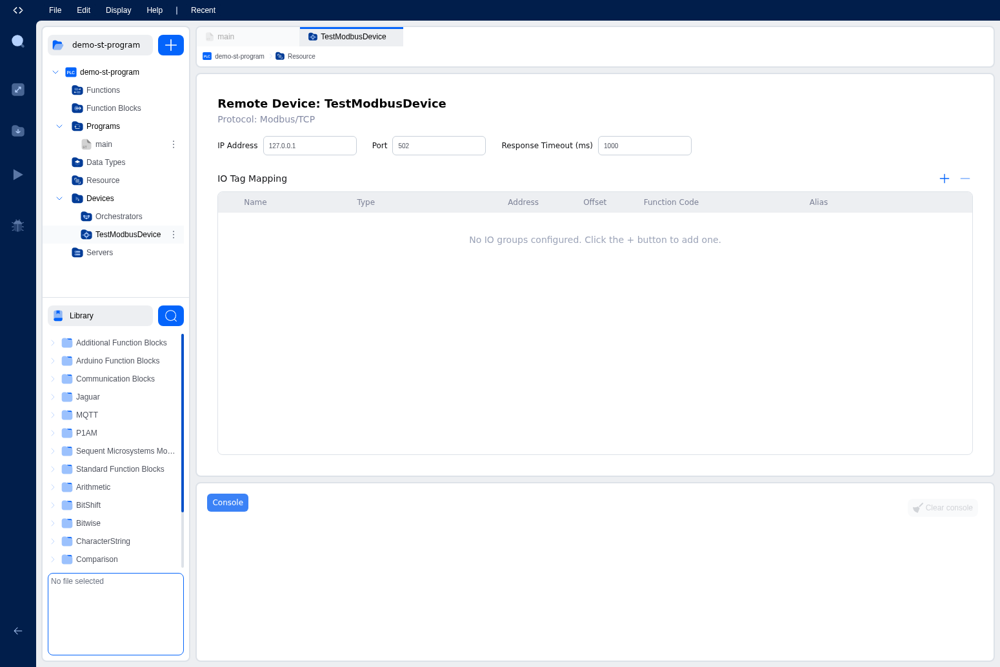
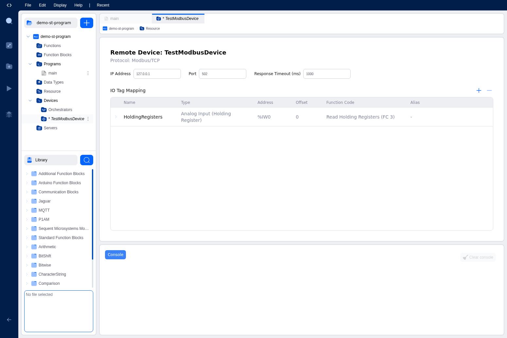

# Quick Start Guide

This guide walks you through creating your first automation project on the Autonomy Edge platform, from setting up your environment to deploying a simple blinking output program to a virtual PLC.

## Understanding Autonomy Edge

Autonomy Edge is a cloud-based platform for industrial automation that brings modern software development practices to PLC programming. Instead of requiring specialized hardware and proprietary software installations, Autonomy Edge lets you develop, deploy, and manage automation programs entirely from your web browser.

### Why Autonomy Edge?

Traditional PLC development requires expensive hardware, proprietary software licenses, and physical access to devices. Autonomy Edge removes these barriers by providing:

- **Browser-Based Development**: Write PLC programs using industry-standard IEC 61131-3 languages without installing any software
- **Virtual PLCs**: Deploy automation logic to physical devices (PLCs, PACs, Industrial PCs, Servers) running in containerized runtime instances in real-time
- **Remote Management**: Deploy programs and monitor devices from anywhere with an internet connection (internet is only required for management, not for running control logic)
- **Cloud Collaboration**: Share projects with team members and maintain version history automatically

### Platform Architecture

The Autonomy Edge ecosystem consists of four key components that work together:

```
┌─────────────────────────────────────────────────────────────┐
│                  Your Web Browser                           │
│         (Autonomy Edge Platform + OpenPLC Web IDE)          │
└─────────────────────────┬───────────────────────────────────┘
                          │ Secure Cloud Connection
                          ▼
┌─────────────────────────────────────────────────────────────┐
│                   Orchestrator Agent                        │
│            (Runs on edge device or on-prem server)          │
│         Manages containers, networking, and security        │
└─────────────────────────┬───────────────────────────────────┘
                          │ Container Management
                          ▼
┌─────────────────────────────────────────────────────────────┐
│                    vPLC Instances                           │
│              (OpenPLC Runtime v4 containers)                │
│         Execute automation programs in real-time            │
└─────────────────────────┬───────────────────────────────────┘
                          │ Industrial Protocols (Modbus, OPC-UA)
                          ▼
┌─────────────────────────────────────────────────────────────┐
│                Physical I/O and Devices                     │
│           (Sensors, actuators, other PLCs, HMIs)            │
└─────────────────────────────────────────────────────────────┘
```

**Autonomy Edge Platform**: The cloud-based web application where you manage projects, users, and devices. It includes the browser-based OpenPLC Editor IDE for writing automation programs.

**Orchestrator**: An agent that runs on an edge device (like a linux-based PLC, PAC, industrial PC, or on-prem server) and manages your vPLC instances. It maintains a secure connection to the cloud and handles container orchestration, networking, and system monitoring.

**vPLC (Virtual PLC)**: A containerized instance of OpenPLC Runtime v4 that executes your automation programs. Each vPLC runs independently and can communicate with physical devices through industrial protocols like Modbus, EtherCAT, or EtherNet/IP.

**OpenPLC Runtime v4**: The execution engine inside each vPLC container. It compiles your IEC 61131-3 programs into native code and runs them with real-time deterministic timing, just like a physical PLC.

### IEC 61131-3 Programming

Autonomy Edge supports all five standard IEC 61131-3 programming languages:

| Language | Type | Best For |
|----------|------|----------|
| **Structured Text (ST)** | Textual | Complex algorithms, calculations, data processing |
| **Ladder Diagram (LD)** | Graphical | Discrete logic, familiar to electricians |
| **Function Block Diagram (FBD)** | Graphical | Process control, signal flow visualization |
| **Instruction List (IL)** | Textual | Low-level control, legacy system migration |
| **Sequential Function Chart (SFC)** | Graphical | State machines, sequential processes |

Additionally, you can extend functionality with **Python** and **C++** function blocks for advanced use cases like machine learning integration or custom protocol handlers.

## What You'll Build

In this guide, you'll create a complete automation workflow from scratch:

1. **Set up infrastructure**: Install the orchestrator agent on your device and provision a vPLC instance
2. **Develop a program**: Write a "Hello World" blinking output program in Structured Text
3. **Configure communication**: Set up Modbus TCP/IP to expose your outputs to external devices
4. **Deploy and run**: Compile and upload your program to the vPLC

## Prerequisites

- **Autonomy Edge account**: Sign up at [edge.autonomylogic.com](https://edge.autonomylogic.com) if you haven't already
- **Modern web browser**: Chrome, Firefox, or Safari recommended for the best experience
- **Linux device**: Any Linux-based device where you have SSH or terminal access (PLC, PAC, Industrial PC, Server, Raspberry Pi, etc.) with Docker installed

---

## Step 1: Set Up an Orchestrator

An orchestrator is an edge agent that manages your vPLC devices. It runs on your physical hardware and maintains a secure connection to the Autonomy Edge cloud.

### 1.1 Start the New Orchestrator Wizard

1. Log in to the Autonomy Edge platform at [edge.autonomylogic.com](https://edge.autonomylogic.com)
2. Navigate to **Orchestrators** in the left sidebar
3. Click the **Add Orchestrator** button



### 1.2 Enter Orchestrator Details

1. Enter a name for your orchestrator (e.g., "LinuxServer")
2. Optionally add a description
3. Click **Next** to proceed to the Install step

### 1.3 Install the Agent on Your Device

The wizard provides a curl command to install the orchestrator agent on your Linux device.



1. Click **Copy** to copy the installation command
2. Open a terminal on your Linux device (via SSH or directly)
3. Paste and run the command: `curl https://getedge.me | bash`
4. Follow the on-screen prompts to complete the installation
5. When the installation completes, the agent will display an **Orchestrator ID**

### 1.4 Link the Orchestrator

After installation, the agent generates an ID that you need to enter in the platform.



1. Copy the **Orchestrator ID** from your terminal
2. Paste it into the **ID Orchestrator** field
3. Click **Create Orchestrator**

> **Note:** The orchestrator ID expires after 5 minutes. If it expires, run the installation command again to generate a new ID.

Once linked, your orchestrator will appear in the list with its connection status.


---

## Step 2: Create a vPLC Device

A vPLC (virtual PLC) is a containerized runtime that executes your automation programs.

1. Click on your orchestrator to open its details
2. Navigate to the **Devices** tab
3. Click **Add Device**


4. Enter a device name (e.g., "MyFirstPLC")
5. Configure the network settings:
   - A default virtual NIC (veth0) is created automatically with DHCP
   - Click on the NIC to configure static IP if needed
6. Click **Create** to provision the vPLC

The vPLC will start automatically and show a "success" status when ready.


---

## Step 3: Create a New Project

Now let's create a project for our blinking output program.

1. Navigate to **Projects** in the left sidebar
2. Click **New Project**
3. Enter a project name (e.g., "BlinkingOutput")
4. Select **Structured Text** as the programming language
5. Click **Create**

The project will open in the OpenPLC Editor IDE.


---

## Step 4: Declare Variables

In the IDE, you'll see the variables table at the top and the program editor below. We need two variables:

1. A timer to control the blink interval
2. An output variable to toggle

### Add the Timer Variable

1. Click the **+** button in the variables table toolbar to add a new row
2. Set the following values:
   - **Name**: `blink_timer`
   - **Class**: Local
   - **Type**: TON (search for "TON" in the type dropdown under Standard Function Blocks)

### Add the Output Variable

1. Click **+** again to add another variable
2. Set the following values:
   - **Name**: `output_state`
   - **Class**: Output
   - **Type**: BOOL (found under Base Type)

---

## Step 5: Write the Program

Click in the program editor area (below the variables table) and enter the following Structured Text code:

```iecst
(* Hello World: Blink output every second *)
blink_timer(IN := NOT(blink_timer.Q), PT := T#500ms);

IF blink_timer.Q THEN
    output_state := NOT(output_state);
END_IF;
```

This program:
- Uses a TON timer that triggers every 500ms
- Toggles the `output_state` each time the timer completes
- Creates a 1-second blink cycle (500ms on, 500ms off)

Press **Cmd+S** (Mac) or **Ctrl+S** (Windows) to save your project.

---

## Step 6: Configure Remote I/O (Modbus)

To connect your program outputs to external devices, we'll configure a Modbus Remote Device.

### Add a Remote Device

1. Click the blue **+** button in the left sidebar
2. Select **Remote Device** from the dropdown menu



3. Enter a device name (e.g., "ModbusCoils")
4. Select **Modbus** as the protocol
5. Click **Create**



The Remote Device configuration panel will open with default TCP/IP settings:
- IP Address: 127.0.0.1
- Port: 502
- Response Timeout: 1000ms



### Add an IO Group

1. In the **IO Tag Mapping** section, click the **+** button
2. Configure the IO Group:
   - **Name**: BlinkCoils
   - **Function Code**: Write Multiple Coils (FC 15)
   - **Cycle Time (ms)**: 100
   - **Offset**: 0
   - **Length**: 8
3. Click **Create**

The IO Group will appear in the table, showing:
- Type: Digital Output (Multiple Coils)
- Address: %QX0.0
- Function Code: Write Multiple Coils (FC 15)



This configuration maps 8 digital outputs starting at address %QX0.0 to Modbus coils.

---

## Step 7: Connect to the vPLC

Now let's connect to the vPLC to deploy your program.

1. In the IDE, expand **Devices** in the left sidebar
2. Click on **Orchestrators** to open the Device Orchestrators panel
3. Expand your orchestrator to see your vPLC
4. Click on the vPLC to select it (it should show "Running" status)
5. Click the **Connect** button


### First-Time User Setup

When connecting to a new vPLC for the first time, you'll need to create an OpenPLC Runtime user account. This account is separate from your Autonomy Edge platform account and is used to authenticate with the PLC runtime.


1. The **Create First User** dialog will appear
2. Enter a username (e.g., "admin")
3. Enter a password and confirm it
4. Click **Create User**

> **Note:** If users have already been created on this vPLC, you'll see a login dialog instead. Enter your OpenPLC Runtime credentials to connect.

Once connected, the vPLC status will show both "Running" and "Connected", and the PLC Status will show "EMPTY" (no program loaded yet).


---

## Step 8: Compile and Deploy

After connecting to the vPLC:

1. Click the **Download** button in the left sidebar (folder icon with a down arrow) to compile and deploy your program
2. Check the Console panel at the bottom for compilation progress
3. If compilation succeeds, the program will be uploaded automatically
4. The PLC Status will change to "RUNNING" when the program is active


The Scan Cycle Statistics panel shows real-time performance metrics:
- **Scan Count**: Number of program cycles executed
- **Overruns**: Cycles that exceeded the target time (should be 0)
- **Scan Time**: Average execution time per cycle
- **Cycle Time**: Time between scan starts
- **Cycle Latency**: Scheduling delay

---

## Verifying Your Program

Once deployed, your blinking output program is running on the vPLC. You can verify this by:

- Watching the Scan Count increment in the Scan Cycle Statistics
- Connecting a Modbus client to the vPLC's IP address on port 502 to read the coil states
- Checking the PLC Logs tab for runtime messages

---

## What You've Accomplished

Congratulations! You've successfully completed the full Autonomy Edge development workflow:

✅ **Infrastructure**: Installed an orchestrator agent and provisioned a vPLC container
✅ **Development**: Created a project and wrote IEC 61131-3 Structured Text code
✅ **Communication**: Configured Modbus TCP/IP for external device integration
✅ **Deployment**: Compiled and uploaded your program to a running vPLC

This simple blinking output demonstrates the same patterns used in production systems. The TON timer you used is the foundation for machine cycle timing, alarm delays, and process sequences. The Modbus configuration you created is how PLCs communicate with HMIs, SCADA systems, and other industrial devices.

---

## Next Steps

Now that you understand the basics, explore these topics to build more sophisticated automation systems:

### Expand Your Programming Skills
- **[Programming Languages](../openplc-editor/programming-languages)** - Learn Ladder Diagram for discrete logic or Function Block Diagram for process control
- **[Standard Function Blocks](../openplc-editor/standard-function-blocks)** - Master timers (TON, TOF, TP), counters (CTU, CTD), and edge detection (R_TRIG, F_TRIG)
- **[Custom Languages](../openplc-editor/custom-languages)** - Extend your PLCs with Python or C++ function blocks

### Connect to Real Devices
- **[Communication Protocols](../openplc-editor/communication)** - Configure Modbus servers, clients, and OPC-UA for device integration
- **[Hardware Configuration](../openplc-editor/hardware-configuration)** - Map program variables to physical I/O pins on supported boards

### Scale Your Deployment
- **[Orchestrator Management](../platform-features/orchestrator-management)** - Deploy orchestrators to edge devices across multiple sites
- **[vPLC Management](../platform-features/vplc-management)** - Run multiple vPLCs on a single edge device for workload consolidation

---

## Troubleshooting

### vPLC shows "Stopped" status
- Check that your orchestrator is connected (green status indicator)
- Verify network connectivity between the orchestrator and the platform
- Check the orchestrator logs for error messages

### Compilation errors
- Ensure all variables are declared before use
- Check for syntax errors in your Structured Text code
- Verify that function block types (like TON) are spelled correctly

### Cannot connect to vPLC
- Ensure the vPLC is in "Running" status
- Check that your project is saved before attempting to connect
- Try refreshing the Orchestrators panel (click the refresh icon)

### Orchestrator ID expired
- Run the installation command again on your Linux device
- A new ID will be generated that you can paste into the Link step

For more help, visit the [Troubleshooting](../advanced-topics/troubleshooting) section or contact support.
