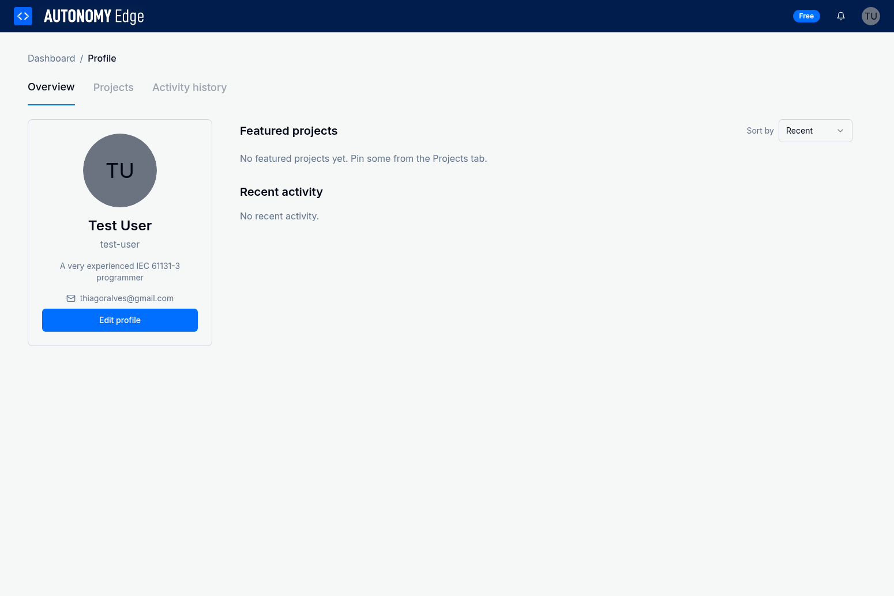
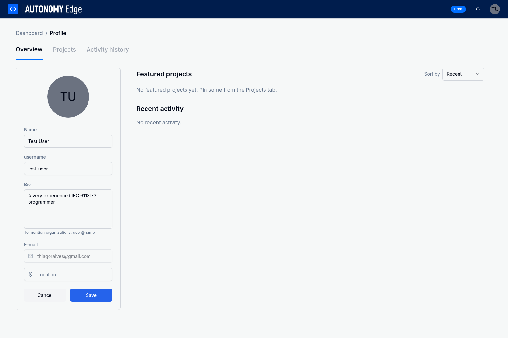

# 1.4 User Profile Management

Your user profile is your identity on the Autonomy Edge platform. It allows you to customize how you appear to other users, showcase your projects, and manage your personal information. This section will guide you through all aspects of profile management.

## Accessing Your Profile

There are two ways to access your profile:

1. **From the Dashboard**: Click your user avatar in the top-right corner of the header, then select **Profile** from the dropdown menu
2. **Direct Navigation**: Navigate to `/profile` in your browser

## Profile Overview

Your profile page is organized into three main tabs:

- **Overview**: Displays featured projects and recent activity
- **Projects**: Shows all your public projects and pinned projects
- **Activity History**: Lists your recent actions on the platform

## Editing Your Profile

To customize your profile information, click the **Edit profile** button on the left sidebar.

### Profile Information Fields

When editing your profile, you can customize the following fields:

#### 1. Profile Picture

Your profile picture appears throughout the platform wherever your name is displayed.

**To change your profile picture:**

1. Click on the avatar circle in the profile sidebar
2. Select an image file from your computer
3. Supported formats: JPG, PNG, GIF
4. Recommended size: 400x400 pixels or larger
5. The image will be automatically cropped to a circle

**If you don't upload a picture:**
- The platform will display your initials instead
- You can customize these initials (see Custom Initials section below)

#### 2. Name

Your full name is displayed on your profile and in project listings.

**To update your name:**

1. Click in the **Name** field
2. Enter your full name (e.g., "John Smith")
3. This field is required and cannot be empty
4. Changes are visible to all users immediately after saving

**Best practices:**
- Use your real name for professional networking
- Keep it professional and appropriate
- Avoid special characters or emojis

#### 3. Username

Your username is your unique identifier on the platform and appears in your profile URL.

**To change your username:**

1. Click in the **username** field
2. Enter your desired username
3. The system will validate availability in real-time
4. Usernames must be unique across the platform

**Username requirements:**
- Must be unique (no two users can have the same username)
- Use lowercase letters, numbers, and hyphens
- No spaces or special characters
- Cannot start or end with a hyphen
- Minimum 3 characters, maximum 30 characters

**Important notes:**
- Changing your username will update your profile URL
- Other users who have bookmarked your profile will need the new URL
- Your username appears in project attributions

#### 4. Bio

Your bio is a short description that appears on your profile page.

**To add or edit your bio:**

1. Click in the **Bio** text area
2. Write a description of yourself (up to 500 characters)
3. You can include:
   - Your professional background
   - Areas of expertise
   - Current projects or interests
   - Contact preferences

**Tips for writing a good bio:**
- Keep it concise and professional
- Highlight your IEC 61131-3 programming experience
- Mention specific industries or applications you work with
- Include relevant certifications or qualifications

**Mentioning organizations:**
- Use `@name` to mention organizations you're affiliated with
- This creates a clickable link to the organization's page

#### 5. Email Address

Your email address is used for account authentication and notifications.

**Important notes about email:**
- The email field is **read-only** and cannot be changed from the profile page
- Your email is **not visible** to other users (privacy protected)
- To change your email, contact Autonomy Logic support
- Keep your email secure as it's your primary account recovery method

#### 6. Location

Add your location to help other users understand your timezone and region.

**To add your location:**

1. Click in the **Location** field
2. Enter your city, state, or country (e.g., "San Francisco, CA" or "Berlin, Germany")
3. This field is optional
4. Your location is visible to all users

**Privacy considerations:**
- You can be as specific or general as you prefer
- Consider using city/country rather than a full address
- Leave blank if you prefer not to share location information

#### 7. Website

Link to your personal website, portfolio, or professional profile.

**To add a website:**

1. Click in the **Website** field (if available)
2. Enter the full URL (e.g., "https://www.example.com")
3. The link will be clickable on your profile
4. This field is optional

**Suggested uses:**
- Personal portfolio website
- LinkedIn profile
- Company website
- GitHub profile
- Technical blog

### Saving Your Changes

After making changes to your profile:

1. Review all modified fields
2. Click the **Save** button at the bottom of the form
3. Your changes will be saved immediately
4. A confirmation message will appear
5. The profile will return to view mode

**To cancel changes:**
- Click the **Cancel** button
- All unsaved changes will be discarded
- The profile will return to its previous state

## Custom Initials and Colors

If you don't upload a profile picture, Autonomy Edge displays your initials in a colored circle. You can customize both the initials and the background color.

### Default Initials

By default, the platform generates initials from your name:
- If you have a first and last name: First letter of each (e.g., "John Smith" → "JS")
- If you have a single name: First two letters (e.g., "Victor" → "VI")

### Customizing Your Initials

You can override the default initials with custom ones:

1. Navigate to your profile settings
2. Look for the **Custom Initials** option
3. Enter 1-2 characters of your choice
4. These can be letters, numbers, or symbols
5. Save your changes

**Use cases for custom initials:**
- Use your company's abbreviation
- Use your professional designation (e.g., "PE" for Professional Engineer)
- Use initials in a different language
- Create a unique identifier

### Choosing an Initial Color

Customize the background color of your avatar:

1. Access the initials customization settings
2. Select from a predefined color palette
3. Choose a color that represents your personal brand
4. The color will be applied immediately

**Available colors typically include:**
- Professional blues and grays
- Warm oranges and reds
- Cool greens and teals
- Neutral browns and tans

## Profile Tabs

### Overview Tab

The Overview tab displays:

#### Featured Projects

- Projects you've pinned for quick access
- Displayed prominently at the top of your profile
- Visible to all users visiting your profile
- Shows up to 6 featured projects

**To feature a project:**
1. Navigate to the **Projects** tab
2. Find the project you want to feature
3. Click the pin icon
4. The project will appear in your Featured Projects section

**Why feature projects:**
- Showcase your best work
- Highlight current projects
- Demonstrate your skills to potential collaborators
- Make important projects easily accessible

#### Recent Activity

- Lists your recent actions on the platform
- Shows project creations, updates, and other activities
- Helps you track your own work
- Visible to all users (public activity only)

**Activity types displayed:**
- Project created
- Project updated
- Project cloned
- Profile updated

### Projects Tab

The Projects tab shows all your public projects:

**Project display options:**
- Sort by: Recent, Name, Language
- Filter by programming language
- Search within your projects

**Project actions:**
- Click a project to open it
- Pin/unpin projects to feature them
- View project details
- Clone your own projects

**Privacy note:**
- Only PUBLIC projects are visible to other users
- Private projects are only visible to you
- Change project visibility in the Projects management page

### Activity History Tab

The Activity History tab provides a detailed log of your actions:

**Information displayed:**
- Action type (created, updated, deleted, etc.)
- Target (project name, resource name)
- Timestamp (exact date and time)
- Additional context

**Uses for activity history:**
- Track your work over time
- Audit your own actions
- Recover information about deleted projects
- Review your productivity

## Viewing Other Users' Profiles

You can view other users' public profiles to learn about their work and projects.

**To view another user's profile:**

1. Find the user through:
   - Search functionality on the Dashboard
   - Project listings (click on the user's name)
   - Activity feed (click on user avatars)

2. Click on the user's name or avatar

3. You'll see their public profile with:
   - Name and username
   - Bio and location
   - Public projects
   - Activity history
   - Featured projects

**What you can do on other users' profiles:**
- View their public projects
- Clone their public projects
- See their activity history
- Learn from their programming approaches

**Privacy protections:**
- Email addresses are never displayed on public profiles
- Only public projects are visible
- Private information remains hidden

## Profile Best Practices

### Professional Presentation

1. **Use a clear profile picture**: A professional photo or company logo helps build trust
2. **Write a descriptive bio**: Help others understand your expertise and interests
3. **Keep information current**: Update your profile as your skills and projects evolve
4. **Feature your best work**: Pin projects that showcase your capabilities

### Privacy Considerations

1. **Control project visibility**: Set projects to private if they contain sensitive information
2. **Be mindful of location sharing**: Share only what you're comfortable with
3. **Review your activity**: Remember that your public actions are visible to all users
4. **Protect your email**: Never share your password or sensitive account details

### Networking and Collaboration

1. **Complete your profile**: A complete profile makes you more discoverable
2. **Showcase diverse skills**: Feature projects using different programming languages
3. **Engage with the community**: Your activity helps others discover your work
4. **Link to external profiles**: Add your website or LinkedIn to expand your network

### Profile Maintenance

1. **Regular updates**: Keep your bio and featured projects current
2. **Clean up old projects**: Archive or delete outdated projects
3. **Monitor your activity**: Review your activity history periodically
4. **Refresh your picture**: Update your profile picture if it becomes outdated

## Profile URL Structure

Your profile is accessible via a direct URL:

**Format:** `https://autonomy-edge.com/profile/{username}`

**Example:** If your username is "john-smith", your profile URL is:
`https://autonomy-edge.com/profile/john-smith`

**Uses for your profile URL:**
- Share with colleagues and collaborators
- Add to your email signature
- Include in professional documentation
- Link from your personal website or LinkedIn

**Important notes:**
- Changing your username changes your profile URL
- Old URLs will not redirect to the new username
- Keep your username stable for consistent linking

## Troubleshooting Profile Issues

### I can't change my email address

Email addresses cannot be changed through the profile page for security reasons. Contact Autonomy Logic support to request an email change.

### My username is already taken

Usernames must be unique. Try variations such as:
- Adding numbers (e.g., "john-smith-2")
- Including your location (e.g., "john-smith-sf")
- Using middle initial (e.g., "john-m-smith")
- Adding your profession (e.g., "john-smith-controls")

### My profile picture won't upload

Check the following:
- File size: Keep images under 5MB
- File format: Use JPG, PNG, or GIF
- Image dimensions: Use at least 200x200 pixels
- Browser compatibility: Try a different browser
- Network connection: Ensure stable internet

### Changes aren't saving

If your profile changes don't save:
- Check for error messages on the form
- Ensure all required fields are filled
- Verify your internet connection
- Try refreshing the page and editing again
- Clear your browser cache
- Contact support if the issue persists

## Next Steps

Now that you understand profile management, you're ready to:

- Customize your profile to reflect your professional identity
- Create your first project (covered in Platform Features section)
- Explore the IEC 61131-3 IDE (covered in IDE section)
- Connect with other users through the activity feed
- Showcase your work by featuring your best projects

Your profile is your presence on the Autonomy Edge platform. Take time to set it up properly, and keep it updated as you grow your skills and complete new projects. A well-maintained profile helps you connect with the community and showcase your expertise in industrial automation programming.
