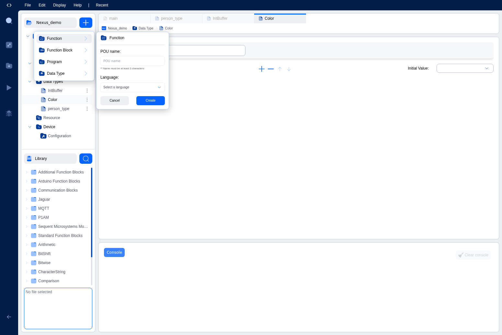

# Program Organization Units (POUs)

Program Organization Units (POUs) are the fundamental building blocks of IEC 61131-3 programs. They allow you to organize your code into modular, reusable components that can be tested independently and combined to create complex automation systems.

## What are POUs?

POUs are self-contained code modules that encapsulate specific functionality. The IEC 61131-3 standard defines three types of POUs, each serving a different purpose in your program architecture:

1. **Programs**: Top-level execution units
2. **Function Blocks**: Stateful, reusable components
3. **Functions**: Stateless, reusable calculations

Understanding when and how to use each type of POU is essential for creating well-structured, maintainable automation programs.

## The Three Types of POUs

### 1. Programs

Programs are the top-level POUs in your project. They represent the main logic that will be executed by the PLC runtime.

#### Characteristics of Programs:
- **Executed by Tasks**: Programs are assigned to tasks that control when and how often they run
- **Can Have State**: Programs can maintain internal variables that persist between execution cycles
- **Call Other POUs**: Programs can call functions and function blocks to perform specific operations
- **One or More Per Project**: A project can have multiple programs, each assigned to different tasks
- **Cannot Be Called**: Programs cannot be called by other POUs; they are only executed by tasks

#### When to Use Programs:
- As the main entry point for your application logic
- To organize different aspects of your control system (e.g., one program for motion control, another for safety logic)
- When you need a POU that will be directly executed by a task

#### Example Program Structure:
```
PROGRAM main
VAR
    counter : INT := 0;
    running : BOOL := FALSE;
END_VAR

// Main program logic
IF running THEN
    counter := counter + 1;
END_IF;
END_PROGRAM
```

### 2. Function Blocks

Function Blocks are reusable components that maintain internal state between calls. They are the workhorses of IEC 61131-3 programming, ideal for implementing control algorithms, state machines, and complex logic.

#### Characteristics of Function Blocks:
- **Maintain State**: Internal variables persist between calls
- **Multiple Instances**: You can create multiple instances of the same function block, each with its own state
- **Input and Output Parameters**: Accept inputs and produce outputs
- **Can Call Other POUs**: Function blocks can call functions and other function blocks
- **Reusable**: Once defined, can be used throughout your project

#### When to Use Function Blocks:
- For control algorithms that need to remember previous states (e.g., PID controllers, timers, counters)
- When you need multiple instances with independent states (e.g., multiple motor controllers)
- For complex logic that you want to reuse in different parts of your program
- When implementing state machines or sequential logic

#### Example Function Block:
```
FUNCTION_BLOCK MotorController
VAR_INPUT
    start : BOOL;
    stop : BOOL;
    speed_setpoint : INT;
END_VAR
VAR_OUTPUT
    motor_running : BOOL;
    current_speed : INT;
END_VAR
VAR
    state : INT := 0;  // Internal state variable
END_VAR

// Motor control logic with state
CASE state OF
    0: // Stopped
        IF start THEN
            state := 1;
            motor_running := TRUE;
        END_IF;
    1: // Running
        IF stop THEN
            state := 0;
            motor_running := FALSE;
        END_IF;
        current_speed := speed_setpoint;
END_CASE;
END_FUNCTION_BLOCK
```

#### Using Function Block Instances:
To use a function block, you must first declare an instance of it:
```
PROGRAM main
VAR
    motor1 : MotorController;  // Instance 1
    motor2 : MotorController;  // Instance 2
END_VAR

// Each instance maintains its own state
motor1(start := TRUE, stop := FALSE, speed_setpoint := 100);
motor2(start := FALSE, stop := TRUE, speed_setpoint := 50);
END_PROGRAM
```

### 3. Functions

Functions are stateless POUs that perform calculations or transformations and return a single value. They are similar to mathematical functions: given the same inputs, they always produce the same output.

#### Characteristics of Functions:
- **No Internal State**: Functions cannot have variables that persist between calls
- **Return a Single Value**: Every function has a return type (e.g., INT, REAL, BOOL)
- **Pure Computation**: Ideal for calculations, data conversions, and transformations
- **Cannot Call Function Blocks**: Functions can only call other functions
- **Efficient**: Because they have no state, functions are typically faster than function blocks

#### When to Use Functions:
- For mathematical calculations (e.g., converting units, calculating averages)
- For data type conversions (e.g., INT to REAL, REAL to STRING)
- For simple logic operations that don't need to remember previous values
- When you need a pure, predictable operation with no side effects

#### Example Function:
```
FUNCTION CelsiusToFahrenheit : REAL
VAR_INPUT
    celsius : REAL;
END_VAR

// Simple conversion calculation
CelsiusToFahrenheit := (celsius * 9.0 / 5.0) + 32.0;
END_FUNCTION
```

#### Using Functions:
Functions are called directly and return a value:
```
PROGRAM main
VAR
    temp_c : REAL := 25.0;
    temp_f : REAL;
END_VAR

// Call the function and use its return value
temp_f := CelsiusToFahrenheit(temp_c);
END_PROGRAM
```

## Comparison of POU Types

| Feature | Program | Function Block | Function |
|---------|---------|----------------|----------|
| **Maintains State** | Yes | Yes | No |
| **Return Value** | No | No (uses outputs) | Yes (single value) |
| **Can Be Instanced** | No | Yes | No |
| **Called By** | Tasks only | Programs, FBs | Programs, FBs, Functions |
| **Can Call FBs** | Yes | Yes | No |
| **Use Case** | Main logic | Stateful algorithms | Calculations |

## POU Variables

Each POU can declare variables in different categories:

### Variable Classes in POUs:

1. **VAR_INPUT**: Input parameters passed to the POU
2. **VAR_OUTPUT**: Output values returned by the POU
3. **VAR_IN_OUT**: Parameters that are both input and output (passed by reference)
4. **VAR**: Local variables (internal to the POU)
5. **VAR_TEMP**: Temporary variables (not persistent, cleared after each execution)

### Example with All Variable Types:
```
FUNCTION_BLOCK DataProcessor
VAR_INPUT
    raw_value : INT;        // Input parameter
    enable : BOOL;
END_VAR
VAR_OUTPUT
    processed_value : INT;  // Output parameter
    valid : BOOL;
END_VAR
VAR_IN_OUT
    buffer : ARRAY[0..9] OF INT;  // In-out parameter
END_VAR
VAR
    sum : INT := 0;         // Local variable (persistent)
    count : INT := 0;
END_VAR
VAR_TEMP
    temp : INT;             // Temporary variable (not persistent)
END_VAR

// Processing logic here
END_FUNCTION_BLOCK
```

## Creating POUs in the IDE

All POUs (Programs, Function Blocks, and Functions) are created graphically using the blue **+** button in the project tree. The IDE does not support creating POUs by writing PROGRAM, FUNCTION_BLOCK, or FUNCTION declarations in text mode - you must use the graphical creation interface.

### Creating a POU: Step-by-Step

To create any type of POU in the IDE:

1. Click the blue **+** button at the top of the project tree
2. Hover over or click the POU type you want to create:
   - **Function**: For stateless calculations
   - **Function Block**: For stateful, reusable components
   - **Program**: For top-level execution units
3. A creation form will appear


*POU creation form showing name input and language selection dropdown*

The creation form includes:
- **POU name**: Enter a descriptive name for your POU (minimum 3 characters)
- **Language**: Select the programming language for your POU

4. Click the **Language** dropdown to see all available programming languages:
   - **Ladder Diagram (LD)**: Graphical ladder logic
   - **Structured Text (ST)**: High-level text-based language
   - **Instruction List (IL)**: Low-level assembly-like language
   - **Functional Block Diagram (FBD)**: Graphical function block language
   - **Sequential Function Chart (SFC)**: State machine and sequential logic language


*Language dropdown showing all five IEC 61131-3 programming languages*

5. Select your desired language and click **Create**

The IDE will create the POU and open it in the appropriate editor based on the selected language. The editor will include a template structure with:
- Variables table at the top (for declaring inputs, outputs, and local variables)
- Code editor area below (graphical or text-based depending on the language)

### Creating a Program

Programs are the top-level POUs that are executed by tasks. To create a program:

1. Click the blue **+** button in the project tree
2. Select **Program**
3. Enter a name (e.g., `MainProgram`, `MotionControl`, `SafetyLogic`)
4. Select a programming language (ST, LD, FBD, IL, or SFC)
5. Click **Create**

The IDE will create the program and open it in the editor. You can then:
- Add variables in the variables table (inputs, outputs, local variables)
- Write your program logic in the code editor
- The program will appear in the project tree under the "Programs" section

**Example Use Cases:**
- `MainProgram`: Main application logic
- `MotionControl`: Dedicated program for motion control
- `SafetyMonitor`: Safety-critical monitoring logic

**IEC 61131-3 Reference (Read-Only):**
For reference, programs in IEC 61131-3 text syntax look like this:
```
PROGRAM main
VAR
    counter : INT := 0;
    running : BOOL := FALSE;
END_VAR

// Main program logic
IF running THEN
    counter := counter + 1;
END_IF;
END_PROGRAM
```
*Note: This syntax is for reference only. You cannot create POUs by typing this code in the IDE.*

### Creating a Function Block

Function blocks are reusable components that maintain state between calls. To create a function block:

1. Click the blue **+** button in the project tree
2. Select **Function Block**
3. Enter a name (e.g., `MotorController`, `PIDController`, `Timer`)
4. Select a programming language (ST, LD, FBD, IL, or SFC)
5. Click **Create**

The IDE will create the function block and open it in the editor. You can then:
- Add input variables (VAR_INPUT) for parameters passed to the function block
- Add output variables (VAR_OUTPUT) for values returned by the function block
- Add local variables (VAR) for internal state that persists between calls
- Write your function block logic in the code editor
- The function block will appear in the project tree under the "Function Blocks" section

**Example Use Cases:**
- `MotorController`: Control a motor with start/stop and speed control
- `PIDController`: Implement a PID control algorithm
- `ConveyorSystem`: Manage a conveyor belt system
- `AlarmHandler`: Handle and track system alarms

**Using Function Blocks:**
Once created, you can use your function block by declaring instances in programs or other function blocks:
```
PROGRAM main
VAR
    motor1 : MotorController;  // Instance of MotorController
    motor2 : MotorController;  // Another instance with independent state
END_VAR

// Call the function block instances
motor1(start := TRUE, stop := FALSE, speed_setpoint := 100);
motor2(start := FALSE, stop := TRUE, speed_setpoint := 50);
END_PROGRAM
```

**IEC 61131-3 Reference (Read-Only):**
For reference, function blocks in IEC 61131-3 text syntax look like this:
```
FUNCTION_BLOCK MotorController
VAR_INPUT
    start : BOOL;
    stop : BOOL;
    speed_setpoint : INT;
END_VAR
VAR_OUTPUT
    motor_running : BOOL;
    current_speed : INT;
END_VAR
VAR
    state : INT := 0;  // Internal state variable
END_VAR

// Motor control logic
CASE state OF
    0: // Stopped
        IF start THEN
            state := 1;
            motor_running := TRUE;
        END_IF;
    1: // Running
        IF stop THEN
            state := 0;
            motor_running := FALSE;
        END_IF;
        current_speed := speed_setpoint;
END_CASE;
END_FUNCTION_BLOCK
```
*Note: This syntax is for reference only. You cannot create POUs by typing this code in the IDE.*

### Creating a Function

Functions are stateless POUs that perform calculations and return a single value. To create a function:

1. Click the blue **+** button in the project tree
2. Select **Function**
3. Enter a name (e.g., `CelsiusToFahrenheit`, `CalculateAverage`, `Clamp`)
4. Select a programming language (ST, LD, FBD, or IL)
   - Note: SFC is not typically used for functions
5. Click **Create**

The IDE will create the function and open it in the editor. You can then:
- Add input variables (VAR_INPUT) for parameters passed to the function
- Add local variables (VAR) for temporary calculations (these do NOT persist between calls)
- Write your function logic in the code editor
- The function will appear in the project tree under the "Functions" section
- Remember: Functions return a single value, which is assigned to the function name

**Example Use Cases:**
- `CelsiusToFahrenheit`: Convert temperature units
- `CalculateAverage`: Calculate the average of an array of values
- `Clamp`: Limit a value to a min/max range
- `ScaleValue`: Scale a value from one range to another

**Using Functions:**
Once created, you can call your function directly in expressions:
```
PROGRAM main
VAR
    temp_c : REAL := 25.0;
    temp_f : REAL;
    values : ARRAY[0..4] OF INT := [10, 20, 30, 40, 50];
    avg : REAL;
END_VAR

// Call functions and use their return values
temp_f := CelsiusToFahrenheit(temp_c);
avg := CalculateAverage(values);
END_PROGRAM
```

**Important Notes About Functions:**
- Functions cannot maintain state between calls
- Functions cannot call function blocks (only other functions)
- Functions must return a value (assigned to the function name)
- Functions are ideal for pure calculations without side effects

**IEC 61131-3 Reference (Read-Only):**
For reference, functions in IEC 61131-3 text syntax look like this:
```
FUNCTION CelsiusToFahrenheit : REAL
VAR_INPUT
    celsius : REAL;
END_VAR

// Simple conversion calculation
CelsiusToFahrenheit := (celsius * 9.0 / 5.0) + 32.0;
END_FUNCTION
```
*Note: This syntax is for reference only. You cannot create POUs by typing this code in the IDE.*

### Naming Conventions

Follow these best practices for naming POUs:
- **Use PascalCase**: `MotorController`, `CalculateAverage`, `MainProgram`
- **Be Descriptive**: Names should clearly indicate the POU's purpose
- **Avoid Abbreviations**: Use `TemperatureController` instead of `TempCtrl`
- **Use Prefixes** (optional but recommended):
  - `FB_` for Function Blocks: `FB_MotorControl`, `FB_PIDController`
  - `FC_` for Functions: `FC_ConvertUnits`, `FC_CalculateAverage`
  - `PRG_` for Programs: `PRG_Main`, `PRG_MotionControl`

### Choosing the Right Programming Language

When creating a POU, you need to select a programming language. Here's guidance on which language to choose:

**Structured Text (ST):**
- Best for: Complex algorithms, mathematical calculations, data processing
- Familiar to: Programmers with experience in Pascal, C, or similar languages
- Use when: You need loops, complex conditionals, or mathematical operations

**Ladder Diagram (LD):**
- Best for: Boolean logic, relay replacement, simple control sequences
- Familiar to: Electricians and technicians with relay logic experience
- Use when: You need simple on/off control or interlocking logic

**Function Block Diagram (FBD):**
- Best for: Signal flow, data processing pipelines, control loops
- Familiar to: Engineers with process control or signal processing background
- Use when: You want to visualize data flow between function blocks

**Instruction List (IL):**
- Best for: Low-level optimization, simple operations
- Familiar to: Programmers with assembly language experience
- Use when: You need maximum performance or low-level control

**Sequential Function Chart (SFC):**
- Best for: State machines, sequential processes, batch control
- Familiar to: Engineers with process automation background
- Use when: You have distinct steps or states in your process

**Best Practice:** You can mix languages in your project - use the most appropriate language for each POU. For example, use ST for complex calculations, LD for simple I/O logic, and SFC for sequential processes.

## Best Practices for Using POUs

### 1. Single Responsibility Principle
Each POU should have one clear purpose. Don't create a single large POU that does everything.

**Good Example:**
- `MotorController` - Controls a single motor
- `ConveyorSystem` - Coordinates multiple motors
- `SafetyMonitor` - Monitors safety conditions

**Bad Example:**
- `MainControl` - Does everything (motor control, safety, communication, etc.)

### 2. Appropriate POU Selection
Choose the right type of POU for each task:
- Use **Functions** for pure calculations
- Use **Function Blocks** for stateful logic
- Use **Programs** as top-level coordinators

### 3. Modular Design
Break complex logic into smaller, reusable POUs:
```
PROGRAM main
VAR
    conveyor1 : ConveyorController;
    conveyor2 : ConveyorController;
    safety : SafetyMonitor;
END_VAR

// Coordinate multiple function blocks
safety();
IF safety.system_safe THEN
    conveyor1(enable := TRUE);
    conveyor2(enable := TRUE);
END_IF;
END_PROGRAM
```

### 4. Documentation
Always document your POUs:
- Add a description in the Documentation field
- Comment complex logic within the code
- Explain input and output parameters
- Document any assumptions or limitations

### 5. Testing
Test POUs independently before integrating them:
- Create test programs for individual function blocks
- Verify functions with known inputs and outputs
- Test edge cases and error conditions

## Advanced POU Concepts

### Inheritance (Future Feature)
Some IEC 61131-3 implementations support function block inheritance, allowing you to create specialized versions of existing function blocks. This feature may be added in future versions of the IDE.

### Methods (Future Feature)
Advanced implementations allow function blocks to have methods (functions that operate on the function block's data). This feature may be added in future versions.

### Properties (Future Feature)
Properties provide controlled access to function block internal variables. This feature may be added in future versions.

## Common POU Patterns

### Pattern 1: State Machine Function Block
```
FUNCTION_BLOCK StateMachine
VAR_INPUT
    trigger : BOOL;
    reset : BOOL;
END_VAR
VAR_OUTPUT
    state : INT;
END_VAR
VAR
    internal_state : INT := 0;
END_VAR

IF reset THEN
    internal_state := 0;
ELSIF trigger THEN
    internal_state := internal_state + 1;
END_IF;
state := internal_state;
END_FUNCTION_BLOCK
```

### Pattern 2: Utility Functions Library
Create a collection of related functions:
- `MathUtils`: `Clamp()`, `Scale()`, `Average()`
- `StringUtils`: `Concat()`, `ToUpper()`, `Trim()`
- `TimeUtils`: `SecondsToDuration()`, `FormatTime()`

### Pattern 3: Coordinator Program
Use programs to coordinate multiple function blocks:
```
PROGRAM ProductionLine
VAR
    station1 : WorkStation;
    station2 : WorkStation;
    conveyor : ConveyorController;
END_VAR

// Coordinate the production line
station1(enable := TRUE);
IF station1.complete THEN
    conveyor(move := TRUE);
    IF conveyor.position_reached THEN
        station2(enable := TRUE);
    END_IF;
END_IF;
END_PROGRAM
```

## Next Steps

Now that you understand Program Organization Units, you can learn about Variables and Data Types to understand how to declare and use data in your POUs, and then explore Tasks and Instances to learn how programs are executed by the PLC runtime.
