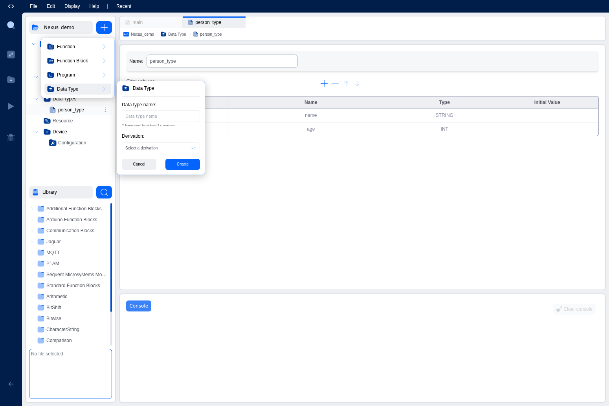
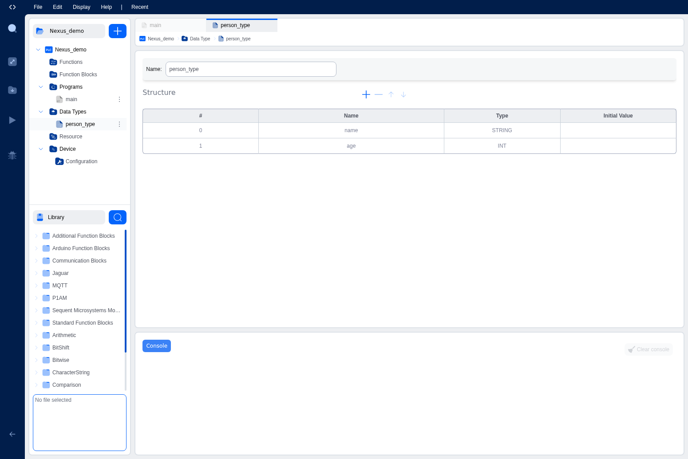
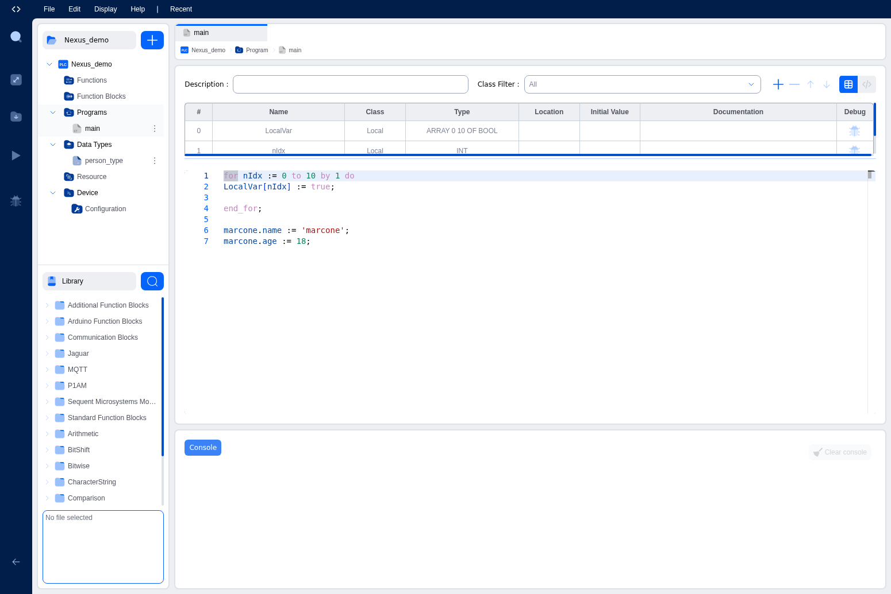
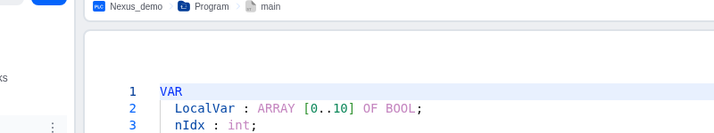

# Variables and Data Types

Variables and data types are fundamental concepts in IEC 61131-3 programming. Understanding how to declare, use, and manage variables is essential for creating effective PLC programs. This section covers variable classes, base data types, and custom data types.

## What are Variables?

Variables are named storage locations that hold data in your program. Each variable has:
- **A Name**: A unique identifier used to reference the variable
- **A Data Type**: Defines what kind of data the variable can hold
- **A Class**: Determines the variable's scope and how it can be accessed
- **An Optional Initial Value**: The value the variable starts with

## Variable Classes

IEC 61131-3 defines several variable classes, each serving a different purpose in your program structure.

### 1. Input Variables (VAR_INPUT)

Input variables are parameters passed into a POU (Program Organization Unit). They are read-only within the POU.

**Characteristics:**
- Declared with `VAR_INPUT ... END_VAR`
- Values are provided by the caller
- Cannot be modified within the POU
- Used for function and function block parameters

**Example:**
```
FUNCTION_BLOCK TemperatureController
VAR_INPUT
    setpoint : REAL;           // Desired temperature
    current_temp : REAL;       // Current temperature reading
    enable : BOOL;             // Enable/disable controller
END_VAR
```

### 2. Output Variables (VAR_OUTPUT)

Output variables are values returned by a POU to its caller.

**Characteristics:**
- Declared with `VAR_OUTPUT ... END_VAR`
- Values are set within the POU
- Can be read by the caller
- Used to return multiple values from function blocks

**Example:**
```
FUNCTION_BLOCK TemperatureController
VAR_OUTPUT
    heater_on : BOOL;          // Heater control output
    error : BOOL;              // Error flag
    power_level : INT;         // Current power level (0-100)
END_VAR
```

### 3. Input-Output Variables (VAR_IN_OUT)

Input-output variables are passed by reference, allowing the POU to both read and modify them.

**Characteristics:**
- Declared with `VAR_IN_OUT ... END_VAR`
- Passed by reference (changes affect the original variable)
- Used for large data structures to avoid copying
- Useful when a POU needs to modify caller's data

**Example:**
```
FUNCTION_BLOCK DataProcessor
VAR_IN_OUT
    buffer : ARRAY[0..99] OF INT;  // Large array passed by reference
    status : STRUCT                 // Status structure
        count : INT;
        valid : BOOL;
    END_STRUCT;
END_VAR
```

### 4. Local Variables (VAR)

Local variables are internal to a POU and maintain their values between calls (for programs and function blocks).

**Characteristics:**
- Declared with `VAR ... END_VAR`
- Not visible outside the POU
- Persist between execution cycles (for programs and function blocks)
- Used for internal state and calculations

**Example:**
```
PROGRAM main
VAR
    counter : INT := 0;        // Persistent counter
    state : INT := 0;          // State machine state
    timer_running : BOOL;      // Internal flag
END_VAR
```

### 5. Temporary Variables (VAR_TEMP)

Temporary variables are local variables that do not persist between calls. They are reset each execution cycle.

**Characteristics:**
- Declared with `VAR_TEMP ... END_VAR`
- Values are not preserved between calls
- More memory efficient than persistent variables
- Used for intermediate calculations

**Example:**
```
FUNCTION_BLOCK Calculator
VAR_TEMP
    temp_result : REAL;        // Temporary calculation result
    index : INT;               // Loop counter
END_VAR
```

### 6. External Variables (VAR_EXTERNAL)

External variables reference global variables defined elsewhere in the project.

**Characteristics:**
- Declared with `VAR_EXTERNAL ... END_VAR`
- Reference global variables
- Must match the name and type of the global variable
- Allow POUs to access shared data

**Example:**
```
PROGRAM main
VAR_EXTERNAL
    system_time : TIME;        // References global variable
    emergency_stop : BOOL;     // References global variable
END_VAR
```

### 7. Global Variables (VAR_GLOBAL)

Global variables are accessible from all POUs in the project. They are defined in the Resource section.

**Characteristics:**
- Declared in the Resource configuration
- Accessible from all programs and function blocks
- Used for shared data between POUs
- Should be used sparingly to avoid coupling

**Example (in Resource):**
```
VAR_GLOBAL
    system_time : TIME;
    emergency_stop : BOOL := FALSE;
    production_count : INT := 0;
END_VAR
```

## Base Data Types

IEC 61131-3 defines a comprehensive set of base data types for different kinds of data.

### Boolean Type

**BOOL**: Boolean value (TRUE or FALSE)
- Size: 1 bit
- Range: TRUE (1) or FALSE (0)
- Example: `running : BOOL := FALSE;`

### Integer Types

**Signed Integers:**
- **SINT** (Short Integer): 8-bit signed integer (-128 to 127)
- **INT** (Integer): 16-bit signed integer (-32,768 to 32,767)
- **DINT** (Double Integer): 32-bit signed integer (-2,147,483,648 to 2,147,483,647)
- **LINT** (Long Integer): 64-bit signed integer

**Unsigned Integers:**
- **USINT** (Unsigned Short Integer): 8-bit unsigned (0 to 255)
- **UINT** (Unsigned Integer): 16-bit unsigned (0 to 65,535)
- **UDINT** (Unsigned Double Integer): 32-bit unsigned (0 to 4,294,967,295)
- **ULINT** (Unsigned Long Integer): 64-bit unsigned

**Example:**
```
VAR
    temperature : INT := 25;           // Signed 16-bit
    counter : UDINT := 0;              // Unsigned 32-bit
    small_value : SINT := -50;         // Signed 8-bit
END_VAR
```

### Real (Floating-Point) Types

**REAL**: 32-bit floating-point number
- Size: 32 bits
- Precision: ~7 decimal digits
- Example: `temperature : REAL := 25.5;`

**LREAL** (Long Real): 64-bit floating-point number
- Size: 64 bits
- Precision: ~15 decimal digits
- Example: `precise_value : LREAL := 3.14159265359;`

### Time Types

**TIME**: Duration or time interval
- Format: T#1d2h3m4s5ms (days, hours, minutes, seconds, milliseconds)
- Example: `cycle_time : TIME := T#100ms;`

**DATE**: Calendar date
- Format: D#2024-01-15
- Example: `production_date : DATE := D#2024-01-15;`

**TIME_OF_DAY (TOD)**: Time of day
- Format: TOD#12:30:45
- Example: `start_time : TOD := TOD#08:00:00;`

**DATE_AND_TIME (DT)**: Combined date and time
- Format: DT#2024-01-15-12:30:45
- Example: `timestamp : DT := DT#2024-01-15-12:30:45;`

### String Type

**STRING**: Character string
- Variable length up to 255 characters
- Example: `message : STRING := 'Hello, World!';`

### Bit String Types

Used for bit manipulation and packed data:
- **BYTE**: 8-bit string (0 to 255)
- **WORD**: 16-bit string (0 to 65,535)
- **DWORD**: 32-bit string (0 to 4,294,967,295)
- **LWORD**: 64-bit string

**Example:**
```
VAR
    status_byte : BYTE := 16#FF;       // Hexadecimal notation
    control_word : WORD := 2#1010101010101010;  // Binary notation
END_VAR
```

### Special Type

**LOGLEVEL**: Logging level for system messages
- Used for controlling log verbosity
- Example: `log_level : LOGLEVEL;`

## Custom Data Types

In addition to base types, you can create custom data types to organize complex data structures. The IDE provides a graphical interface for creating and managing custom data types through the project tree.

### Creating Custom Data Types in the IDE

All custom data types are created graphically using the blue **+** button in the project tree. The IDE currently does not support creating data types by writing IEC 61131-3 TYPE...END_TYPE declarations in text mode.

To create a new data type:

1. Click the blue **+** button at the top of the project tree
2. Hover over or click **Data Type** in the menu
3. A creation form will appear with the following fields:
   - **Data type name**: Enter a descriptive name for your data type (minimum 3 characters)
   - **Derivation**: Select the type of data type you want to create


*Data type creation form showing name input and derivation dropdown*

4. Click the **Derivation** dropdown to see the three available options:
   - **Array**: For collections of elements of the same type
   - **Enumerated**: For defining a set of named constants
   - **Structure**: For grouping related variables of different types


*Derivation dropdown showing Array, Enumerated, and Structure options*

5. Select the desired derivation type and click **Create**

The IDE will create the data type and open its editor interface. Each data type has a specialized graphical editor for configuring its properties.

### 1. Array Data Types

Arrays are collections of elements of the same type, accessed by index. Arrays are useful for storing lists of values, sensor readings, or any collection of similar data.

#### Creating an Array in the IDE

To create an array data type:

1. Click the blue **+** button in the project tree
2. Select **Data Type**
3. Enter a name for your array (e.g., `IntBuffer`, `TemperatureReadings`)
4. Select **Array** from the Derivation dropdown
5. Click **Create**

The IDE will open the Array editor interface:


*Array editor showing base type selection, initial value, and dimensions configuration*

#### Configuring an Array

The Array editor provides the following configuration options:

- **Name**: The name of your array data type
- **Base Type**: Select the data type for array elements (BOOL, INT, REAL, STRING, etc.)
  - Click the dropdown to choose from available base types
  - You can also select custom data types you've created
- **Initial Value**: Set a default value for all array elements (optional)
- **Dimensions**: Define the size and structure of your array
  - Click the **+** button to add a dimension
  - For each dimension, specify the start and end indices
  - You can create multi-dimensional arrays by adding multiple dimensions
  - Use the **-** button to remove dimensions
  - Use **↑** and **↓** buttons to reorder dimensions

**Example: Creating a 1D Array**
1. Set Base Type to `INT`
2. Click **+** to add a dimension
3. Set the dimension range (e.g., `0` to `9` for 10 elements)

**Example: Creating a 2D Array (Matrix)**
1. Set Base Type to `REAL`
2. Click **+** to add first dimension (e.g., `0` to `2` for 3 rows)
3. Click **+** to add second dimension (e.g., `0` to `3` for 4 columns)

#### Using Arrays in Your Code

Once created, you can use your array data type in variable declarations:

```
VAR
    temperatures : ARRAY[0..9] OF REAL;      // Inline array declaration
    buffer : IntBuffer;                      // Using custom array type
END_VAR

// Accessing array elements
temperatures[0] := 25.5;
temperatures[5] := temperatures[0] + 10.0;

// Multi-dimensional array access
grid[3, 5] := 42;  // Access element at row 3, column 5
```

**IEC 61131-3 Reference (Read-Only):**
For reference, arrays in IEC 61131-3 text syntax look like this once your project is compiled:
```
TYPE
    IntArray : ARRAY[0..9] OF INT;           // 10 integers
    Matrix : ARRAY[0..2, 0..3] OF REAL;      // 2D array (3x4)
END_TYPE
```

### 2. Enumerated Data Types

Enumerations define a set of named constants, making code more readable and maintainable. Instead of using magic numbers or unclear boolean flags, enumerations provide meaningful names for states, modes, or options.

#### Creating an Enumeration in the IDE

To create an enumerated data type:

1. Click the blue **+** button in the project tree
2. Select **Data Type**
3. Enter a name for your enumeration (e.g., `MotorState`, `DayOfWeek`, `Color`)
4. Select **Enumerated** from the Derivation dropdown
5. Click **Create**

The IDE will open the Enumeration editor interface:


*Enumeration editor showing the values table and initial value selection*

#### Configuring an Enumeration

The Enumeration editor provides the following configuration options:

- **Name**: The name of your enumeration data type
- **Description**: Optional description of the enumeration's purpose
- **Values Table**: Define the enumeration values
  - Click the **+** button to add a new enumeration value
  - Enter a name for each value (e.g., `RED`, `GREEN`, `BLUE`)
  - Use the **-** button to remove values
  - Use **↑** and **↓** buttons to reorder values
  - The order matters: the first value is 0, second is 1, etc.
- **Initial Value**: Select the default value from the dropdown

**Example: Creating a Motor State Enumeration**
1. Name: `MotorState`
2. Click **+** to add values:
   - `STOPPED`
   - `STARTING`
   - `RUNNING`
   - `STOPPING`
   - `ERROR`
3. Set Initial Value to `STOPPED`

**Example: Creating a Day of Week Enumeration**
1. Name: `DayOfWeek`
2. Click **+** to add values:
   - `MONDAY`
   - `TUESDAY`
   - `WEDNESDAY`
   - `THURSDAY`
   - `FRIDAY`
   - `SATURDAY`
   - `SUNDAY`

#### Using Enumerations in Your Code

Once created, you can use your enumeration in variable declarations and comparisons:

```
VAR
    motor_status : MotorState := STOPPED;
    today : DayOfWeek;
END_VAR

// Using enumeration values in logic
IF motor_status = RUNNING THEN
    // Motor is running
END_IF;

// Changing enumeration values
motor_status := STARTING;

// Using in CASE statements
CASE motor_status OF
    STOPPED:
        // Handle stopped state
    RUNNING:
        // Handle running state
    ERROR:
        // Handle error state
END_CASE;
```

**IEC 61131-3 Reference (Read-Only):**
For reference, enumerations in IEC 61131-3 text syntax look like this once your project is compiled:
```
TYPE
    MotorState : (STOPPED, STARTING, RUNNING, STOPPING, ERROR);
    DayOfWeek : (MONDAY, TUESDAY, WEDNESDAY, THURSDAY, FRIDAY, SATURDAY, SUNDAY);
END_TYPE
```

### 3. Structure Data Types

Structures group related variables of different types into a single unit. This is useful for organizing complex data, such as sensor information, motor parameters, or user records.

#### Creating a Structure in the IDE

To create a structure data type:

1. Click the blue **+** button in the project tree
2. Select **Data Type**
3. Enter a name for your structure (e.g., `Person`, `MotorData`, `SensorReading`)
4. Select **Structure** from the Derivation dropdown
5. Click **Create**

The IDE will open the Structure editor interface:


*Structure editor showing the fields table with Name, Type, and Initial Value columns*

#### Configuring a Structure

The Structure editor provides a table-based interface for defining structure fields:

- **Name**: The name of your structure data type
- **Fields Table**: Define the structure members
  - **#**: Row number
  - **Name**: Field name (click to edit)
  - **Type**: Data type for this field (click to select)
    - Choose from base types (BOOL, INT, REAL, STRING, etc.)
    - Or select custom data types you've created
    - Can include arrays, enumerations, or other structures
  - **Initial Value**: Default value for this field (optional)
- **Toolbar Controls**:
  - **+** button: Add a new field to the structure
  - **-** button: Remove the selected field
  - **↑** button: Move the selected field up
  - **↓** button: Move the selected field down

**Example: Creating a Person Structure**
1. Name: `Person`
2. Click **+** to add fields:
   - Field 1: Name = `name`, Type = `STRING`
   - Field 2: Name = `age`, Type = `INT`
   - Field 3: Name = `height`, Type = `REAL`

**Example: Creating a Motor Data Structure**
1. Name: `MotorData`
2. Click **+** to add fields:
   - Field 1: Name = `speed`, Type = `INT`
   - Field 2: Name = `current`, Type = `REAL`
   - Field 3: Name = `running`, Type = `BOOL`
   - Field 4: Name = `error_code`, Type = `INT`

#### Using Structures in Your Code

Once created, you can use your structure in variable declarations and access its members using dot notation:

```
VAR
    employee : Person;
    motor1 : MotorData;
END_VAR

// Accessing structure members
employee.name := 'John Smith';
employee.age := 35;
employee.height := 1.75;

// Using structure in logic
IF motor1.running AND motor1.current > 10.0 THEN
    motor1.error_code := 1;
END_IF;
```

#### Nested Structures

You can create structures that contain other structures as fields. Simply select a structure data type when defining a field:

**Example: Employee with Address**
1. First, create an `Address` structure:
   - Field: `street` (STRING)
   - Field: `city` (STRING)
   - Field: `zip_code` (STRING)

2. Then, create an `Employee` structure:
   - Field: `name` (STRING)
   - Field: `age` (INT)
   - Field: `home_address` (Address)  ← Select the Address structure type

**Using nested structures:**
```
VAR
    worker : Employee;
END_VAR

// Accessing nested structure members
worker.name := 'Jane Doe';
worker.home_address.city := 'New York';
worker.home_address.zip_code := '10001';
```

**IEC 61131-3 Reference (Read-Only):**
For reference, structures in IEC 61131-3 text syntax look like this once your project is compiled:
```
TYPE
    Person : STRUCT
        name : STRING;
        age : INT;
        height : REAL;
    END_STRUCT;
    
    MotorData : STRUCT
        speed : INT;
        current : REAL;
        running : BOOL;
        error_code : INT;
    END_STRUCT;
END_TYPE
```

## Variable Declaration and Initialization

### Declaration Syntax

Variables are declared with the following syntax:
```
variable_name : data_type := initial_value;
```

### Examples:
```
VAR
    // Simple declarations
    counter : INT;                          // No initial value (defaults to 0)
    temperature : REAL := 25.0;             // With initial value
    running : BOOL := FALSE;                // Boolean with initial value
    
    // Array declarations
    buffer : ARRAY[0..9] OF INT;            // Array of 10 integers
    
    // Structure declarations
    motor : MotorData;                      // Using custom type
    
    // Multiple variables of same type
    x, y, z : REAL := 0.0;                  // All initialized to 0.0
END_VAR
```

### Initial Values

- If no initial value is specified, variables are initialized to their type's default:
  - Numeric types: 0
  - BOOL: FALSE
  - STRING: empty string ''
  - Structures: all members initialized to their defaults

## Working with Variables in the IDE

The IDE provides two ways to declare and manage variables: a graphical table mode and a text mode. You can switch between these modes to use whichever approach you prefer.

### Variables Table (Graphical Mode)

When editing a POU, the IDE displays a variables table above the code editor. This graphical interface provides a structured way to declare and manage variables.


*Variables table in graphical mode showing columns for Name, Class, Type, Location, Initial Value, Documentation, and Debug*

The variables table displays the following columns:
- **#**: Row number
- **Name**: Variable name (click to edit)
- **Class**: Variable class dropdown (Input, Output, Local, etc.)
- **Type**: Data type (click to edit or select from dropdown)
- **Location**: Memory location for I/O mapping (optional)
- **Initial Value**: Starting value (optional)
- **Documentation**: Description of the variable (optional)
- **Debug**: Checkbox to enable debug monitoring during runtime

#### Adding Variables in Table Mode

To add a variable using the graphical table:
1. Click the **+** button in the toolbar above the variables table
2. A new row will be added to the table
3. Click on the **Name** cell and enter the variable name
4. Click on the **Class** dropdown and select the variable class (Local, Input, Output, etc.)
5. Click on the **Type** cell and either:
   - Type the data type directly (e.g., `INT`, `BOOL`, `REAL`)
   - Select from the dropdown list of available types
   - For arrays, type the full declaration (e.g., `ARRAY[0..10] OF BOOL`)
   - For custom types, select from your defined data types
6. Optionally, enter an **Initial Value** (e.g., `0`, `FALSE`, `25.5`)
7. Optionally, add **Documentation** to describe the variable's purpose
8. Check the **Debug** checkbox if you want to monitor this variable during runtime

#### Editing Variables in Table Mode

To modify an existing variable:
- **Change Name**: Click on the name cell and type the new name
- **Change Class**: Click on the class dropdown and select a different class
- **Change Type**: Click on the type cell and enter or select a new data type
- **Set Initial Value**: Click on the initial value cell and enter a value
- **Add Documentation**: Click on the documentation cell and type a description
- **Enable/Disable Debug**: Check or uncheck the debug checkbox

#### Managing Variables in Table Mode

The toolbar above the variables table provides additional controls:
- **+ (Add)**: Add a new variable row
- **- (Remove)**: Remove the selected variable row
- **↑ (Move Up)**: Move the selected variable up in the list
- **↓ (Move Down)**: Move the selected variable down in the list

### Variables Text Mode

The IDE also supports a text mode for declaring variables, which allows you to write variable declarations using standard IEC 61131-3 syntax. This mode is useful if you prefer typing declarations directly or need to copy/paste variable declarations.


*Variables in text mode showing standard IEC 61131-3 VAR...END_VAR syntax*

#### Switching Between Table and Text Mode

To toggle between graphical table mode and text mode:
1. Look for the view toggle buttons in the top-right corner of the variables section
2. Click the **table icon** (grid icon) to switch to graphical table mode
3. Click the **code icon** (text/brackets icon) to switch to text mode

The IDE automatically synchronizes between both modes - changes made in one mode are immediately reflected in the other.

#### Declaring Variables in Text Mode

In text mode, you write variable declarations using standard IEC 61131-3 syntax:

```
VAR
    variable_name : data_type := initial_value;
END_VAR
```

**Example declarations in text mode:**
```
VAR
    counter : INT := 0;
    temperature : REAL := 25.0;
    running : BOOL := FALSE;
    buffer : ARRAY[0..9] OF INT;
    motor_data : MotorData;
END_VAR
```

#### Advantages of Each Mode

**Graphical Table Mode:**
- Visual overview of all variables in a structured format
- Easy to see all variable properties at a glance
- Dropdown menus help prevent syntax errors
- Good for beginners or when managing many variables
- Quick access to debug checkboxes

**Text Mode:**
- Faster for experienced programmers
- Easy to copy/paste variable declarations
- Familiar to those who know IEC 61131-3 syntax
- Allows for quick bulk editing
- Better for complex type declarations

**Best Practice**: Use whichever mode you're most comfortable with. The IDE keeps both modes synchronized, so you can switch between them as needed.

### Variable Naming Conventions

Follow these best practices for naming variables:
- **Use descriptive names**: `motor_speed` instead of `ms`
- **Use camelCase or snake_case**: `motorSpeed` or `motor_speed`
- **Avoid reserved keywords**: Don't use IEC 61131-3 keywords
- **Use prefixes for clarity** (optional):
  - `b` for BOOL: `bRunning`
  - `i` for INT: `iCounter`
  - `r` for REAL: `rTemperature`
  - `s` for STRING: `sMessage`

## Type Conversion

Sometimes you need to convert between data types. IEC 61131-3 provides conversion functions:

### Explicit Conversion Functions:
```
VAR
    int_value : INT := 42;
    real_value : REAL;
    string_value : STRING;
END_VAR

// Convert INT to REAL
real_value := INT_TO_REAL(int_value);

// Convert REAL to INT (truncates decimal)
int_value := REAL_TO_INT(real_value);

// Convert INT to STRING
string_value := INT_TO_STRING(int_value);
```

### Common Conversion Functions:
- `INT_TO_REAL`, `REAL_TO_INT`
- `INT_TO_STRING`, `STRING_TO_INT`
- `BOOL_TO_INT`, `INT_TO_BOOL`
- `REAL_TO_STRING`, `STRING_TO_REAL`

## Best Practices

### 1. Choose Appropriate Data Types
- Use the smallest type that fits your data range
- Use REAL for measurements and calculations requiring decimals
- Use INT for counters and discrete values
- Use BOOL for flags and binary states

### 2. Initialize Variables
Always provide initial values for variables to ensure predictable behavior:
```
VAR
    counter : INT := 0;           // Good: explicit initialization
    temperature : REAL := 20.0;   // Good: known starting value
END_VAR
```

### 3. Use Meaningful Names
Choose names that clearly indicate the variable's purpose:
```
// Good names
motor_speed : INT;
emergency_stop_pressed : BOOL;
target_temperature : REAL;

// Poor names
x : INT;
flag : BOOL;
temp : REAL;
```

### 4. Document Variables
Use the Documentation field to explain the purpose and units of variables:
```
VAR
    temperature : REAL := 25.0;  // Ambient temperature in degrees Celsius
    pressure : REAL;             // System pressure in bar
END_VAR
```

### 5. Minimize Global Variables
Use global variables sparingly. Prefer passing data through function parameters to reduce coupling between POUs.

### 6. Use Custom Types for Complex Data
Create structures and enumerations for complex data to improve code readability and maintainability.

### 7. Group Related Variables
Organize variables logically in your declarations:
```
VAR
    // Motor control variables
    motor_speed : INT;
    motor_running : BOOL;
    motor_current : REAL;
    
    // Temperature monitoring variables
    temp_sensor1 : REAL;
    temp_sensor2 : REAL;
    temp_alarm : BOOL;
END_VAR
```

## Next Steps

Now that you understand Variables and Data Types, you can learn about Tasks and Instances to understand how your programs are scheduled and executed by the PLC runtime system.
