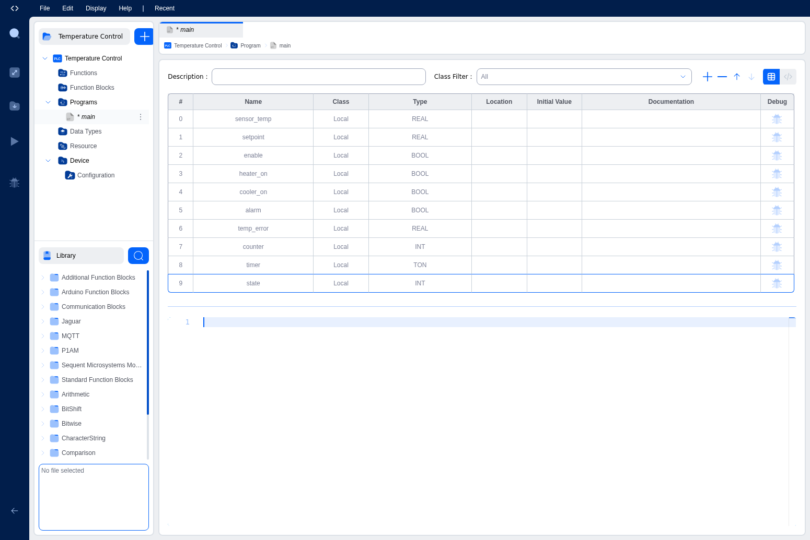
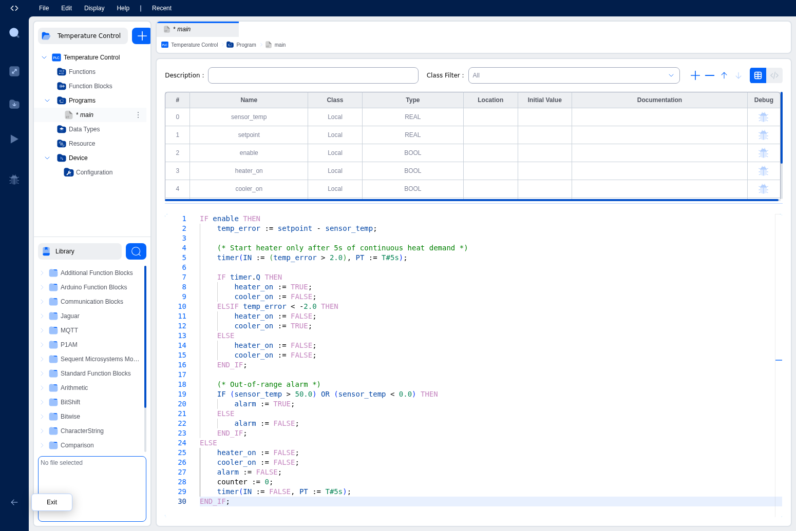

# ST Language Basics

Structured Text (ST) is a high-level text-based programming language defined in the IEC 61131-3 standard. With its Pascal-like syntax, ST is ideal for complex algorithms, mathematical calculations, and data processing tasks that would be cumbersome to express in graphical languages like Ladder Diagram or Function Block Diagram.

## Introduction to Structured Text

ST provides a familiar programming environment for developers with experience in languages like Pascal, C, or similar procedural languages. It supports:

- Arithmetic and logical operations
- Control flow structures (IF/THEN/ELSE, CASE, loops)
- Function and function block calls
- Complex expressions and calculations
- Comments for code documentation

## Variables in Structured Text

Before writing ST code, you must define the variables your program will use in the Variables Table. The Autonomy Edge IDE uses a dual-part structure for ST programming:

1. **Variables Table**: Where you declare all variables with their names, types, and classes
2. **Code Editor**: Where you write the actual ST code that uses those variables


*Variables table showing local variables defined for a temperature control program*

For detailed information about variable classes (Local, Input, Output, In-Out, External, Global, Temp) and data types, see the [Variables and Data Types](../../iec-concepts/variables-datatypes) section.

**Important Note on Variable Classes**: When creating Programs (as opposed to Functions or Function Blocks), you should typically use the **Local** variable class. Input and Output variable classes are more appropriate for Functions and Function Blocks where parameters need to be passed between POUs (see [Program Organization Units (POUs)](../../iec-concepts/pous)).

## Basic Syntax

### Assignment Statements

The assignment operator in ST is `:=` (colon-equals). This assigns a value to a variable.

```
variable_name := expression;
```

Examples:
```
temperature := 25.5;
counter := counter + 1;
running := TRUE;
result := (value1 + value2) * 3;
```

### Comments

ST supports two types of comments:

**Single-line comments** (using `//`):
```
counter := counter + 1;  // Increment the counter
```

**Multi-line comments** (using `(* ... *)`):
```
(* This is a multi-line comment
   that can span multiple lines
   for detailed explanations *)
timer(IN := enable, PT := T#5s);
```

### Statements and Semicolons

Each statement in ST must end with a semicolon (`;`). Multiple statements can appear on the same line, but it's recommended to place each statement on its own line for readability.

## Operators

ST provides a comprehensive set of operators for arithmetic, comparison, logical, and bitwise operations.

### Arithmetic Operators

| Operator | Description | Example |
|----------|-------------|---------|
| `+` | Addition | `result := a + b;` |
| `-` | Subtraction | `result := a - b;` |
| `*` | Multiplication | `result := a * b;` |
| `/` | Division | `result := a / b;` |
| `**` | Exponentiation | `result := a ** 2;` |
| `MOD` | Modulo (remainder) | `result := a MOD 10;` |

**Example:**
```
temp_error := setpoint - sensor_temp;
power_level := (error * gain) / 100;
index := (counter + 1) MOD 1000;
```

### Comparison Operators

| Operator | Description | Example |
|----------|-------------|---------|
| `=` | Equal to | `IF value = 100 THEN` |
| `<>` | Not equal to | `IF status <> OK THEN` |
| `<` | Less than | `IF temp < 0.0 THEN` |
| `>` | Greater than | `IF temp > 50.0 THEN` |
| `<=` | Less than or equal | `IF count <= 10 THEN` |
| `>=` | Greater than or equal | `IF level >= threshold THEN` |

### Logical Operators

| Operator | Description | Example |
|----------|-------------|---------|
| `AND` | Logical AND | `IF enable AND ready THEN` |
| `OR` | Logical OR | `IF alarm OR warning THEN` |
| `XOR` | Logical exclusive OR | `IF input1 XOR input2 THEN` |
| `NOT` | Logical negation | `IF NOT running THEN` |

**Operator Precedence** (highest to lowest):
1. Parentheses `( )`
2. Function calls
3. Exponentiation `**`
4. Negation `-`, `NOT`
5. Multiplication `*`, Division `/`, `MOD`
6. Addition `+`, Subtraction `-`
7. Comparison `<`, `>`, `<=`, `>=`, `=`, `<>`
8. Boolean `AND`, `XOR`, `OR`

**Example:**
```
IF (sensor_temp > 50.0) OR (sensor_temp < 0.0) THEN
    alarm := TRUE;
END_IF;
```

### Bitwise Operators

| Operator | Description | Example |
|----------|-------------|---------|
| `SHL` | Shift left | `result := value SHL 2;` |
| `SHR` | Shift right | `result := value SHR 1;` |
| `ROL` | Rotate left | `result := value ROL 3;` |
| `ROR` | Rotate right | `result := value ROR 2;` |

## Control Structures

ST provides several control structures for managing program flow.

### IF/THEN/ELSE Statement

The IF statement allows conditional execution of code blocks.

**Basic IF:**
```
IF condition THEN
    // statements
END_IF;
```

**IF/ELSE:**
```
IF condition THEN
    // statements when TRUE
ELSE
    // statements when FALSE
END_IF;
```

**IF/ELSIF/ELSE:**
```
IF condition1 THEN
    // statements for condition1
ELSIF condition2 THEN
    // statements for condition2
ELSIF condition3 THEN
    // statements for condition3
ELSE
    // statements when all conditions are FALSE
END_IF;
```

**Example from Temperature Control:**
```
IF enable THEN
    temp_error := setpoint - sensor_temp;
    
    IF timer.Q THEN
        heater_on := TRUE;
        cooler_on := FALSE;
    ELSIF temp_error < -2.0 THEN
        heater_on := FALSE;
        cooler_on := TRUE;
    ELSE
        heater_on := FALSE;
        cooler_on := FALSE;
    END_IF;
ELSE
    heater_on := FALSE;
    cooler_on := FALSE;
END_IF;
```

### CASE Statement

The CASE statement provides multi-way selection based on a selector value.

```
CASE selector OF
    value1:
        // statements for value1
    value2, value3:
        // statements for value2 or value3
    value4..value6:
        // statements for range value4 to value6
ELSE
    // statements for all other values
END_CASE;
```

**Example:**
```
CASE state OF
    0:  // Idle state
        motor_on := FALSE;
        ready := TRUE;
    1:  // Starting state
        motor_on := TRUE;
        ready := FALSE;
    2:  // Running state
        motor_on := TRUE;
        ready := TRUE;
ELSE
    // Error state
    motor_on := FALSE;
    ready := FALSE;
    alarm := TRUE;
END_CASE;
```

### FOR Loop

The FOR loop repeats a block of code a specific number of times.

```
FOR counter := start_value TO end_value BY step DO
    // statements
END_FOR;
```

The `BY step` part is optional (default is 1).

**Example:**
```
FOR i := 0 TO 9 DO
    buffer[i] := 0;  // Initialize array elements
END_FOR;

FOR index := 10 TO 0 BY -1 DO
    countdown[index] := index;  // Count down
END_FOR;
```

### WHILE Loop

The WHILE loop repeats as long as a condition is TRUE. The condition is checked before each iteration.

```
WHILE condition DO
    // statements
END_WHILE;
```

**Example:**
```
WHILE (counter < 100) AND (NOT done) DO
    counter := counter + 1;
    IF process_item(counter) THEN
        done := TRUE;
    END_IF;
END_WHILE;
```

### REPEAT/UNTIL Loop

The REPEAT loop executes at least once and repeats until a condition becomes TRUE. The condition is checked after each iteration.

```
REPEAT
    // statements
UNTIL condition
END_REPEAT;
```

**Example:**
```
REPEAT
    value := read_sensor();
    attempts := attempts + 1;
UNTIL (value > 0) OR (attempts >= 10)
END_REPEAT;
```

### EXIT Statement

The EXIT statement immediately terminates the innermost loop (FOR, WHILE, or REPEAT).

```
FOR i := 0 TO 99 DO
    IF buffer[i] = target THEN
        found_index := i;
        EXIT;  // Stop searching
    END_IF;
END_FOR;
```

### RETURN Statement

The RETURN statement exits a function or function block immediately. For functions, it returns the function's value.

```
IF error_condition THEN
    RETURN;  // Exit early
END_IF;
```

## Function and Function Block Calls

ST allows you to call functions and function blocks to perform operations and manage complex logic.

### Function Calls

Functions return a single value and can be used in expressions.

```
result := ABS(value);           // Absolute value
max_value := MAX(a, b, c);      // Maximum of values
length := LEN(text_string);     // String length
```

### Function Block Calls

Function blocks are called with named parameters and maintain internal state between calls.

**Basic syntax:**
```
function_block_instance(parameter1 := value1, parameter2 := value2);
```

**Example with TON (Timer On-Delay):**
```
timer(IN := (temp_error > 2.0), PT := T#5s);

IF timer.Q THEN
    // Timer has elapsed
    heater_on := TRUE;
END_IF;
```

In this example:
- `timer` is the function block instance (declared as type TON in the variables table)
- `IN` and `PT` are input parameters
- `Q` is an output that can be accessed using dot notation (`timer.Q`)


*ST code showing syntax highlighting for keywords, variables, operators, and comments*

## Time Literals

ST supports time literals for specifying durations:

```
T#5s          // 5 seconds
T#100ms       // 100 milliseconds  
T#1m30s       // 1 minute 30 seconds
T#2h15m       // 2 hours 15 minutes
T#1d12h       // 1 day 12 hours
```

**Example:**
```
timer(IN := start_signal, PT := T#5s);
delay_time := T#250ms;
```

## Best Practices

1. **Use meaningful variable names**: Choose descriptive names that indicate the variable's purpose
2. **Add comments**: Document complex logic and non-obvious operations
3. **Keep expressions simple**: Break complex calculations into multiple steps for clarity
4. **Use parentheses**: Make operator precedence explicit in complex expressions
5. **Consistent indentation**: Indent code blocks within control structures for readability
6. **One statement per line**: Avoid cramming multiple statements on one line
7. **Initialize variables**: Set appropriate initial values in the variables table
8. **Use appropriate data types**: Choose the smallest data type that meets your needs

## Next Steps

Now that you understand ST language basics, explore:
- [ST Programming Examples](st-examples.md) - Practical examples and common patterns
- [ST Editor Features](st-editor.md) - Learn about syntax highlighting, IntelliSense, and code completion
- [Variables and Data Types](../../iec-concepts/variables-datatypes.md) - Comprehensive guide to variable management
