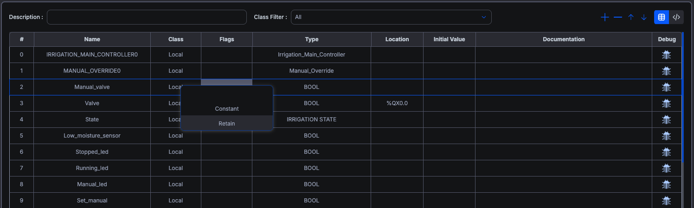
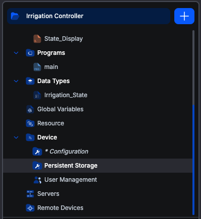

# Persistent storage for retained variables

A PLC loses the contents of its memory when it powers down. Usually that is what you want: the program starts from a known state. Sometimes it is not. A production counter, a totaliser, an operator's chosen recipe or a machine's last mode are all values that should still be there after a power cut.

IEC 61131-3 handles this with **retained** variables, and making them work takes two steps:

1. Mark the variable as retained, in the variables table.
2. Tell the device where to keep the values, on the **Persistent Storage** screen.

Both are needed, and neither is on by default. A retained variable on a device with no storage configured behaves like an ordinary one, starting at its initial value every time.

## Step 1: mark the variable as retained

Retention is set per variable, in the **Flags** column of the variables table.

| Flag | IEC declaration | Meaning |
|---|---|---|
| **—** | `VAR` | The default. The variable starts at its initial value on every start. |
| **Constant** | `VAR CONSTANT` | Fixed at build time and never written at run time. |
| **Retain** | `VAR RETAIN` | Preserved across a restart, if the device has somewhere to keep it. |

`Constant` and `Retain` are mutually exclusive, which is why this is one dropdown and not two checkboxes. The dash is a real choice rather than an empty cell: pick it to clear a flag you set earlier.

A `Constant` cannot have a `Location`. It is folded into the program when you build, so there is no storage behind it for an address to point at, and choosing the flag clears the `Location` cell.

Keep the retained set small. Every retained variable is written to storage on the interval you configure below, and on flash or an SD card that write budget is finite. Retain the handful of values that genuinely have to survive.

## Step 2: configure the device's storage

The storage setting lives on the device, not in the project, so it has its own screen under the **Device** branch of the project tree.

Being device-scoped matters. Two people opening the same project against two different PLCs are configuring two different things, and the setting does not travel with the project. It works like User Management, for the same reason.

### When the screen appears

The leaf is in the tree when both of these hold:

- **You are connected to the device.** The screen reads its values from the runtime. Opening it without a connection shows: *"You are not connected to a runtime. Connect to the device to configure where it keeps retained variables."*
- **The runtime is version 4.2.0 or newer.** Earlier runtimes have no built-in store to configure.

It is also removed, deliberately, on a board whose vendor package provides its own retention. See [When a board handles retention itself](#when-a-board-handles-retention-itself).

### The screen

**Keep retained variables on this device**

Off by default, matching the runtime. Until you turn it on, retention does nothing and every retained variable starts at its initial value. Turning it on enables the two fields below.

**File location**

An absolute path on the device where the values are written. The default is shown beneath the field, and on a standard runtime install it is `/var/lib/openplc-runtime/retain.bin`.

The runtime checks the path when you save and refuses one it could not honour, telling you exactly what is wrong. These are the four refusals, in the runtime's own words:

| If the path | The runtime says |
|---|---|
| is not absolute | *The storage path must be absolute.* |
| is an existing directory | *The storage path names a directory, not a file.* |
| has a parent that does not exist | *The directory /your/path does not exist, so nothing could be written there.* |
| contains `..` segments | *The storage path must be given in normalised form (did you mean /var/lib/openplc-runtime/retain.bin?).* |

A refused save changes nothing on the device, so you can correct the path and try again.

**Save every**

How often the runtime commits the retained values to storage: a whole number of seconds, **between 1 and 3600**, defaulting to **5**. Anything outside that range is rejected before it reaches the device, with *"Check the save interval: it must be a whole number between 1 and 3600 seconds."*

This number is a real trade-off, not a default to leave alone:

- **A shorter interval risks less.** The interval is the window of recent change a power cut can cost you. Save every second and you lose at most a second's worth.
- **A shorter interval works the storage harder.** On an SD card or onboard flash, that shortens its life.

Pick from how much loss the process can absorb. A parts counter that can be off by a few units after an outage is fine at 30 seconds. A totaliser feeding a billing record is not.

**Save** and **Cancel** become available once you change something, and a note appears beside them reading *"Changes take effect the next time the PLC starts."* Cancel restores the values currently on the device; the refresh button at the top right re-reads them. A successful save confirms with *"Settings saved: they take effect the next time the PLC starts."*

### Changes apply at the next PLC start

Saving writes the settings to the device immediately, and the runtime reads them when it next loads a program. **A running PLC keeps using the settings it started with.** Stop and start it, or upload again, for a change to take effect.

### Viewing versus changing

Anyone signed in to the device can open the screen and read how it is configured. **Changing the settings requires an administrator account** on that device; the runtime refuses the save otherwise. See **[User management](user-management)**.

## The screen shows the setting, not whether retention is running

This is the most common way to be misled, so it is worth stating plainly.

The checkbox reflects **what you configured**, not what the device is actually doing. The runtime tracks those separately, and the screen currently displays only the first. A device can show a ticked box while nothing is being retained at all, which is exactly what a freshly configured device looks like when:

- **the loaded program declares no retained variables.** There is nothing to store, so the store never engages. This is by far the most likely case.
- **no program is loaded yet.**
- **a vendor driver has taken retention over**, in which case the file store is off and the driver is doing the work.

**The device log is what tells you the truth.** After the PLC starts, the runtime reports how many bytes it is retaining and where they are being kept, or says that retained variables will start at their initial values and points you at this screen. Check the log after the first start following any change, rather than trusting the tick.

## Changing the program discards the stored values, once

The runtime records the shape of the program's retained variables alongside the data. Add, remove, reorder or retype a retained variable and the stored bytes no longer describe the program that is loading, so they are not restored, and those variables start at their initial values.

This is the correct outcome. Restoring bytes into a different set of variables would put arbitrary values into them. The runtime logs the reason, distinguishing a layout change from a corrupt store.

Expect it after any change to your retained set, and plan the first start after a deployment accordingly.

## When a board handles retention itself

Some boards keep retained values in hardware, in battery-backed RAM or FRAM, through a driver in their vendor package. That is better than a file where it exists: faster, and it does not wear out.

When you target such a board, the editor **removes the Persistent Storage screen from the tree and switches the runtime's own file store off on the device.**

The two go together on purpose. Removing only the screen would be worse than leaving it alone: the built-in store would keep running alongside the hardware one, both writing every scan, both appearing to work, and which set of values you got back after a power cut would come down to timing. Turning it off leaves exactly one thing responsible.

You need do nothing for this. It happens when you connect, and again if you change target. Retention still works; the vendor's driver is doing it, and there is nothing here to configure.

## If retained values are not surviving a restart

Work down this list:

1. **Is the variable's Flags cell set to Retain?** An ordinary variable is never preserved.
2. **Is the checkbox on?** Off is the default and a no-op until turned on.
3. **Was the PLC restarted after you saved?** Settings apply at the next program load, not immediately.
4. **Did the program's retained variables change?** Any change to the set discards the stored values once, as above.
5. **Check the device log after a start.** This is the step that distinguishes "storage is not configured" from "the program retains nothing", which the screen itself cannot tell you apart.
6. **Is the path still valid?** A directory removed after you saved makes every write fail.

## Related

- **[The variables editor](../working-with-variables/variables-editor)** for the Flags column in context.
- **[User management](user-management)** for the administrator account that saving requires.
- **[Global Variable Lists](../working-with-variables/global-variable-lists)**, whose list-level qualifier is preserved but never applied. Retention has to be set on a POU or Resource variable.
