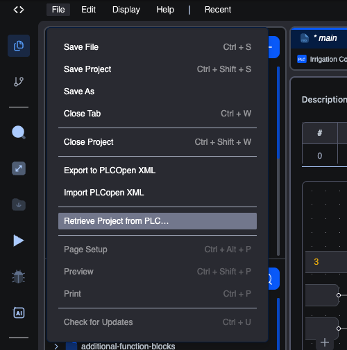
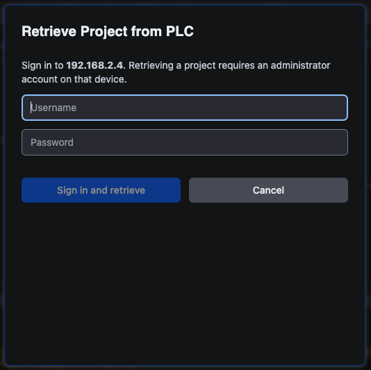
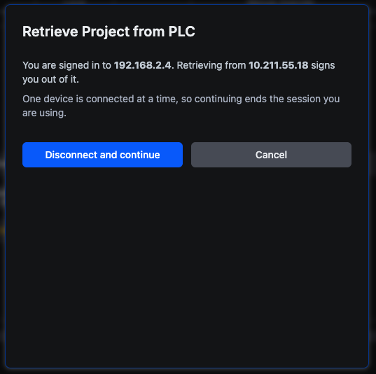

# Retrieve a project from a PLC

**File → Retrieve Project from PLC…** downloads the source project a device is holding and opens it in the editor.

This is the answer to a situation every commissioning engineer knows: a machine is running, the program on it works, and nobody can find the project it was built from. Since every upload sends the source project along with the compiled program, the device itself is the copy of last resort.

## What is stored, and when

Uploading attaches a snapshot of the source project to the program you send. It happens on every upload, from either the web editor or the desktop editor, with nothing to switch on.

So a device holds the project of its **most recent upload**. Two consequences worth being clear about:

- A device programmed before this feature existed has nothing to retrieve. It will still show up in the picker; it just has no project attached.
- The stored copy tracks uploads, not edits. If you changed the project after the last upload, the device is holding the older version.

## Retrieving

1. **File → Retrieve Project from PLC…**
2. The editor searches for devices and lists what it finds.
3. Select one and click **Continue**.
4. Sign in to that device.
5. The project is downloaded and opens in the workspace.

### Choosing a device

Each row leads with **the name of the project the device is holding**, and underneath it the device's address, its location if it has one, and when that project was stored. That is usually enough to pick the right machine without cross-referencing anything.

Rows behave in three ways:

| The row shows | It means | Selectable |
|---|---|---|
| A project name and a timestamp | The device answered and is holding that project | Yes |
| **No project stored** (greyed out) | The device answered and has nothing attached | No |
| The device name and **project unknown** | The device did not answer the search in time | Yes |

The third case is deliberately still selectable. A device that stayed silent has not told you it is empty, so the picker does not claim it is. Select it and the retrieval itself will report what is actually there.

**Refresh** runs the search again. If a device you expect is missing, check it is powered and on the same network, then refresh.

### Signing in

**Retrieving requires an administrator account on that device.** A read-only account can sign in to the runtime but cannot pull the stored project down.

If you are **already connected to the device you picked**, this step is skipped entirely and retrieval starts at once. The session you are holding is the right one.

### If you are connected to a different device

The editor holds a session for one device at a time, so signing in to another ends the one you have. Rather than doing that quietly as a side effect of browsing, the dialog stops and tells you which device you are about to be signed out of.

**Disconnect and continue** accepts. **Cancel** leaves your existing session alone.

## What happens to the project you have open

The project currently open is closed first, exactly as **File → Close Project** would close it.

**If it has unsaved changes**, retrieval stops and tells you to save or discard them first, then retrieve again. Nothing is lost and nothing is replaced behind your back. Deal with the changes and repeat the four steps; it costs one extra click.

The check runs *after* the project has been fetched from the device, so a device that turns out to have nothing stored never costs you your open project.

## A retrieved project has no home yet

This is the one behaviour to understand before you start editing.

A retrieved project came from a device, not from a location you chose, so **a normal Save is refused**:

> **This project has no location yet**
> It was retrieved from a device. Use Save As to choose where to keep it, then saving works as usual.

Use **File → Save As** to give it somewhere to live. From then on it is an ordinary project and Save works as normal.

Building is unaffected. Compiling a retrieved project works straight away, because the editor's own pre-build write is allowed even while a user-initiated save is not.

> **On the web editor, Save As is not yet available.** A retrieved project can be read, inspected and built in the browser, but there is no way to keep it there yet. To retrieve a project and keep it, use the desktop editor. Support on the web is planned.

## Libraries the project needs

A retrieved project brings the list of libraries it was built with. On the desktop editor, anything missing from your machine is offered for installation, and you are told which of two situations applies:

- **Not installed here.** The library is absent and needs installing before the project will build.
- **Installed but different.** You have a library with the same name whose contents differ from the one the project was built with. This is the one worth reading carefully: building against it produces a **different program** from the one running on the device, silently. Update it to match before you trust a rebuild.

See **[Installing a library](../library-manager/installing-a-library)**.

## Troubleshooting

**No devices found.** The search reaches devices on the local network through your orchestrator. Check the device is powered and reachable, then click **Refresh**. A device on another subnet may not answer.

**Devices are listed but every row says "project unknown".** The devices were found, but the part of the search that asks each one what it is holding did not answer. This happens when the orchestrator agent is older than the feature. The list is still usable: select a device and retrieve, and you will find out what it has. Updating the agent restores the project names.

**"No project stored" on a device you know is programmed.** It was last programmed before uploads began carrying the source, or with a tool that does not attach one. Upload from the editor once and the project will be there afterwards.

**Sign-in is refused.** Retrieving needs an administrator account on the device, not merely a valid one.

## Related

- **[Deployment to a vPLC](deployment-vplc)** for uploading in the first place, which is what puts the project on the device.
- **[Connecting to runtimes](../connecting-to-runtimes)** for how device sessions work.
