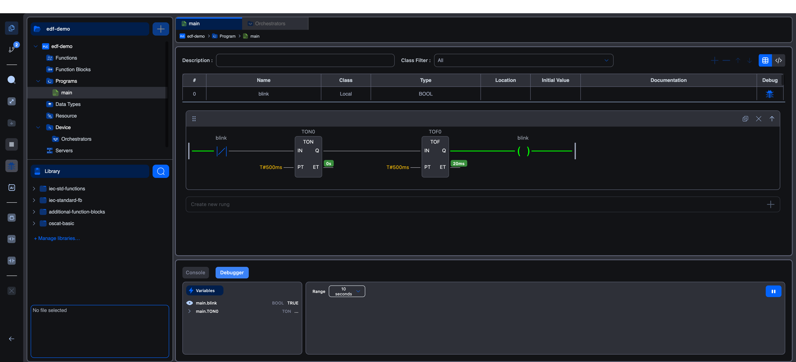

# Running with the Simulator

The editor ships with a built-in **OpenPLC Simulator** that runs entirely in your browser. It's an `avr8js` ATmega2560 emulator (pure JavaScript), so there's no hardware to plug in and no server-side runtime to talk to. Compile, hit **Start Simulator**, and the program is executing in a sandbox under your editor tab.

This is the fastest path from "I have an idea" to "let me try it", ideal for learning, prototyping, and quick smoke tests before deploying to a real vPLC.

## Step 1: Make sure the Simulator is selected

The Simulator is the default target. Until you connect to an orchestrator-managed vPLC, anything you build runs on the Simulator. You'll see a small simulator icon in the status bar at the very bottom-left of the editor when it's selected.

If you've previously connected to a vPLC and want to switch back:

1. In the project tree, expand **Device** and click **Orchestrators**.
2. The Device Orchestrators screen opens in a tab.
3. **OpenPLC Simulator** sits at the top with a **Selected** badge. Click anywhere on its card to make sure it's selected.


You don't log in to the Simulator. There's no user account, no IP, no password, it's just there.

## Step 2: Open a POU

Pick any program in the project tree (or create one). For this walkthrough we're going to use the **EDF Demo** project's `main` program, a simple Ladder Diagram blinker that toggles a `BOOL` variable called `blink` once a second using a TON / TOF pair.


The variables table above the body lists `blink` (Local, BOOL). That's all this program needs.

## Step 3: Start the Simulator

Click the **Start Simulator** button in the activity bar, the triangular Play icon, middle of the bar. (When the Simulator is the selected target, the button is labelled "Start Simulator" on hover. When a real vPLC is selected, it reads "Start PLC" instead.)

The editor immediately kicks off a build. The Console tab at the bottom logs each step:

```
[23-05-26 11:10:57]: Build process started
[23-05-26 11:10:57]: Generating IEC 61131-3 XML...
[23-05-26 11:10:57]: Generating Structured Text...
[23-05-26 11:10:58]: Compiling Structured Text to C++ with STruC++...
[23-05-26 11:10:58]: Debug map: 9 leaves in 1 arrays
[23-05-26 11:10:58]: Compiling Arduino firmware...
[23-05-26 11:11:05]: Simulator started
```

The whole loop takes around 5–10 seconds for a small project. Most of the time is the STruC++ compile.

If the project doesn't compile, the build stops at the failing step and the console shows the error. Clicking the error jumps to the offending line in the source.

## Step 4: Watch the program run

Once the simulator is up, the bottom panel automatically switches from **Console** to **Debugger**, and your LD or FBD body lights up with **live execution colouring**:

- Green wires carry current.
- Block input/output pins show their current values inline (e.g. a TON's `ET` shows `0s`, `200ms`, `420ms`, etc. as it counts up).
- The contact / coil shape itself doesn't change, but the wires around it tell you whether power is flowing.


The **Debugger panel** at the bottom lists every variable you ticked the **Debug** column for, with their current values updating in real time.

The Play button in the activity bar is now labelled **Stop Simulator**, click it to halt. Clicking it again returns to **Start Simulator** ready for the next run.

## Step 5: Plot variables on the chart

The Debugger has a time-series chart to the right of the variables list:

- Click a monitored variable to add it to the chart.
- The **Range** dropdown picks the visible window (1 s, 5 s, 10 s, 30 s, 1 min, 5 min, or 10 min).
- The pause icon at the top right freezes the chart (polling keeps running; resume to catch up).



For the `blink` program, plot `main.blink` and you'll see it square-wave between FALSE and TRUE every second.

To watch a variable that's not in the list, open the POU's variable table, tick its **Debug** column, save, and the variable appears in the Debugger on the next poll.

## Step 6: Iterate

The simulator hot-swaps cleanly:

1. Make a change to your POU.
2. Click **Stop Simulator**.
3. Click **Start Simulator** again. The editor re-compiles and re-loads the new firmware.

You don't need to close anything in between. The Debugger panel keeps its chart settings.

## What the Simulator can and can't do

**What it can do:**

- Execute any IEC body the compiler accepts: ST, LD, FBD, IL, Python function blocks, C++ function blocks.
- Run timers, counters, edge-triggers: anything driven by the simulated AVR's clock.
- Speak Modbus TCP server, OPC-UA server, S7Comm server. These run inside the runtime image baked into the Simulator firmware. Other clients on your local machine can connect to them through the runtime's WebSocket bridge.
- Drive the debugger, live-update LD/FBD execution state, and update the variables panel.

**What it can't do:**

- Touch any physical I/O. `%IX`, `%QX`, etc. exist in the emulator's memory image but no real sensor or relay reacts.
- Persist anything across page reloads. The Simulator's state lives in the editor tab. Reload the page and the program is freshly cold-booted on the next Start.

If you need physical I/O, or a long-running PLC that survives page reloads, deploy to a vPLC. See **[Connecting to a vPLC](../connecting-to-runtimes)**.

## Behind the scenes

When you press **Start Simulator**, the editor:

1. Compiles your project through the **STruC++** pipeline (same path as for a real runtime).
2. Targets the `arduino:avr:mega` platform (Arduino Mega 2560, what `avr8js` emulates).
3. Loads the resulting `.hex` into the in-browser `avr8js` core.
4. Starts the core's clock and hooks up the runtime's I/O bridges so server traffic, debugger queries, and Python/C++ block invocations all work as they would on real hardware.

Stopping halts the emulator's clock. Starting again re-runs the build and loads the fresh `.hex`.

## Limitations to keep in mind

- **Memory.** The emulated Mega has 256 KB flash and ~8 KB RAM. Very large projects can outgrow it. If you hit a memory error on the Simulator, try the same project on a vPLC, where Runtime v4 has far more headroom.
- **Performance.** Emulation overhead means the Simulator runs slower than real silicon. For timing-sensitive tests (sub-millisecond cycles), prefer a vPLC.
- **No retentive memory.** A page reload wipes everything. Test retentive logic on a real runtime.

## Troubleshooting

**The build fails with a syntax error.** Click the error in the console to jump to the source line. The Simulator never tries to load a broken build.

**The Simulator starts but the LD body doesn't colour.** The Debugger needs at least one variable opted in (the **Debug** column in the variable table). Tick the relevant variables and re-save, the live colouring kicks in immediately.

**The chart stays empty.** Click the variable name in the Debugger's variables list to add it to the chart. Boolean variables plot as sharp 0/1 transitions; numeric variables share a normalised Y axis with whatever else is on the chart.

**The Simulator runs forever after I close my tab.** It doesn't. The Simulator lives in your editor tab; closing the tab stops it. A real vPLC keeps running after you disconnect, the Simulator does not.

## What's next

- **[Connecting to a vPLC](../connecting-to-runtimes)**: when you're ready to run on a real (or orchestrator-managed virtual) device.
- **[Debugger](debugger)**: the full reference for the live-variable chart and how variables get included.
- **[Project compilation](project-compilation)**: what each step of the build pipeline does.
