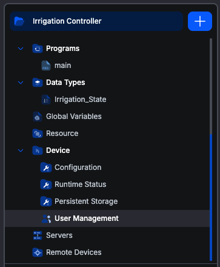
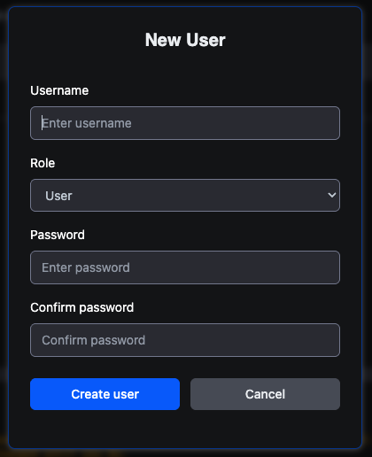
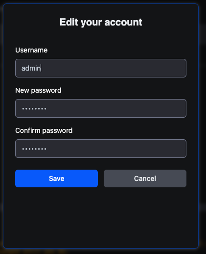

# User management

Every OpenPLC runtime keeps its own list of accounts. Signing in to a device is what lets the editor upload to it, start and stop it, watch variables and read its logs, so those accounts are the device's access control, not the platform's.

**User Management** is where you manage them. It lives under the **Device** branch of the project tree, and unlike most of what is in that tree it configures the **connected device** rather than the project.

Accounts belong to the device. They do not travel with the project, and two people working on the same project against different PLCs are administering two separate lists. Your Autonomy Edge account is a different thing entirely: it gets you into the platform and the editor, not into any particular PLC.

## When the screen appears

The leaf is in the tree when you are **connected to a device** running **runtime 4.1.9 or newer**. Older runtimes predate the account roles this screen manages.

Opening it without a connection shows: *"You are not connected to a runtime. Connect to the runtime to manage its users."*

## The first account

A brand-new runtime has no accounts, and until it has one anybody on the network could claim it. So the first time you connect to an empty device, the editor asks you to create an account instead of asking you to sign in.

**That first account is always an administrator**, whatever you pick afterwards. The device would otherwise have no one able to create the second account.

## The two roles

| | **Admin** | **User** |
|---|---|---|
| Sign in to the device | Yes | Yes |
| Upload a program | Yes | **Yes** |
| Start and stop the PLC | Yes | **Yes** |
| Read status, logs, scan statistics | Yes | Yes |
| Debug and force variables | Yes | **Yes** |
| View the account list | Yes | Yes |
| Create an account | Yes | No |
| Delete an account | Yes | No |
| Change another account's name or password | Yes | No |
| Change any account's role | Yes | No |
| Change **its own** name and password | Yes | Yes |
| [Retrieve the project stored on the device](retrieve-project) | Yes | No |

## The screen

The table lists every account on the device with its role. Your own account is marked **(you)**.

The **Actions** column shows only what you are allowed to do, so what you see depends on your role:

| | You are Admin | You are User |
|---|---|---|
| **+ New User** button | Shown | Hidden |
| Pencil on your own row | Yes | Yes |
| Pencil on someone else's row | Yes | Hidden |
| Bin on someone else's row | Yes | Hidden |
| Bin on your own row | **Never** | Never |

There is no bin on your own row for anyone, including an administrator. You cannot delete the account you are signed in as, which is what stops a device being left with no way in.

## Creating an account

Admin only. Click **+ New User**.

Fill in the username, pick the **Role**, and enter the password twice. **The role defaults to `User`**, which is the right default: an account gets administrative rights only when someone deliberately grants them.

Usernames must be unique on the device.

## Editing an account

Click the pencil. What the dialog offers depends on whose row it is.

**Your own account** opens as *"Edit your account"* and lets you change your username and password. It does **not** offer the Role field, so you cannot promote or demote yourself; another administrator has to do that.

The password fields start filled with a masked placeholder so the form looks populated without holding a real password. Nothing is submitted until you actually type in them.

**Changing your own password asks for your current one.** The extra field appears as soon as you start typing a new password, rather than sitting on the form from the start. This is what stops someone who has walked up to an unlocked session from silently taking the account over.

> **Changing your own password signs you out.** The device revokes the session that made the change, so an old token cannot outlive it. The editor drops back to the not-connected state and you sign in again with the new password. Expect it; nothing has gone wrong.

**Someone else's account** opens as *"Edit user — name"* and, for an administrator, adds the **Role** dropdown. Changing another account's password does not require their current one, which is what makes an admin able to reset a forgotten password.

### The last administrator is protected

A device must keep at least one administrator, so the runtime refuses to demote the only one, answering *"Cannot demote the last remaining admin"*. Promote a second administrator first, then demote the original.

## Deleting an account

Admin only, and never your own. Click the bin and confirm.

Deleting an account does not disturb the running program. It only removes that account's ability to sign in.

## Related

- **[Connecting to runtimes](../connecting-to-runtimes)** for signing in and what a device session is.
- **[Runtime status](runtime-status)**, the other device-scoped screen, for what the device is and how it is running.
- **[Persistent storage](persistent-storage)**, which sits beside this screen in the tree but is a project setting rather than a device one.
- **[Retrieve a project from a PLC](retrieve-project)**, which requires an administrator account on the device.
