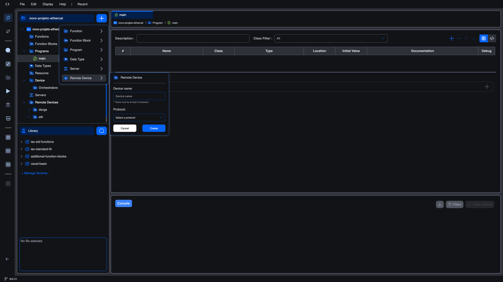
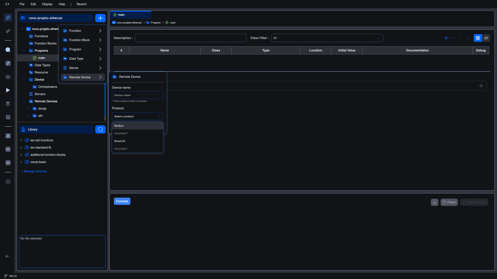

# EtherCAT

EtherCAT (Ethernet for Control Automation Technology) is a real-time industrial fieldbus that uses standard Ethernet hardware but replaces TCP/IP with a deterministic on-the-fly processing protocol. A single Ethernet frame travels around a daisy-chained ring of slaves, and each slave reads and writes its slice of process data as the frame passes through. Cycle times in the sub-millisecond range are routine, and a single segment can carry thousands of I/O points with predictable jitter.

Autonomy Edge ships an EtherCAT master plugin that lets a Runtime v4 deployment drive a segment of EtherCAT slaves directly from your IEC 61131-3 program. You upload the slave description files (ESI XML), scan the wire for the devices that are physically attached, map their input and output channels onto IEC located variables (`%IX`, `%QX`, `%IW`, `%QW`, …), and the runtime takes care of cyclic data exchange.

## When to use EtherCAT

EtherCAT is the right choice when one or more of the following apply:

- You need **deterministic, sub-millisecond cycle times**. Modbus and OPC-UA are request/response protocols layered on TCP. They cannot match EtherCAT's wire-level timing.
- You are connecting **many I/O points** (hundreds or thousands) to the same controller. EtherCAT amortises its overhead across the entire segment.
- You need to run **synchronised motion** across multiple drives. EtherCAT's distributed-clock mechanism keeps slave clocks within a few nanoseconds of each other.
- Your devices already speak EtherCAT. Beckhoff EL/EK terminals, drives from SEW/Lenze/Yaskawa/Bosch, encoders, valve banks, safety couplers, and so on.

If you only need to read a handful of registers from a sensor or VFD, [Modbus](../modbus/README) is simpler and more widely supported. If your priority is secure data exchange with enterprise systems rather than real-time control, [OPC-UA](../opc-ua/README) is the better fit. EtherCAT and the other protocols can coexist on the same project. Many deployments use EtherCAT for the field bus and OPC-UA for the SCADA uplink.

## Platform support

| Runtime | EtherCAT Master |
|---------|-----------------|
| Runtime v4 (Linux) | Yes |
| Runtime v3 | No |
| Arduino | No |

EtherCAT requires Runtime v4 running on a Linux host with a dedicated network interface card available to the master. See [Prerequisites](prerequisites) for hardware and operating-system requirements.

## Two editors, one bus

Configuring an EtherCAT segment uses **two distinct editor screens** in the project explorer:

| Where you click | Editor that opens | What you do there |
|-----------------|-------------------|-------------------|
| The bus node (e.g. `eth`) under **Remote Devices** | EtherCAT Bus Editor | Pick a NIC, scan the wire, manage the ESI repository, set master cycle time and watchdog |
| A slave child node under the bus | EtherCAT Slave Device Editor | View identification, set startup checks/timeouts/watchdog/distributed clocks, write SDO startup parameters, map channels to IEC variables |

The Bus Editor has three top-level tabs (**Bus**, **Repository**, **Advanced**). The Slave Device Editor has four top-level tabs (**Channel Mappings**, **Device Info**, **Configuration**, **Startup Parameters**).

## Adding an EtherCAT segment

To add an EtherCAT segment to your project:

1. Open your project in the Autonomy Edge editor.
2. In the project explorer panel on the left, click the blue **`+`** button next to the project name.
3. Select **Remote Device** from the menu that opens.

   

4. In the **Device name** field, enter a short identifier for the bus (e.g. `eth`, `axis_bus`, `field_io`). Names must be at least 3 characters.
5. Click the **Protocol** dropdown and choose **EtherCAT**.

   

6. Click **Create**.
7. The new bus appears under **Remote Devices** in the project tree. Click it to open the EtherCAT Bus Editor.

Slaves are added underneath the bus from inside the Bus Editor. Either by scanning a connected segment (**[Bus tab](bus-scan)**) or by picking devices from the ESI repository (**[Repository workflow](bus-repository)**). Each slave you add becomes a child node under the bus and opens its own **[Slave Device Editor](slave-channel-mappings)** when clicked.

## Documentation pages

### Setup

- **[Prerequisites](prerequisites)**: Hardware, operating system, NIC, cabling, and topology requirements
- **[Adding an EtherCAT segment](adding-ethercat)**: Walk-through of creating the bus entry in the project tree

### Bus Editor

- **[Bus tab](bus-scan)**: Network interface selection, live scan, and matching scanned devices to the ESI repository
- **[Repository tab](bus-repository)**: Uploading, browsing, and removing ESI XML files
- **[Advanced tab](bus-advanced)**: Master cycle time, task priority, watchdog timeout, and the bus enable toggle

### Slave Device Editor

- **[Channel Mappings](slave-channel-mappings)**: How PDO entries become IEC located variables and the address-collision warning
- **[Device Info](slave-info)**: Read-only identification fields
- **[Configuration](slave-configuration)**: Startup checks, addressing, timeouts, watchdog, distributed clocks
- **[Startup Parameters](slave-startup-params)**: One-shot SDO writes performed before the slave goes operational

### Operation

- **[Diagnostics](diagnostics)**: What the runtime status panel reports while the bus is running
- **[Worked example](example)**: End-to-end walkthrough with a Beckhoff EK1100 + EL1809 + EL2809 segment
- **[Troubleshooting](troubleshooting)**: Common UI and runtime issues with how to fix them

## What's next?

If you have never set up an EtherCAT bus before, start with the [Prerequisites](prerequisites) page to make sure your host is ready, then walk through the [Worked example](example) end to end. If you already have a bus running and just need to look up a specific field, jump straight to the relevant Bus or Slave Device Editor page.
