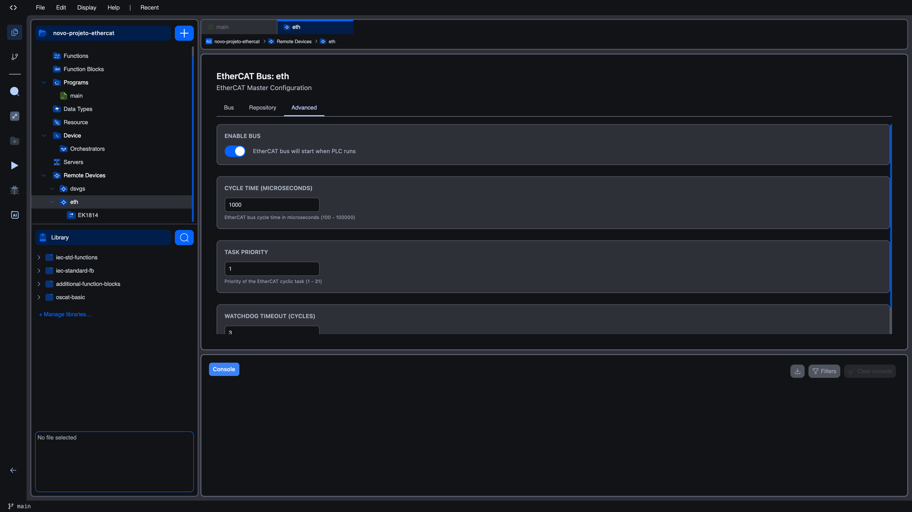

# Advanced tab

The **Advanced** tab is the third tab in the EtherCAT Bus Editor. It holds master-wide settings that apply to the whole segment: whether the bus runs at all, how often the master cycles the wire, the priority of the cyclic task, and how long the watchdog waits before declaring a stall.

The tab is divided into four cards, each with a single setting.

## Enable Bus

The first card, **ENABLE BUS**, has a single toggle.

| Toggle state | Meaning |
|--------------|---------|
| On (default) | `EtherCAT bus will start when PLC runs`. The master initialises the segment and brings slaves to OP whenever the PLC program runs. |
| Off | `EtherCAT bus is disabled`. The master will not touch the wire even if the PLC runs. Configured slaves stay in the project but are inactive. |

Use the disabled state to keep an EtherCAT configuration in your project while temporarily running without the bus, for example while developing logic in the simulator or while replacing field hardware.

## Cycle Time (microseconds)

The **CYCLE TIME (MICROSECONDS)** card sets how often the master sends a process-data frame around the segment.

| Property | Value |
|----------|-------|
| Default | `1000` µs |
| Minimum | `100` µs |
| Maximum | `100000` µs |
| Hint shown under the field | `EtherCAT bus cycle time in microseconds (100 - 100000)` |

If you type a value below the minimum or above the maximum, the editor clamps it on blur. `0` becomes `100`, `200000` becomes `100000`.

### How to choose

Cycle time is the most important number on this tab. Faster cycles mean tighter control loops but also more CPU load on the host and more EMC budget on the wire. The right value depends on the segment size, the host's CPU, and the application:

| Slave count | Recommended starting cycle |
|-------------|----------------------------|
| Up to 8 | 250 -- 500 µs |
| 8 -- 32 | 500 -- 1000 µs |
| 32 -- 64 | 1000 µs (default) |
| 64 -- 128 | 2000 µs |
| Over 128 | 4000 µs or more |

Motion control typically wants 250 -- 500 µs to keep the position loop tight; pure I/O acquisition is comfortable at 1000 -- 4000 µs. If the runtime reports cycle-time overruns in the [Diagnostics](diagnostics) panel, the cycle is too fast for the host. Increase it before tuning anything else.

## Task Priority

The **TASK PRIORITY** card sets the priority at which the master's cyclic task runs on the host operating system.

| Property | Value |
|----------|-------|
| Default | `1` |
| Minimum | `1` |
| Maximum | `31` |
| Hint shown under the field | `Priority of the EtherCAT cyclic task (1 - 31)` |

Higher numbers run at higher priority. The value is only useful if the host kernel actually grants priority. On a desktop kernel without real-time patches, the difference between `1` and `31` is small. On an industrial PC running PREEMPT_RT or similar, raising the priority makes the cyclic task less likely to be preempted by other workloads, which improves cycle-time jitter.

If you do not have a strong reason to change it, leave it at `1`.

## Watchdog Timeout (cycles)

The **WATCHDOG TIMEOUT (CYCLES)** card sets how many missed cycles the master tolerates before declaring the segment unhealthy and putting the slaves into the safe state.

| Property | Value |
|----------|-------|
| Default | `3` |
| Minimum | `1` |
| Maximum | `100` |
| Hint shown under the field | `Number of missed cycles before watchdog triggers (1 - 100)` |

The watchdog is expressed in **cycles**, not in milliseconds. With the default 1000 µs cycle, a watchdog of 3 means the master tolerates up to 3 ms without a successful round-trip before reacting. With a 250 µs cycle, 3 cycles means 0.75 ms.

| Application | Recommended watchdog (cycles) |
|-------------|-------------------------------|
| Slow I/O, tolerant to brief glitches | 5 -- 10 |
| General-purpose I/O (default) | 3 |
| Motion control, safety-critical | 1 -- 2 |

Lowering the watchdog catches faults faster but makes the bus more sensitive to one-off glitches such as a brief CPU stall on the host. Raising it makes the bus more forgiving but takes longer to react when something is genuinely wrong.

## Saving changes

Edits on the Advanced tab take effect the next time the runtime starts the bus. While the bus is running you can change the values, but the new settings only become active after a restart of the PLC program. The editor marks the workspace as **unsaved** as soon as you change any field; save the project (Ctrl+S) to persist the values into the project file.

## What's next?

- **[Bus tab](bus-scan)** to scan the segment and add slaves
- **[Channel Mappings](slave-channel-mappings)** to wire each slave's I/O onto IEC variables
- **[Diagnostics](diagnostics)** to monitor what the bus is doing at runtime
