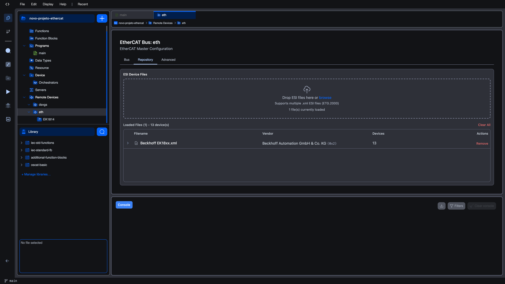
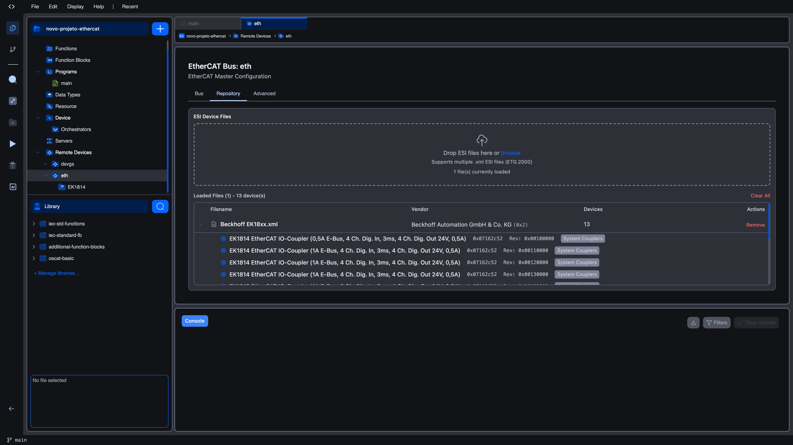

# Repository tab

The **Repository** tab is the second tab in the EtherCAT Bus Editor. It is where you upload, browse, and remove the **ESI XML** files that describe the slave devices in your segment. The editor matches scanned devices against this repository to figure out which ESI describes which physical slave.

The repository is saved per user account, not per project. Files you upload while working on one project remain available for every other project you open. There is no need to re-import the same vendor catalog every time you start a new bus.

## What ESI files are

ESI (EtherCAT Slave Information) is the standard machine-readable description of a slave device, defined by the EtherCAT Technology Group as standard ETG.2000. A single ESI XML can describe one device or an entire family. For example Beckhoff publishes one file per terminal series (`Beckhoff EL1xxx.xml`, `Beckhoff EL2xxx.xml`, …) covering hundreds of devices each.

ESI files are normally provided as `.xml` downloads on the manufacturer's website. The editor accepts the XML directly. There is no need to extract anything from a vendor archive other than the `.xml` file itself.

> **Supported format**: `.xml` ESI files conforming to the ETG.2000 schema. Each file may be up to 100 MB.

## Uploading ESI files

The top of the Repository tab is a drop zone labelled **ESI Device Files**. Inside the zone the prompt reads:

> Drop ESI files here or **browse**

The line below shows `Supports multiple .xml ESI files (ETG.2000)`, and once the repository has at least one file you also see `<N> file(s) currently loaded`.

To upload:

| Method | How |
|--------|-----|
| Drag and drop | Drag one or more `.xml` files from your file manager and drop them onto the zone. |
| File picker | Click anywhere in the zone (or the **browse** link) to open a standard file picker. You can select multiple files at once. |

Each file is parsed in turn. While parsing is in progress the zone shows a progress display: the current file name, the index out of the total (`3 / 14`), and a percentage. Files larger than 100 MB are rejected with a clear error.

If a file you upload has the same content as one already in the repository, the editor silently skips it. Duplicate uploads are safe to retry.

If parsing fails for one of the files, the others still load and a red collapsible banner appears under the zone that reads `<N> file(s) failed to parse`. Click the banner to expand it and read the per-file error. Use **Dismiss** to close the banner once you have noted the failures. Common causes: the file is not actually an ESI XML, the XML is malformed, or the schema is non-standard (for example an extracted firmware file).

## The loaded-files table

Below the upload zone, the **Loaded Files** table lists every ESI in the repository. The header reads `Loaded Files (<N>) - <M> device(s)`, where N is the file count and M the total number of slave devices described across all files. A **Clear All** link on the right empties the entire repository (use carefully. It removes every ESI you uploaded for your account, not just the ones used by this project).

| Column | Meaning |
|--------|---------|
| Expand chevron | Click to expand the row and see the devices contained in this ESI. |
| **Filename** | The file name as you uploaded it. A small file icon sits before the name. If the file produced any parse warnings, a yellow `<N> warning(s)` badge is shown to the right of the name. |
| **Vendor** | The vendor name extracted from the XML (e.g. `Beckhoff Automation GmbH & Co. KG`) followed by the vendor ID in hex in parentheses (e.g. `(0x2)`). |
| **Devices** | How many distinct slave devices are described in this ESI. |
| **Actions** | A **Remove** link that deletes this ESI from the repository. |

### Inspecting devices inside an ESI

Click the chevron to expand a row. Below the file row, one row per device is shown, indented and highlighted.

Each device row carries:

- A small grid icon followed by the **device name** as it will appear in the Bus tab.
- The **product code** in hex.
- The **revision** in hex (`Rev: 0x00120000`).
- An optional group badge (e.g. `System Couplers`) shown when the ESI groups its devices.

If parsing produced any warnings, a yellow row underneath lists them in plain text. Most warnings are harmless. For example, a warning about an unsupported optional element. But they are surfaced so you can decide whether to download a newer version of the ESI from the vendor.

## Per-revision handling

A single physical slave is uniquely identified by **vendor + product code + revision**. ESI files often contain multiple revisions of the same product code: when you re-add a Beckhoff EK1100 to a fresh bus, you can see four or five entries with the same name and product code but different revisions in the device browser.

When matching scanned devices to the repository, the editor looks for an exact revision match first, then falls back to the closest match within the same vendor and product code. If your scan returns a `No XML` badge for a device whose product code you can clearly see in the repository, the most likely cause is a revision gap. The slave on the wire reports a revision that no ESI in your repository covers. The fix is to download the latest ESI from the manufacturer's website and import it.

## Removing files

| Action | Where |
|--------|-------|
| Remove a single ESI | Click **Remove** on the right end of its row. |
| Remove every ESI | Click **Clear All** above the table. |

Removing an ESI does not break a project that already has slaves added from it. The slave configurations stay in your project file. However, the affected slaves will show as `No XML` after a future scan because the editor will no longer have the data needed to match them. If a slave still references an ESI you are about to delete, the editor will refuse the deletion and surface an error; remove the configured slave first, or simply leave the ESI in the repository.

## What's next?

Once your repository contains the ESI files for the slaves you intend to use, switch back to the [Bus tab](bus-scan) to scan the wire or browse the repository directly via the **Add Device** ➕ button.
