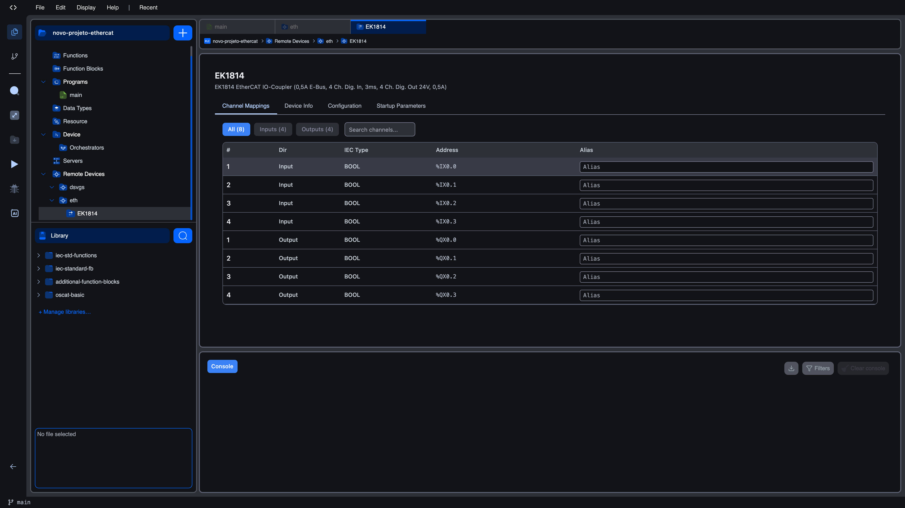
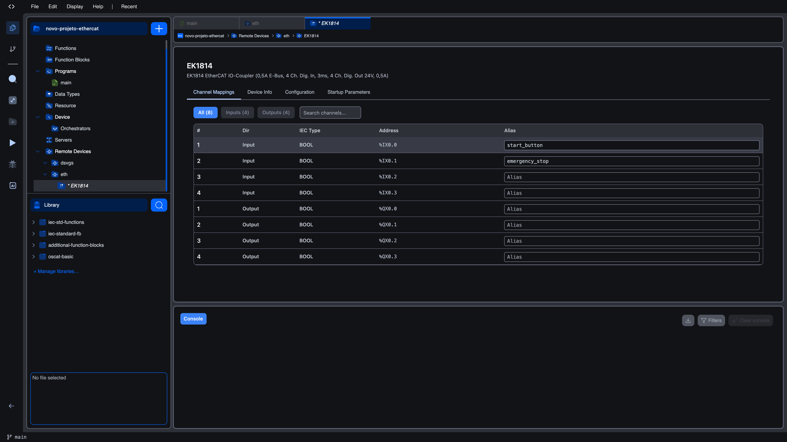

# Channel Mappings

The **Channel Mappings** tab is the first tab that opens when you click a slave in the project tree. It is the most-used part of the Slave Device Editor and the place where each PDO entry described by the slave's ESI XML is bound to an IEC 61131-3 located variable in your program.

The PDOs (TxPDO for inputs into the controller, RxPDO for outputs out of the controller) are read directly from the matched ESI. You do not pick them by hand. The editor lists every channel the device declares, ready to be referenced from your Ladder, ST, or FBD code.

## What gets pre-assigned

When you add a slave (either from a scan or from the [Repository](bus-repository)), the editor automatically:

1. Loads the channel definitions from the ESI XML.
2. Picks an IEC located variable for each channel based on its data type and direction.
3. Skips any address already in use by another slave on the same bus or by another remote device in the project.

The result is that as soon as a slave appears under your bus, it already has every channel mapped to a fresh, non-colliding IEC address. You can use the address immediately in your program.

If you ever change the order of slaves, replace a slave with a different model, or rebuild the project from a stale state, the editor checks for collisions every time channels are loaded and shifts new addresses up to avoid existing ones. **Existing mappings are never silently rewritten**: only newly-added channels move.

## The mapping table

The table fills the body of the tab. The toolbar above it has three filter pills and a search field.

### Direction filter

| Pill | Effect |
|------|--------|
| **All (N)** | Show every channel. N is the total channel count. |
| **Inputs (N)** | Show only channels with **Dir = Input** (TxPDO entries. Data flowing from the slave into the controller). |
| **Outputs (N)** | Show only channels with **Dir = Output** (RxPDO entries. Data flowing out of the controller to the slave). |

The numbers in parentheses always reflect the device's totals, not the filtered view.

### Search

The **Search channels…** field filters live as you type. It matches against the IEC type, the address, and the alias columns simultaneously, so you can type `BOOL`, `%QX0`, or part of an alias and get the matching channels.

### Columns

| Column | Meaning |
|--------|---------|
| **#** | A 1-based index per direction. The first input is `1`, the second input `2`, and so on; outputs start their own counter at `1` independently. |
| **Dir** | `Input` or `Output`. |
| **IEC Type** | The IEC 61131-3 type the channel maps to (`BOOL`, `BYTE`, `INT`, `UINT`, `DINT`, `UDINT`, `REAL`, …). |
| **Address** | The auto-assigned located variable (`%IX0.0`, `%QX0.3`, `%IW2`, `%QW7`, …). Read-only. |
| **Alias** | An optional human-readable name. Editable. |

### IEC type compatibility

The following table summarises how the editor maps each ESI channel type to an IEC 61131-3 type and a located-variable form. The exact mapping depends on the channel's `direction` and bit length declared in the ESI:

| ESI / channel type | IEC type | Address form (input) | Address form (output) |
|--------------------|----------|----------------------|-----------------------|
| 1-bit boolean | `BOOL` | `%IX<byte>.<bit>` | `%QX<byte>.<bit>` |
| 8-bit unsigned | `BYTE` / `USINT` | `%IB<n>` | `%QB<n>` |
| 8-bit signed | `SINT` | `%IB<n>` | `%QB<n>` |
| 16-bit unsigned | `UINT` / `WORD` | `%IW<n>` | `%QW<n>` |
| 16-bit signed | `INT` | `%IW<n>` | `%QW<n>` |
| 32-bit unsigned | `UDINT` / `DWORD` | `%ID<n>` | `%QD<n>` |
| 32-bit signed | `DINT` | `%ID<n>` | `%QD<n>` |
| 32-bit float | `REAL` | `%ID<n>` | `%QD<n>` |
| 64-bit float | `LREAL` | `%IL<n>` | `%QL<n>` |

The editor picks one address per channel; you do not need to compute byte offsets or bit positions yourself.

### The Alias column

Every row has an editable alias field. The alias is **purely cosmetic**: it does not change the address or how the channel is referenced from your program. Use it to remind yourself what each channel is wired to.

To set one, click the **Alias** cell of any row and type a name. The change is committed when you tab out of the cell.

Aliases appear next to the address in the variable picker on the editor's other tabs (search, debug). They make the rest of the project read like the wiring diagram rather than like raw IEC addresses.

## Auto-mapping for DS401 modules

Generic I/O devices that follow the **CANopen DS401** profile (most digital and analog I/O terminals do) are pre-mapped automatically by the editor. The 16 input bits of an EL1809 become 16 consecutive `%IX` addresses; the 16 output bits of an EL2809 become 16 consecutive `%QX` addresses; the analog channels of an EL3068 become four consecutive `%IW` addresses. There is no manual step to perform. The addresses appear filled in as soon as the slave is added.

For non-DS401 devices (servo drives, custom OEM modules), the channels still appear in the table with auto-assigned addresses, but the names you see in the **#** column may not match anything in the device's manual. Use Device Info and the manufacturer's documentation to identify which channel does what.

## Address-collision warnings

Because addresses are assigned per slave but the IEC address space is shared across the entire project, the editor watches for collisions:

- When a new slave is added, the editor checks every IEC address it is about to assign against every address already in use anywhere in the project (other EtherCAT slaves, Modbus servers, Modbus clients, and so on). The first non-conflicting slot is picked.
- If you remove a slave and re-add it later, the editor will not reuse addresses that another slave grabbed in the meantime.

You will not see a popup or banner. Collisions are prevented before they happen rather than reported after. The practical effect is that sometimes a freshly added slave's first channel sits at, say, `%IX2.0` instead of `%IX0.0` because two earlier slaves already occupied the lower bytes. This is normal.

If you want to reuse a specific address (for example because legacy Ladder code references it by name), remove the slave that currently owns the address first, then re-add the slave you want there.

## Saving and using the addresses

The mappings are part of the project file. Save the project (Ctrl+S) to persist them. Once saved, the addresses can be referenced from any POU. They appear in Monaco's auto-complete just like any other located variable.

Example: an EL1809 added at slave position 2 with default mappings gives you `%IX0.0` through `%IX1.7`, which a Ladder rung can wire to a TON timer simply by referencing `%IX0.0` as the IN.

## What's next?

- **[Configuration](slave-configuration)** to tune timeouts, watchdog, and distributed clocks
- **[Startup Parameters](slave-startup-params)** if the slave needs SDO writes (range select, mode select, …)
- **[Worked example](example)** for a full setup using EK1100 + EL1809 + EL2809 + EL3068
