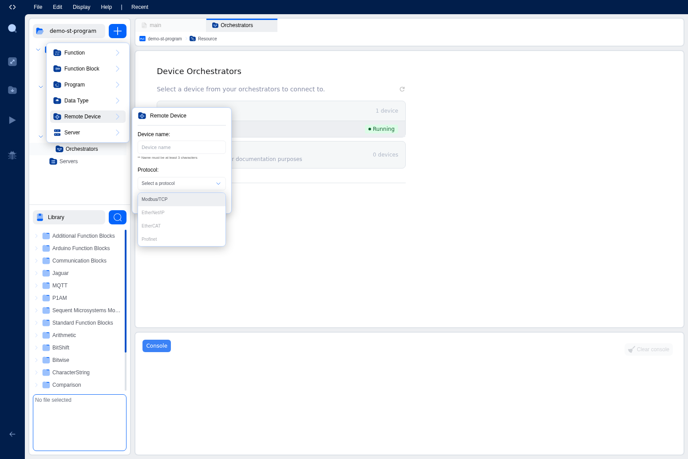
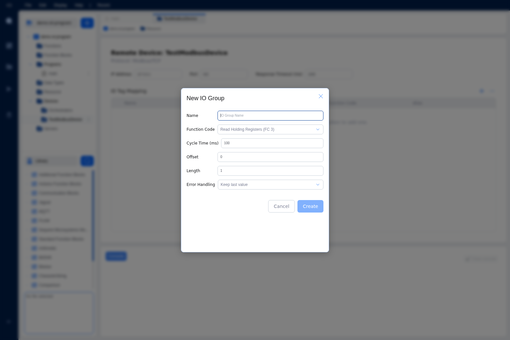
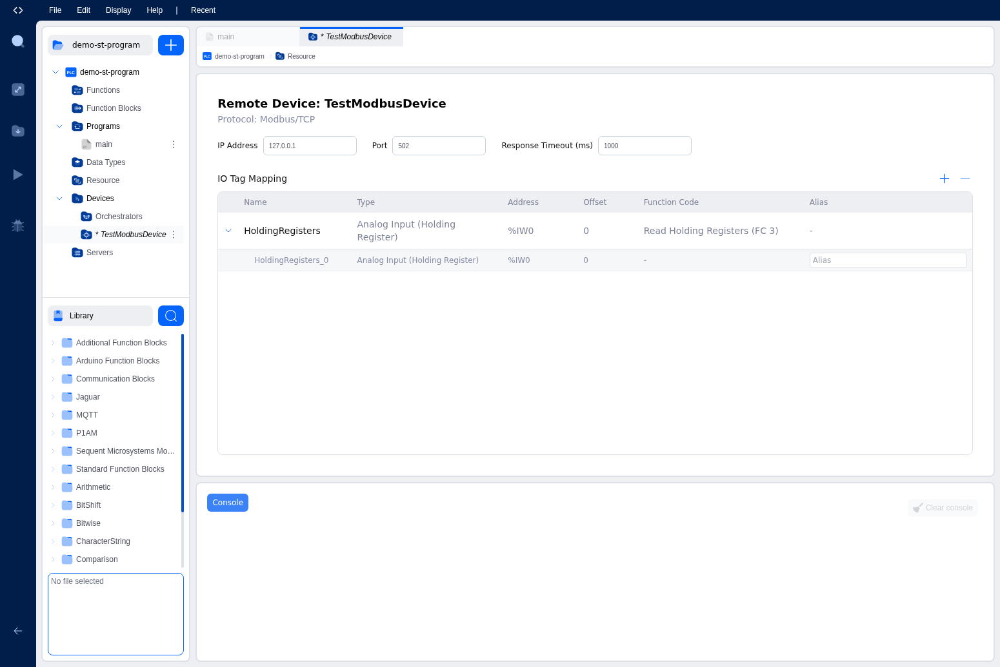

# Modbus Client Configuration

This page explains how to configure OpenPLC as a Modbus TCP client (master), allowing your PLC program to read and write data to external Modbus devices.

## Overview

When configured as a Modbus client, OpenPLC can poll data from external Modbus servers such as:

- Remote I/O modules
- Variable frequency drives (VFDs)
- Power meters and sensors
- Other PLCs with Modbus server capability

## Adding a Remote Device

To add a Modbus client configuration to your project:

1. In the project explorer, click the blue **+** button
2. Select **Remote Device** from the menu

3. Enter a name for your device and select **Modbus/TCP** as the protocol

4. Click **Create** to add the device
5. A new remote device entry will appear under the Devices folder
6. Click on the device entry to configure its settings

## Device Configuration

### Connection Settings

| Setting | Description | Default |
|---------|-------------|---------|
| Name | A descriptive name for the device | Remote Device |
| Host | IP address or hostname of the Modbus server | - |
| Port | TCP port of the Modbus server | 502 |
| Timeout | Connection timeout in milliseconds | 1000 |

### Error Handling

| Option | Description |
|--------|-------------|
| Keep Last Value | On communication error, retain the last successfully read value |
| Set to Zero | On communication error, set all values to zero |

## IO Groups

IO Groups define what data to read or write from the remote device. Each IO group specifies:

- **Function Code**: The Modbus function to use
- **Offset**: The starting address on the remote device
- **Length**: Number of registers or coils to read/write
- **IEC Location**: The starting IEC address to map the data to
- **Cycle Time**: How often to poll this data (in milliseconds)

### Supported Function Codes

| Code | Name | Operation |
|------|------|-----------|
| FC 1 | Read Coils | Read digital outputs from remote device |
| FC 2 | Read Discrete Inputs | Read digital inputs from remote device |
| FC 3 | Read Holding Registers | Read analog outputs/data from remote device |
| FC 4 | Read Input Registers | Read analog inputs from remote device |
| FC 5 | Write Single Coil | Write a single digital output |
| FC 6 | Write Single Register | Write a single analog value |
| FC 15 | Write Multiple Coils | Write multiple digital outputs |
| FC 16 | Write Multiple Registers | Write multiple analog values |

## Adding an IO Group

After creating a remote device, you can add IO Groups to define what data to read or write. The editor automatically assigns IEC locations to each IO Group.

### Step 1: Open the Remote Device Configuration

Click on your remote device in the project explorer to open its configuration panel. You'll see the connection settings and an empty IO Tag Mapping table.

### Step 2: Add a New IO Group

Click the **+** button above the IO Tag Mapping table to open the New IO Group dialog.

Configure the IO group settings:

| Field | Description |
|-------|-------------|
| Name | A descriptive name for this IO group |
| Function Code | The Modbus function to use (e.g., Read Holding Registers FC 3) |
| Cycle Time (ms) | How often to poll this data |
| Offset | The starting Modbus address on the remote device |
| Length | Number of registers or coils to read/write |
| Error Handling | What to do on communication errors (Keep last value or Set to zero) |

### Step 3: Automatic IEC Location Assignment

When you click **Create**, the editor automatically assigns an IEC location to the IO Group based on the function code selected:

- **Read functions (FC 1-4)**: Assigned to input addresses (%I)
- **Write functions (FC 5, 6, 15, 16)**: Assigned to output addresses (%Q)

In this example, a "HoldingRegisters" IO Group using FC 3 (Read Holding Registers) was automatically assigned the IEC location `%IW0`.

### Step 4: View Individual IO Points

Click the arrow next to an IO Group to expand it and see the individual IO points. Each point shows its assigned IEC address and allows you to set an optional alias.

The expanded view shows:
- **Name**: Auto-generated name (e.g., HoldingRegisters_0)
- **Type**: The data type (Analog Input for registers, Digital for coils)
- **Address**: The IEC address (%IW0, %IW1, etc.)
- **Alias**: Optional custom name for use in your PLC program

## Example Configuration

### Reading Temperature Sensors

To read 4 temperature values from a remote sensor module:

| Setting | Value |
|---------|-------|
| Host | 192.168.1.50 |
| Port | 502 |
| Function Code | FC 4 (Read Input Registers) |
| Offset | 0x0000 |
| Length | 4 |
| IEC Location | %IW100 |
| Cycle Time | 500 ms |

This configuration reads 4 input registers from the remote device every 500ms and maps them to %IW100 through %IW103 in your PLC program.

### Writing to a VFD

To control a variable frequency drive:

| Setting | Value |
|---------|-------|
| Host | 192.168.1.60 |
| Port | 502 |
| Function Code | FC 16 (Write Multiple Registers) |
| Offset | 0x0000 |
| Length | 2 |
| IEC Location | %QW200 |
| Cycle Time | 100 ms |

This configuration writes 2 holding registers to the VFD every 100ms, taking values from %QW200 and %QW201.

## Multiple Devices

You can add multiple remote devices to a single project. Each device operates independently with its own connection and polling schedule.

## Troubleshooting

### Communication Errors

1. Verify the remote device is powered and connected to the network
2. Check the IP address and port settings
3. Ensure the Modbus addresses are correct for your device
4. Increase the timeout value for slow networks

### Incorrect Data Values

1. Verify the function code matches what the remote device expects
2. Check the byte order (big-endian vs little-endian)
3. Ensure the data type interpretation is correct (signed vs unsigned)
4. Verify the offset addresses match the device documentation

### Polling Too Slow

1. Reduce the cycle time for critical data
2. Combine multiple reads into fewer IO groups where possible
3. Check network latency to the remote device
