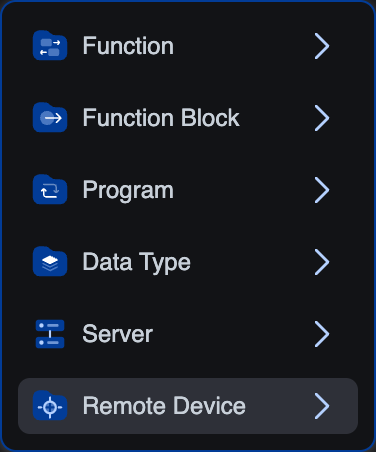
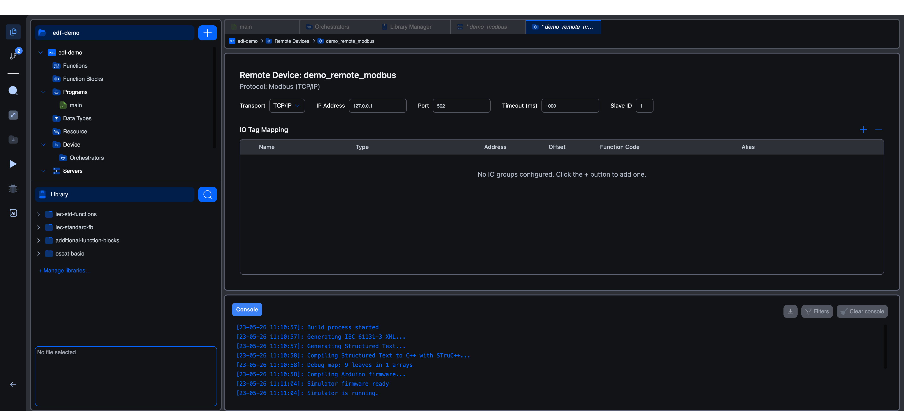
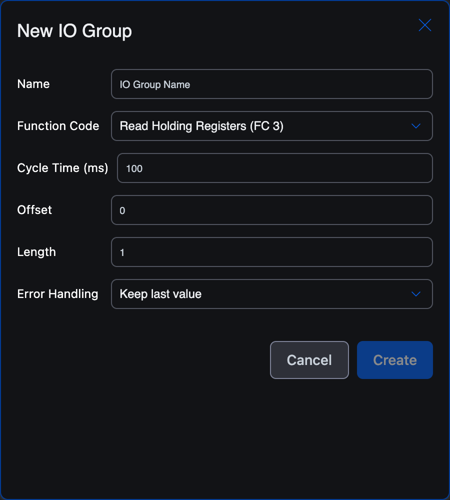
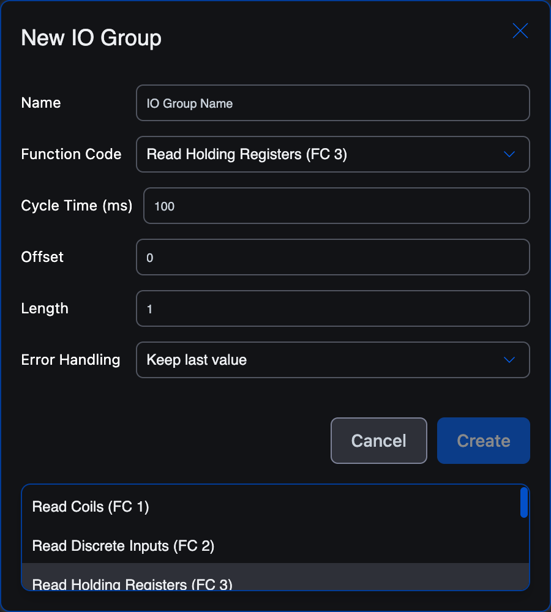
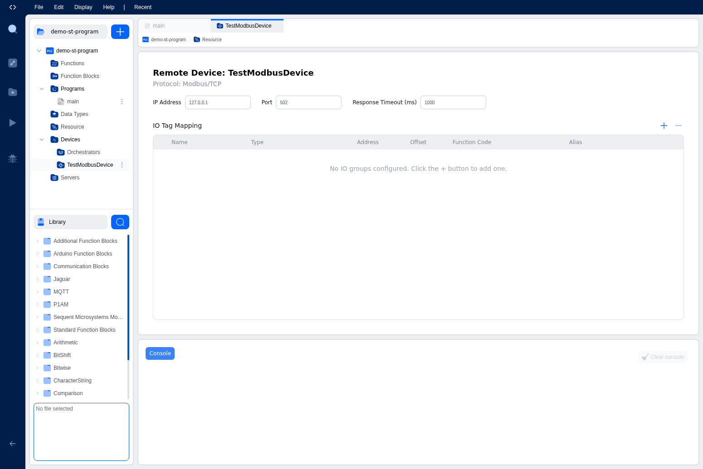
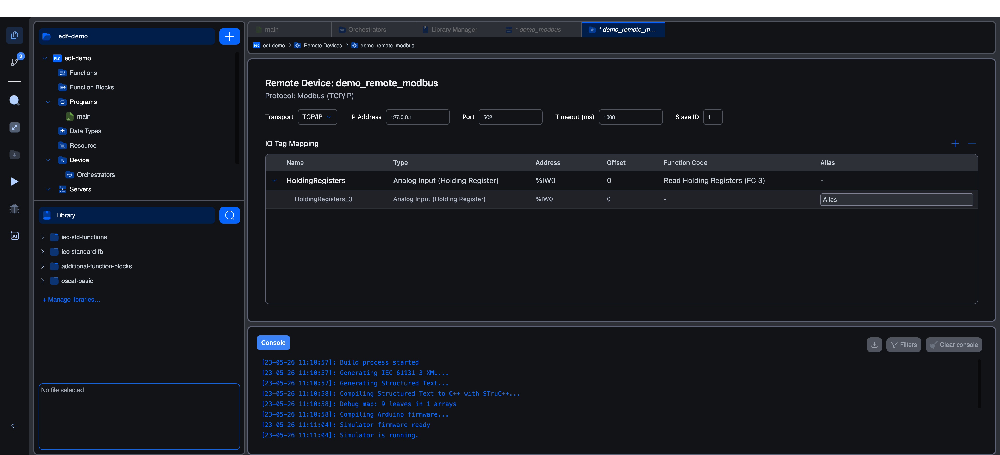
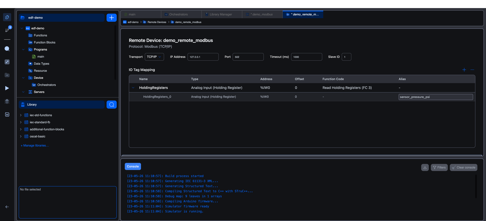

# Modbus remote device (master)

When you want your vPLC to **read** from or **write** to a remote Modbus slave, a field-level sensor, a meter, a VFD, an external PLC, a Modbus-RTU gateway, configure a **Modbus remote device**. The vPLC becomes the master; the remote is the slave.

This lives under **Device** in the project tree, not under **Servers** (that's the *slave*-side configuration covered on the **[Modbus server](server)** page).

## Add a remote device

1. Click the **`+`** button at the top of the project tree.
2. Pick **Remote Device** in the popover.
3. The dialog asks for a device name and a protocol. Pick **Modbus** from the dropdown.

    *(EtherNet/IP and PROFINET are visible but greyed out, they're not supported on this build yet)*

4. Name it (e.g. `flow_meter_1`) and click **Create**.

The new entry appears under **Device** in the tree. Click it to open the configuration editor.

> Modbus remote devices are gated to Runtime v4 and the Simulator. Other targets won't offer Modbus in the protocol picker.

## The editor at a glance



The top row is the **transport** (how the editor reaches the slave on the wire). Below is the **IO Tag Mapping** table, your I/O Groups and the points within them.

## Transport configuration

A single dropdown selects **TCP/IP** or **Serial (RTU)**.

### TCP/IP transport

| Field | Default | Notes |
|---|---|---|
| **IP Address** | `127.0.0.1` | IP or hostname of the remote slave. Reachable from the runtime's network. |
| **Port** | `502` | TCP port. Most slaves listen on 502; gateway hardware sometimes uses 1502 or 5020. |
| **Slave ID** (Unit ID) | `1` | Range `0…255` for TCP. Most native TCP slaves accept any ID; gateways use it to route to RS-485 sub-devices. |
| **Timeout (ms)** | `1000` | How long to wait for a response before counting the cycle as failed. Increase for slow slaves or congested networks. |

### Serial (RTU) transport

Switch the Transport dropdown to **Serial**. The fields change to:

| Field | Default | Notes |
|---|---|---|
| **Serial port** | first available | Combobox populated from `runtime.getSerialPorts`. The choices depend on what the vPLC's runtime can see (USB serial adapters, mapped serial ports). |
| **Baud rate** | `9600` | Pick from `9600 / 19200 / 38400 / 57600 / 115200`. Match the slave's setting. |
| **Parity** | `N` (none) | `N`one / `E`ven / `O`dd. |
| **Stop bits** | `1` | `1` or `2`. |
| **Data bits** | `8` | `7` or `8`. |
| **Slave ID** | `1` | RTU range is `1…247` (not 0). |
| **Timeout (ms)** | `1000` | Same meaning as TCP. RTU slaves typically need more time per turnaround. |

The single most common cause of "no RTU response" is a single mismatched parity / stop bit, they fail silently and the master just times out. Cross-check against the slave's data sheet.

## I/O Groups

An **I/O Group** is one polled Modbus operation against the remote: one function code, one address range on the remote, one polling cycle. A remote device usually has several groups, one for reading temperatures, one for reading pressures, one for writing setpoints, etc.

### Adding a group

Click the **`+`** in the IO Tag Mapping section's top-right. The **New IO Group** modal opens.



Field by field:

| Field | Notes |
|---|---|
| **Name** | Your label. The points inside the group are auto-named `<name>_0`, `<name>_1`, …, but you can rename them later. |
| **Function Code** | Pick one of the 6 supported codes (see below). Determines whether this group reads or writes, and what kind of memory it targets. |
| **Cycle Time (ms)** | How often the master issues this request. `100` is a reasonable default; `1000` is gentler on slow slaves. The runtime pipelines all groups; cycles don't need to be aligned. |
| **Offset** | The Modbus address on the **remote** where this read/write starts. The remote's address space, not yours. |
| **Length** | How many addresses to read/write per cycle. The runtime creates `Length` I/O points within the group. |
| **Error Handling** | What to do with the local mirror if a cycle fails: `Keep last value` (leave the local image untouched) or `Set to zero` (clear the mirror). Use `Keep last value` for HMIs that show last-known-good; use `Set to zero` for safety logic that should default-fail. |

### Function codes

The modal's Function Code dropdown lists six options:



| FC | Direction | Reads / Writes | Use when |
|---|---|---|---|
| **FC 1** Read Coils | Read | Bits | Polling on/off statuses (alarms, switch positions, control bits) from a remote |
| **FC 2** Read Discrete Inputs | Read | Bits, read-only | Polling sensor states the remote exposes as read-only (limit switches, photoelectric flags) |
| **FC 3** Read Holding Registers | Read | 16-bit | Polling integer/scaled-real values (temperatures, pressures, setpoint readbacks), **most common** |
| **FC 4** Read Input Registers | Read | 16-bit, read-only | Polling sensor analogs the remote exposes as read-only |
| **FC 5** Write Single Coil | Write | One bit per cycle | Toggling a single output (start/stop bit) |
| **FC 6** Write Single Register | Write | One 16-bit per cycle | Writing a setpoint or command word |

For **block writes** (Write Multiple Coils / Write Multiple Registers, FC 15 / FC 16), use multiple write groups, or stage values to a holding-register block on the remote that it then atomically applies.

### Worked example, polling a single holding register

A flow meter exposes its current reading at holding register `0` of slave ID `7` over Modbus RTU. Configure:

- **Transport**: Serial, with the meter's baud / parity settings.
- **Slave ID**: `7`.
- **New IO Group**: Name `flow`, Function Code `Read Holding Registers (FC 3)`, Cycle Time `500` ms, Offset `0`, Length `1`, Error Handling `Set to zero`.

Click **Create**. The group appears in the IO Tag Mapping table:



### Expanding a group to see its points

Click the chevron at the start of the group row to expand it. Each point inside the group gets its own row.



Per-point columns:

- **Name**: auto-generated as `<group>_<index>`. Rename to something meaningful.
- **Type**: derived from the group's function code. You typically don't edit this directly.
- **Address**: the **local IEC address** the remote value is mirrored into (or pulled from for writes). For an FC 3 group, the master writes incoming values into `%IW<n>` slots starting from offset 0.
- **Offset**: the per-point offset inside the group. For `Length=1` you only have offset 0.
- **Function Code**: only meaningful at the group level for reads/writes; per-point shown as `-`.
- **Alias**: your stable name for the point. Use this in your program instead of the bare IEC address.

### Setting an alias

Click the Alias field on a point row and type a name. Tab out to save.



Once you've set an alias, you can reference the variable in your program by alias, and if you later reorganise the group (insert points, change offsets), the variable's local `Location` follows the alias automatically. Without an alias, your program references the raw IEC address (`%IW0`), and if the address moves you have to track down every reference by hand.

This is the **producer-managed addressing** pattern, see **[Variables editor → Aliases](../../working-with-variables/variables-editor#aliases-producer-managed-addresses)** for the full mechanism.

## Multiple groups, mixed function codes

A typical remote-device configuration has several groups:

```
flow_meter:
  Group "readings"   FC 3 cycle 500ms  offset 0  length 8   → 8 holding registers
  Group "alarms"     FC 1 cycle 200ms  offset 100 length 16 → 16 coils
  Group "setpoint"   FC 6 cycle 1000ms offset 200 length 1  → write single register
```

Each group polls or pushes on its own cycle. The runtime serialises them, at any moment one request is in flight, with the others queued. Cycle times are a hint, not a hard guarantee; under load, slow cycles can be pushed back. If you're hitting timing trouble, raise cycle times rather than trying to align them precisely.

## How values land in your program

After the runtime starts, your program just reads the local mirror, either by the IEC address (`%IW0`) or by the alias you set (recommended). For read groups, the mirror is updated each cycle from the remote. For write groups, your program writes to the local address and the runtime ships the value to the remote at the next cycle.

This means your program treats remote I/O exactly the same as local I/O, same variables editor, same execution model. The Modbus master is invisible at the IEC level.

## Diagnostics

The console reports each group's first failure and recovery. While running, the **PLC Logs** tab (visible when connected to a vPLC) prints per-cycle failures and the slave's exception codes.

## Troubleshooting

**No Remote Device option in the popover.** The active target doesn't support Modbus master (capability gated on the runtime image). Use Runtime v4 or the Simulator.

**TCP timeouts.** Host or port unreachable. From a shell on the orchestrator host: `telnet <ip> 502` should connect. Check firewalls, NAT, and that you're using the right port.

**RTU never responds.** Match the serial parameters exactly, baud, parity, stop bits, data bits. A single mismatched bit silently drops every frame.

**Reading wrong values.** Modbus tools differ in coil/register numbering (some 1-based, some 0-based). The IEC address you bind is the *wire* address, coil 0, holding register 0. If your HMI shows "coil 1" for the same point, that's its display offset, not the wire address.

**Cycle time looks ignored.** Under load, the master queues. If cycle = 100 ms but a single round-trip is 200 ms because of a slow slave, you'll see ~200 ms intervals. Either accept the actual rate or move slow groups to a longer cycle so the fast ones don't queue behind them.

## What's next

- **[Modbus addressing](addressing)**: coil 8 vs. `%QX1.0`, holding-register layout.
- **[Modbus server](server)**: the slave side, hosted on this vPLC.
- **[Variables editor → Aliases](../../working-with-variables/variables-editor)**: how alias-tracked variables keep their bindings as groups change.
