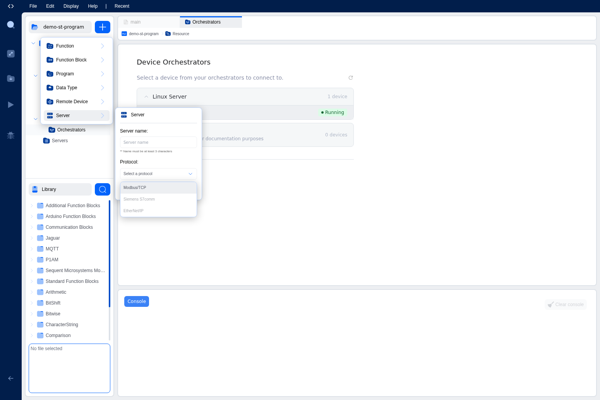

# Modbus Server Configuration

This page explains how to configure OpenPLC as a Modbus TCP server (slave), allowing external systems to read and write data to your PLC program.

## Overview

When configured as a Modbus server, OpenPLC exposes its internal memory buffers as Modbus registers. This allows SCADA systems, HMIs, and other Modbus clients to:

- Read digital and analog inputs from the PLC
- Read and write digital and analog outputs
- Access internal memory locations for data exchange

## Adding a Modbus Server

To add a Modbus server configuration to your project:

1. In the project explorer, click the blue **+** button
2. Select **Server** from the menu

3. Enter a name for your server and select **Modbus/TCP** as the protocol

4. Click **Create** to add the server
5. A new Modbus server entry will appear under the Servers folder
6. Click on the server entry to configure its settings

## Configuration Options

### Network Settings

| Setting | Description | Default |
|---------|-------------|---------|
| Enabled | Enable or disable the Modbus server | Enabled |
| Network Interface | The network interface to listen on | 0.0.0.0 (all interfaces) |
| Port | TCP port for Modbus connections | 502 |

### Buffer Mapping

The Modbus server exposes the following buffer sizes:

| Buffer Type | Maximum Size | IEC Address Range |
|-------------|--------------|-------------------|
| Coils | 8000 | %QX0.0 - %QX999.7 |
| Discrete Inputs | 8000 | %IX0.0 - %IX999.7 |
| Holding Registers | 1000 | %QW0 - %QW999 |
| Input Registers | 1000 | %IW0 - %IW999 |

## Address Mapping

The Modbus server maps IEC 61131-3 addresses to Modbus addresses as follows:

### Coils (FC 1, 5, 15)
- Modbus address 0-63 maps to %QX0.0 - %QX7.7
- Each coil corresponds to a single bit output

### Discrete Inputs (FC 2)
- Modbus address 0-63 maps to %IX0.0 - %IX7.7
- Each discrete input corresponds to a single bit input

### Holding Registers (FC 3, 6, 16)
- Modbus address 0-31 maps to %QW0 - %QW31
- Each register is a 16-bit word output

### Input Registers (FC 4)
- Modbus address 0-31 maps to %IW0 - %IW31
- Each register is a 16-bit word input

For detailed address mapping information, see [Modbus Addressing](addressing.md).

## Runtime v4 vs v3 Address Mapping Differences

OpenPLC Runtime v4 uses a simplified address mapping compared to v3. Understanding these differences is important when migrating projects or working with existing Modbus configurations.

### Runtime v4 (Current)

The v4 Modbus server plugin maps directly to the basic I/O buffers:

| Modbus Type | Buffer | Size | IEC Addresses |
|-------------|--------|------|---------------|
| Coils | bool_output | 64 | %QX0.0 - %QX7.7 |
| Discrete Inputs | bool_input | 64 | %IX0.0 - %IX7.7 |
| Holding Registers | int_output | 32 | %QW0 - %QW31 |
| Input Registers | int_input | 32 | %IW0 - %IW31 |

**Important**: Runtime v4 does NOT currently support memory locations (%M) through the Modbus server. Only direct I/O addresses (%I and %Q) are accessible via Modbus.

### Runtime v3 (Legacy)

The v3 Modbus server supported extended address ranges including memory locations:

| Modbus Address Range | IEC Addresses | Data Type |
|---------------------|---------------|-----------|
| 0 - 1023 | %QW0 - %QW1023 | 16-bit outputs |
| 1024 - 2047 | %MW0 - %MW1023 | 16-bit memory |
| 2048 - 4095 | %MD0 - %MD1023 | 32-bit memory (2 registers each) |
| 4096 - 8191 | %ML0 - %ML1023 | 64-bit memory (4 registers each) |

The v3 runtime also supported larger buffer sizes (8000 coils, 8000 discrete inputs, 8192 holding registers, 1024 input registers).

### Migration Considerations

When migrating from v3 to v4:

1. **Memory locations not supported**: If your v3 project used %MW, %MD, or %ML addresses through Modbus, you will need to restructure your program to use direct I/O addresses instead.

2. **Smaller buffer sizes**: The v4 runtime has smaller default buffer sizes. Ensure your Modbus client configurations do not exceed the v4 limits.

3. **Address remapping**: Modbus clients that previously accessed addresses above 31 (for registers) or 63 (for coils/discrete inputs) will need to be reconfigured.

## Example Configuration

A typical Modbus server configuration might look like:

- **Enabled**: Yes
- **Network Interface**: 0.0.0.0 (listen on all interfaces)
- **Port**: 502

This configuration allows any Modbus client on the network to connect to the PLC on the standard Modbus port.

## Security Considerations

The Modbus protocol does not include built-in authentication or encryption. Consider the following security measures:

- Use network segmentation to isolate the PLC network
- Configure firewalls to restrict access to the Modbus port
- Use VPNs for remote access to Modbus devices
- Monitor network traffic for unauthorized access attempts

## Troubleshooting

### Clients cannot connect

1. Verify the Modbus server is enabled
2. Check that the port is not blocked by firewalls
3. Ensure the network interface setting is correct
4. Verify the PLC program is running

### Incorrect data values

1. Verify the address mapping between client and server
2. Check that the correct function codes are being used
3. Ensure data types match (16-bit vs 32-bit values)
