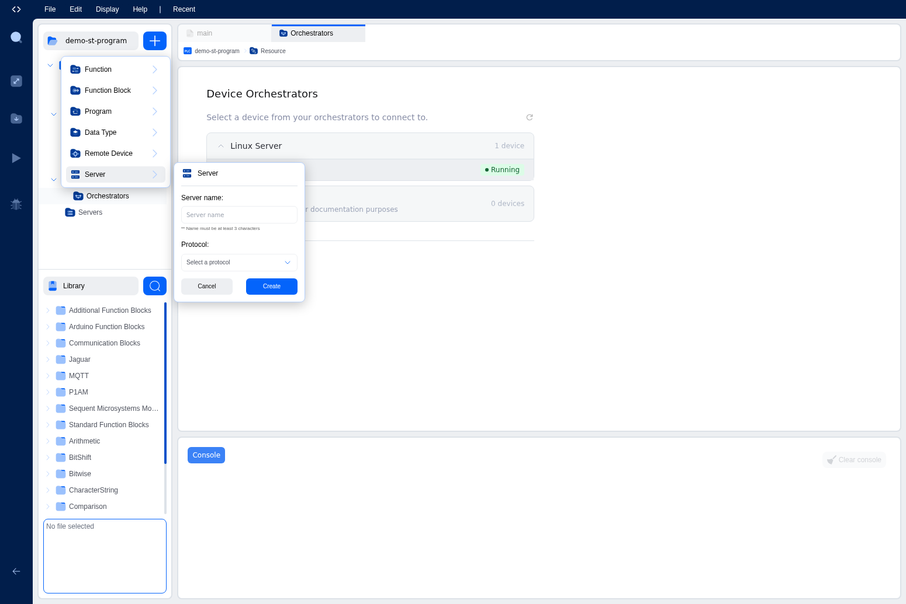
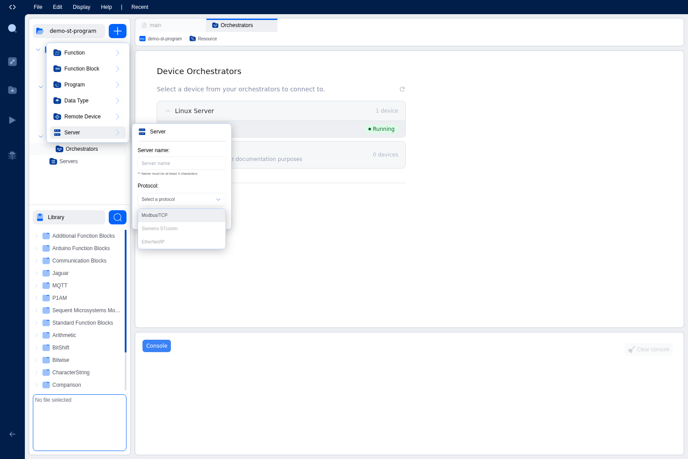

# Modbus Server Configuration

When configured as a Modbus server (slave), Autonomy Edge exposes the PLC's internal memory buffers as Modbus registers. This allows SCADA systems, HMIs, historians, and any other Modbus TCP client to read inputs, read and write outputs, and exchange data with your running PLC program. The Modbus server runs as a built-in plugin inside the runtime.

## Adding a Modbus Server

To add a Modbus server to your project in the Autonomy Edge web editor:

1. In the project explorer, click the **+** button.
2. Select **Server** from the dropdown menu.



3. Choose **Modbus/TCP** as the protocol and enter a descriptive name.



4. Click **Create**.
5. The new server entry appears under the **Servers** folder in the project tree.
6. Click the server entry to open its configuration panel.

## Network Settings

The configuration panel provides the following network settings:

| Setting | Description | Default |
|---------|-------------|---------|
| **Enabled** | Toggle to enable or disable the Modbus server at runtime | Enabled |
| **Network Interface** | IP address of the network interface to bind to. Use `0.0.0.0` to listen on all interfaces. | `0.0.0.0` |
| **Port** | TCP port number for incoming Modbus connections | `502` |

> **Port 502**: The standard Modbus TCP port is 502. On Linux systems, binding to ports below 1024 may require elevated privileges. If you encounter permission errors, either run the runtime with appropriate privileges or choose a port above 1024 (e.g., 1502).

## Buffer Mapping

The Modbus server exposes four data areas, each backed by an internal PLC buffer. You can configure the maximum size of each area in the server settings:

| Buffer Type | Modbus Function Codes | Default Maximum | IEC Address Range |
|-------------|----------------------|-----------------|-------------------|
| **Coils** | FC 1 (Read), FC 5 (Write Single), FC 15 (Write Multiple) | 8000 | `%QX0.0` -- `%QX999.7` |
| **Discrete Inputs** | FC 2 (Read) | 8000 | `%IX0.0` -- `%IX999.7` |
| **Holding Registers** | FC 3 (Read), FC 6 (Write Single), FC 16 (Write Multiple) | 1000 | `%QW0` -- `%QW999` |
| **Input Registers** | FC 4 (Read) | 1000 | `%IW0` -- `%IW999` |

The maximum values represent the upper bound of the addressable range. For example, with 8000 coils you can address individual bits from `%QX0.0` through `%QX999.7` (1000 bytes x 8 bits = 8000 bits).

## Address Mapping Summary

The Modbus server maps each Modbus address directly to an IEC 61131-3 located variable:

| Modbus Data Type | Modbus Address Range | IEC Address Range | Size per Point |
|------------------|---------------------|-------------------|----------------|
| Discrete Inputs | 0 -- 7999 | `%IX0.0` -- `%IX999.7` | 1 bit |
| Coils | 0 -- 7999 | `%QX0.0` -- `%QX999.7` | 1 bit |
| Input Registers | 0 -- 999 | `%IW0` -- `%IW999` | 16 bits |
| Holding Registers | 0 -- 999 | `%QW0` -- `%QW999` | 16 bits |

For bit addresses, the formula is:

```
Modbus Address = (Byte * 8) + Bit
```

For example, `%IX5.3` corresponds to Modbus discrete input address `(5 * 8) + 3 = 43`.

For register addresses, the mapping is one-to-one: `%IW25` corresponds to Modbus input register 25.

For detailed mapping tables and multi-register data types, see [Modbus Addressing](addressing).

## Runtime v4 vs. v3 Differences

The Modbus server implementation differs significantly between Runtime v4 and v3. If you are migrating an existing project, review these differences carefully.

### Runtime v4 (Current)

Runtime v4 uses a streamlined Modbus server plugin that maps directly to the basic I/O buffers:

| Modbus Type | Internal Buffer | Effective Size | IEC Addresses |
|-------------|----------------|----------------|---------------|
| Coils | `bool_output` | 64 bits | `%QX0.0` -- `%QX7.7` |
| Discrete Inputs | `bool_input` | 64 bits | `%IX0.0` -- `%IX7.7` |
| Holding Registers | `int_output` | 32 words | `%QW0` -- `%QW31` |
| Input Registers | `int_input` | 32 words | `%IW0` -- `%IW31` |

**Important limitation**: Runtime v4 does **not** support memory locations (`%M` addresses) through the Modbus server. Only direct I/O addresses (`%I` and `%Q`) are accessible via Modbus. If your application requires sharing internal variables with external systems, consider using the [OPC-UA server](../opc-ua/README) instead, which supports exposing any project variable.

### Runtime v3 (Legacy)

The v3 Modbus server supported extended address ranges, including memory locations:

| Modbus Address Range | IEC Addresses | Data Type |
|---------------------|---------------|-----------|
| Coils 0 -- 7999 | `%QX0.0` -- `%QX999.7` | 1-bit outputs |
| Discrete Inputs 0 -- 7999 | `%IX0.0` -- `%IX999.7` | 1-bit inputs |
| Holding Registers 0 -- 999 | `%QW0` -- `%QW999` | 16-bit outputs |
| Holding Registers 1000 -- 2023 | `%MW0` -- `%MW1023` | 16-bit memory |
| Holding Registers 2024 -- 4047 | `%MD0` -- `%MD1023` | 32-bit memory (2 registers each) |
| Holding Registers 4048 -- 8143 | `%ML0` -- `%ML1023` | 64-bit memory (4 registers each) |
| Input Registers 0 -- 1023 | `%IW0` -- `%IW1023` | 16-bit inputs |

### Migration Considerations

When migrating a project from Runtime v3 to v4:

1. **Memory locations are not accessible via Modbus**: If your v3 project exposed `%MW`, `%MD`, or `%ML` variables through Modbus, you must restructure your program to use direct I/O addresses (`%QW`, `%QD`) or switch to OPC-UA for those data points.

2. **Smaller default buffer sizes**: The v4 runtime has smaller I/O buffers (64 bits for coils/discrete inputs, 32 words for registers). Verify that your Modbus clients do not request addresses beyond these limits.

3. **Address remapping required**: Any Modbus client that previously accessed register addresses above 31 or coil/discrete input addresses above 63 will need reconfiguration.

4. **Configuration file format**: The v4 server exports its configuration as `modbus_slave.json` inside the program package. The format differs from v3.

## Example Configuration

A typical Modbus server setup for connecting a SCADA system:

```
Server Name:       SCADA_Interface
Enabled:           Yes
Network Interface: 0.0.0.0
Port:              502
Max Coils:         8000
Max Discrete In:   8000
Max Holding Reg:   1000
Max Input Reg:     1000
```

With this configuration, any Modbus TCP client on the network can connect to port 502 and access the full range of PLC I/O data.

## Security Considerations

The Modbus TCP protocol does not include authentication or encryption. All data is transmitted in plaintext. To protect your system:

- **Network segmentation**: Place PLCs and Modbus devices on a dedicated industrial network, isolated from the corporate IT network.
- **Firewall rules**: Restrict access to port 502 to known SCADA/HMI IP addresses.
- **VPN**: Use a VPN tunnel for any remote Modbus access over untrusted networks.
- **Monitoring**: Log and monitor Modbus connections for unauthorized access attempts.

If your application requires secure, authenticated communication, consider using the [OPC-UA server](../opc-ua/README), which provides built-in encryption, certificate-based authentication, and role-based access control.

## Troubleshooting

### Clients Cannot Connect

1. Verify the Modbus server is enabled in the configuration panel.
2. Confirm the runtime is running and the PLC program is loaded.
3. Check that port 502 (or your custom port) is not blocked by a firewall.
4. If using a specific network interface, ensure the IP address is correct and the interface is up.
5. Test connectivity with a Modbus diagnostic tool (e.g., ModRSsim2, QModMaster, or `mbpoll`).

### Clients Connect but Read Incorrect Values

1. Verify the address mapping between your client configuration and the server. Remember that Autonomy Edge uses 0-based addressing.
2. Confirm you are using the correct function code for the data type you want to access.
3. For multi-register values (32-bit or 64-bit), ensure your client is configured for big-endian byte order.
4. Check that the IEC variables are actually being written by your PLC program.

### Stale or Unchanging Data

1. Confirm your PLC program is running (not stopped or in error).
2. Verify that the program logic is actually updating the variables mapped to the Modbus addresses.
3. Check the scan cycle time of your PLC program. Very fast Modbus polling may read the same value multiple times per scan cycle.

## What's Next?

- **[Modbus Client Configuration](client)**: Configure polling of external Modbus devices
- **[Modbus Addressing](addressing)**: Full address mapping tables and calculation formulas
- **[OPC-UA Server](../opc-ua/README)**: Secure, modern alternative to Modbus for data exchange
