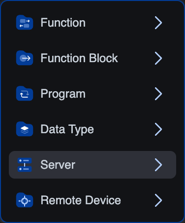
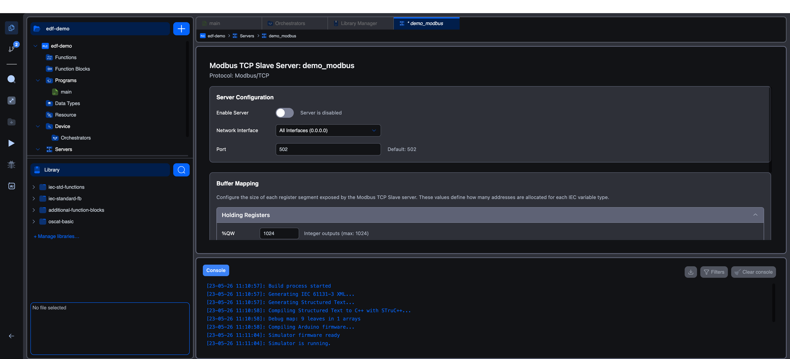
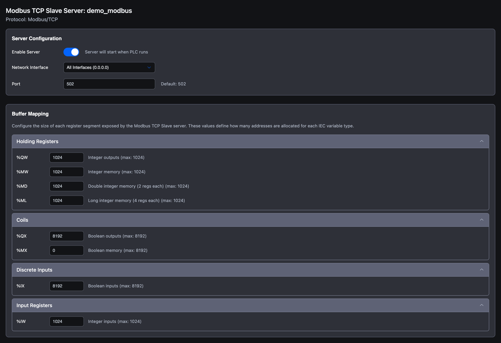

# Modbus server

The Modbus server (slave) exposes parts of the PLC's memory image as **Modbus addresses** that any Modbus TCP client (SCADA, HMI, historian) can read or write. The server runs as a plugin inside the OpenPLC runtime on your vPLC. There's nothing to install; you only configure it.

## Add a Modbus server to your project

1. In the project tree, click the **`+`** button at the top.
2. Pick **Server** in the popover.

   

3. A small **Server** dialog appears: type a name (at least 3 characters), pick the protocol.

    *(the protocol dropdown lists Modbus/TCP, Siemens S7comm, OPC-UA, and EtherNet/IP, the last one is greyed out as not yet supported on this build)*

4. Click **Create**.
5. The new server appears under **Servers** in the project tree. Click it to open the configuration editor.

## Server Configuration

The top section of the editor.

| Field | Default | Notes |
|---|---|---|
| **Enable Server** | off | Toggle on to make the server start when the PLC runs. The helper text reads "Server is disabled" when off and "Server will start when PLC runs" when on. Leave it off until the rest of the configuration is complete. |
| **Network Interface** | `All Interfaces (0.0.0.0)` | Picks the IP the server binds to. Other options include `Localhost (127.0.0.1)` for local-only access. |
| **Port** | `502` | Standard Modbus TCP port. Ports below 1024 may need extra privileges on Linux; if the runtime can't bind, try `1502`. |



## Buffer Mapping

This is where you decide **which slices of the PLC's memory image are exposed** as Modbus registers and coils. Four accordion sections, one per Modbus block type (Holding Registers, Coils, Discrete Inputs, Input Registers). Each lets you pick how many IEC items of each segment you want to expose; the editor lays the segments out sequentially within their Modbus block.



### Holding Registers (FC 3 / 6 / 16)

Read/write 16-bit registers. Four IEC segments laid out in this order:

| IEC | Size each | Max | Used for |
|---|---|---|---|
| `%QW` | 1 register | 1024 | Integer outputs your program writes |
| `%MW` | 1 register | 1024 | Integer memory shared between scans |
| `%MD` | **2 registers** | 1024 | 32-bit doubles |
| `%ML` | **4 registers** | 1024 | 64-bit longs |

So with the defaults all at 1024, the first `%QW0` lands at Modbus holding register 0, `%MW0` at 1024, `%MD0` (which takes 2 registers) at 2048, `%ML0` (which takes 4 registers) at 4096.

### Coils (FC 1 / 5 / 15)

Read/write single bits. Two IEC segments:

| IEC | Size each | Max | Used for |
|---|---|---|---|
| `%QX` | 1 bit | 8192 | Boolean outputs |
| `%MX` | 1 bit | 8192 | Boolean memory |

Bit addresses use `byte.bit` notation. `%QX0.0` is bit 0 (Modbus coil 0), `%QX0.7` is bit 7 (coil 7), `%QX1.0` rolls over to bit 8 (coil 8). This is the most common source of "why is my coil offset wrong?" confusion, see **[Modbus addressing](addressing)** for the full table.

### Discrete Inputs (FC 2)

Read-only single bits. One segment, `%IX`, capped at 8192 bits.

### Input Registers (FC 4)

Read-only 16-bit registers. One segment, `%IW`, capped at 1024.

## Address Mapping Reference

Below the Buffer Mapping accordion there's an **Address Mapping Reference** section that the editor **computes live** from your current segment counts. If you've changed any of the defaults, that table is the source of truth for what an external Modbus client will actually see. Always consult it before configuring an external client.

## How clients connect

Once the server is enabled and the PLC is running, any standard Modbus TCP client can reach it at the vPLC's IP on the configured port. Modbus TCP has no authentication, if you need access control, firewall the port or use a VLAN.

For testing, [`mbpoll`](https://github.com/epsilonrt/mbpoll) is a quick CLI client:

```bash
# Read coil 0 from vPLC at 192.168.1.50, port 502
mbpoll -t 0 -r 0 192.168.1.50

# Write 1 to coil 8 (the first bit of %QX1.x)
mbpoll -t 0 -r 0 -1 192.168.1.50 1

# Read holding register 0 (a 16-bit %QW0)
mbpoll -t 4 -r 0 -1 192.168.1.50
```

Worked example end-to-end: **[Modbus slave: expose digital outputs](../../examples/modbus-slave-outputs)**.

## Troubleshooting

**Modbus is not in the protocol dropdown.** Your target doesn't support a Modbus TCP server. The capability is exposed on Runtime v4 and the Simulator.

**Connection refused from a client.** Verify the runtime is running (the **Play** button in the activity bar is the toggle). On Linux, ports below 1024 need elevated privileges, switch to `1502` if you're not running the runtime as root.

**Writes don't land in the PLC.** Check that the variable's `Location` (in the variables editor) actually falls inside an exposed segment range. Open the **Address Mapping Reference** to confirm the variable's IEC address has a Modbus address assigned.

**Reads always return zero.** Same root cause, the address is outside the exposed segment, or the segment count is `0`. Bump the relevant `%QX` / `%QW` / `%MX` / `%MW` count and rebuild.

## What's next

- **[Modbus addressing](addressing)**: the canonical mapping rule with worked examples.
- **[Modbus remote device](client)**: configure your vPLC as a master reading remote slaves.
- **Worked example: [Modbus slave: expose digital outputs](../../examples/modbus-slave-outputs)**: toggle `%QX0.0` every two seconds and read coil 0 from `mbpoll`.
