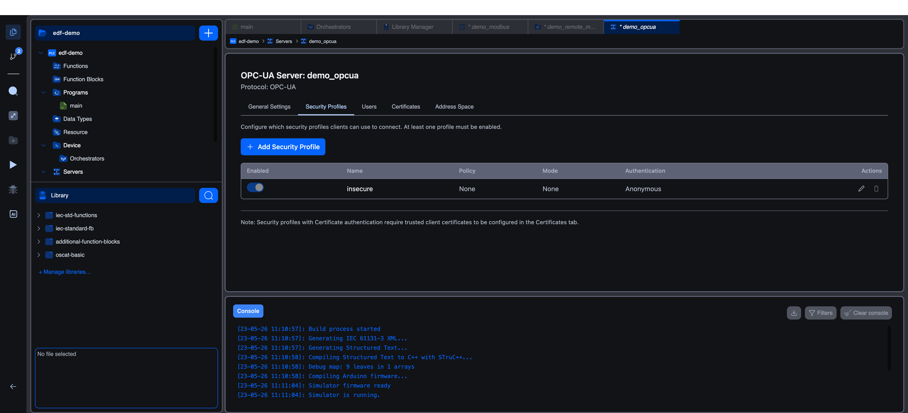

# Security Profiles

The **Security Profiles** tab defines the combinations of encryption, signing, and authentication that clients may use when they connect. Each profile is a separate row, and a client must match exactly one profile (policy + mode + at least one accepted authentication method) to be allowed in.

The on-screen description reads: *"Configure which security profiles clients can use to connect. At least one profile must be enabled."*

## Default Profile

When you create an OPC-UA server, Autonomy Edge adds a single profile named **`insecure`** with these values:

| Field | Value |
|-------|-------|
| Policy | `None` |
| Mode | `None` |
| Authentication | `Anonymous` |

A yellow inline warning appears under this profile: *"Warning: No encryption or authentication. Use only for development/testing."*

The toggle and **Delete** button are disabled while `insecure` is the only enabled profile, so you cannot accidentally lock yourself out. To remove it, first add a second profile and enable it.

## Profile Card Layout

Each profile in the list shows:

- A **toggle** to enable or disable it. The last enabled profile cannot be turned off. At least one profile must remain enabled.
- The profile **name** in bold.
- An **Edit** button that opens the profile editor.
- A **Delete** button that removes the profile (disabled when only one profile exists).
- The current **Policy**, **Mode**, **Authentication** methods, and a one-line description.

A note at the bottom of the tab reads: *"Note: Security profiles with Certificate authentication require trusted client certificates to be configured in the Certificates tab."*

## Adding or Editing a Profile

Click **+ Add Security Profile** at the top of the tab to open the profile editor. The same modal also opens when you click **Edit** on an existing profile, with the title changing from `Add Security Profile` to `Edit Security Profile`.

### Profile Name

| Field | Description |
|-------|-------------|
| **Profile Name** | Unique identifier for this profile. Required, maximum 64 characters. The inline hint reads `Unique identifier for this profile`. Names are case-insensitive: `Secure` and `secure` collide. |

### Enabled

A toggle that controls whether the profile is active. Disabled profiles remain in the list but reject all client connections that match them.

### Security Policy

The Security Policy combobox offers four options:

| Option (as shown in the UI) | When to Use |
|-----------------------------|-------------|
| **None (No Security)** | Local testing only. No encryption and no signing. The Security Mode is forced to `None` and only Anonymous authentication is allowed. |
| **Basic128Rsa15** | Legacy clients that do not support SHA-256. RSA-15 is now considered weak; avoid for new deployments. |
| **Basic256** | Stronger than Basic128Rsa15 but still uses SHA-1. Use only when the client cannot be upgraded. |
| **Basic256Sha256 (Recommended)** | The modern default. AES-256 with SHA-256 signing. Use this for any production deployment. |

### Security Mode

The Security Mode combobox offers up to two options, depending on the selected policy:

| Option (as shown in the UI) | Effect |
|-----------------------------|--------|
| **Sign Only** | Messages are digitally signed but not encrypted. Tamper-evident, but anyone on the wire can read the data. |
| **Sign and Encrypt** | Messages are signed and encrypted. The recommended setting for any policy other than `None`. |

When the policy is `None`, the dropdown is disabled and the helper text reads: *"Security Mode is fixed to 'None' when Security Policy is 'None'."* When you change the policy from `None` to a real policy, the editor automatically switches Mode to `Sign and Encrypt`.

### Authentication Methods

This section uses three checkboxes. You must enable at least one.

| Checkbox | Description | Notes |
|----------|-------------|-------|
| **Anonymous** | No credentials required. Helper text: *"No authentication required."* | Only available when the Security Policy is `None`. With any other policy the box is disabled and the helper text changes to *"Only available with Security Policy 'None'."* |
| **Username / Password** | Clients send a username and password verified against the [Users](users) tab. Helper text: *"Users must be configured in the Users tab."* | Becomes the default when you switch from `None` to a real policy. |
| **Certificate** | Clients present an X.509 certificate that must be in the trusted list. Helper text: *"Client certificates must be added to trusted list."* | Requires entries in the **Trusted Client Certificates** list. See [Certificates](certificates). |

### Validation

If the form is incomplete, an error list appears above the buttons and **Add Profile** / **Save Changes** stays disabled. The validation rules surfaced in the UI are:

- *"Profile name is required"*
- *"Profile name must be 64 characters or less"*
- *"A profile with this name already exists"*
- *"Security Mode must be 'None' when Security Policy is 'None'"*
- *"Security Mode cannot be 'None' when using a security policy"*
- *"Anonymous authentication is only available with Security Policy 'None'"*
- *"At least one authentication method is required"*

### Saving

Click **Add Profile** (new) or **Save Changes** (edit) to apply. **Cancel** discards the changes and closes the modal.

## Recommended Profiles

### Production

A typical secure deployment uses one strong profile and disables `insecure`:

| Profile | Policy | Mode | Authentication |
|---------|--------|------|----------------|
| `secure_password` | `Basic256Sha256 (Recommended)` | `Sign and Encrypt` | `Username / Password` |
| `secure_certificate` | `Basic256Sha256 (Recommended)` | `Sign and Encrypt` | `Certificate` |

If you only need one entry point, a single profile with both `Username / Password` and `Certificate` checked is sufficient.

### Development

For local testing where you do not yet have certificates or user accounts, the default `insecure` profile is acceptable. Disable it again before connecting the runtime to a shared network.

## What's Next?

- **[Users](users)**: create the password-based or certificate-bound accounts referenced by your profiles.
- **[Certificates](certificates)**: supply the server certificate and the trusted client certificates needed for `Certificate` authentication.
- **[Address Space](address-space)**: choose which variables clients are allowed to read or write.
