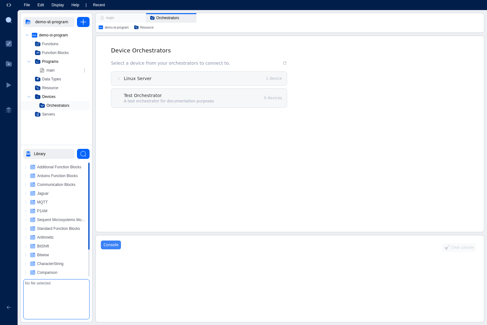
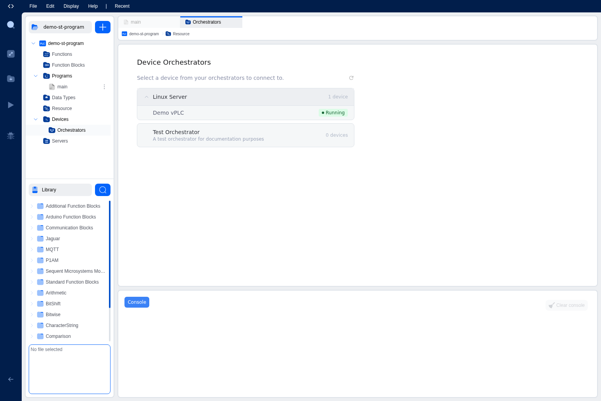
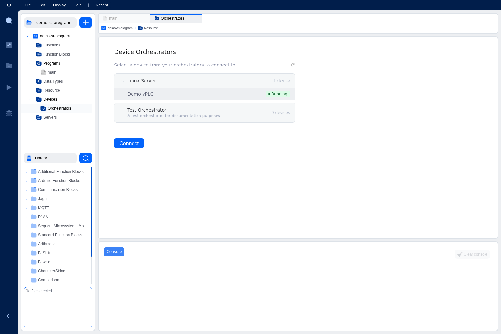
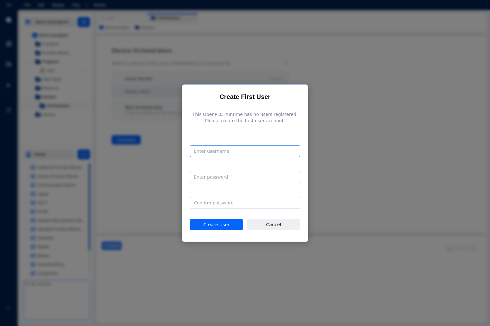
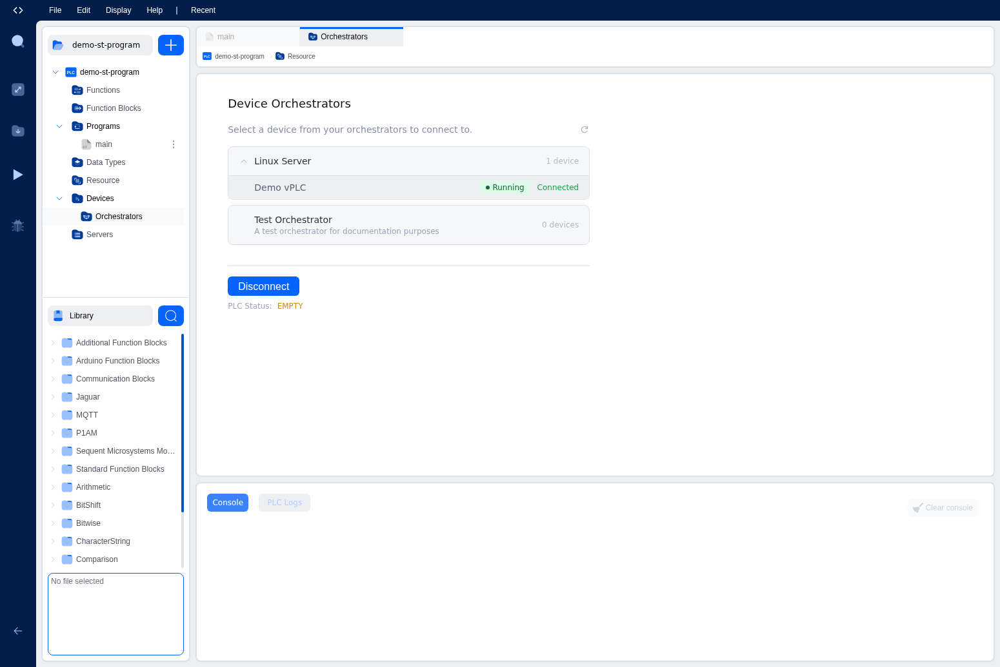
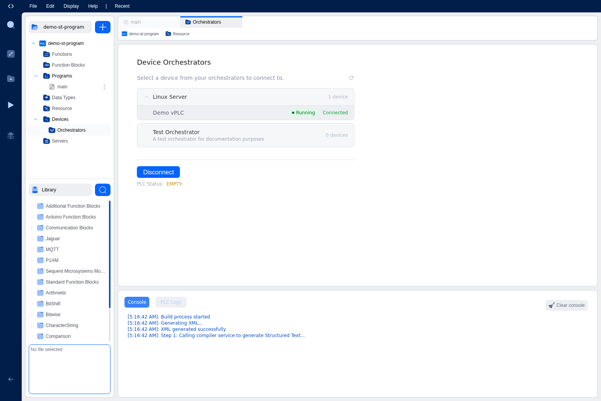
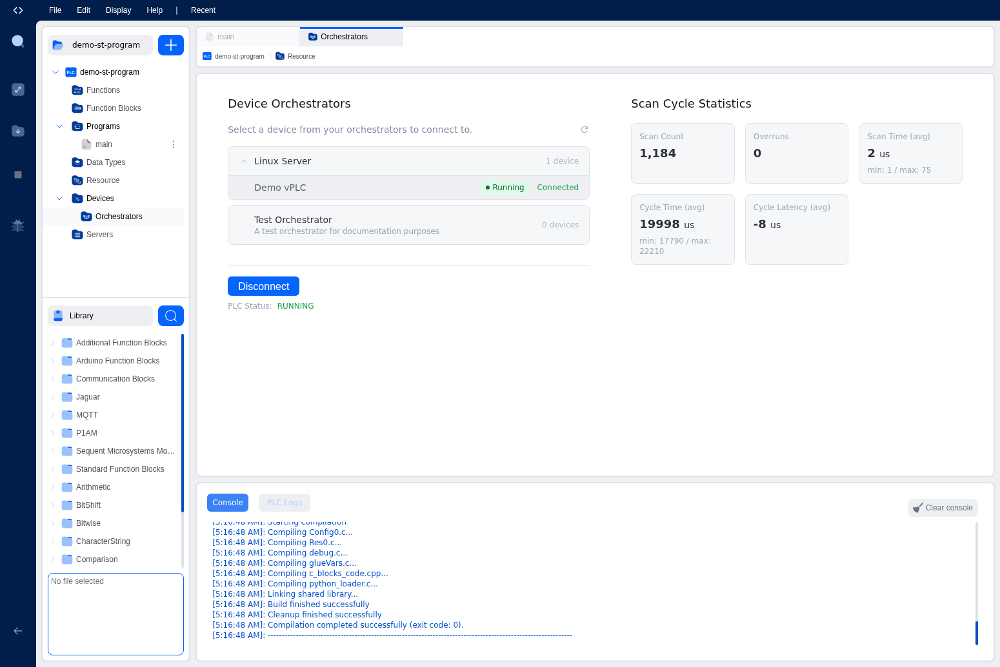

# Connecting to Runtimes

Before you can deploy and run your PLC program, you need to connect the IDE to a device. This page walks you through the connection flow, user setup, authentication, and what to do when things go wrong.

> **Autonomy Edge Users:** If you're using the Autonomy Edge cloud platform, you don't need to install or configure a runtime. The Orchestrator manages the runtime automatically when you create a Device. Simply create a Device on your Orchestrator, then connect to it here. This page covers the connection flow. The runtime setup is handled for you.

## Prerequisites

Before connecting:

1. **An orchestrator must be registered** in your Autonomy Edge account and must be online. See [Understanding Orchestrators](../platform/orchestrators/overview).
2. **A device must exist** on that orchestrator and must be active. See [Creating Devices](../platform/vplcs/creating-a-vplc).

## Selecting a Device

1. In the **Project Explorer** (left sidebar), expand the **Device** folder.
2. Click **Orchestrators** inside the Device folder.
3. The Orchestrators page opens in the Editor Area. At the top, you'll see the **OpenPLC Simulator** (selected by default). Below it, all orchestrators linked to your account are listed.

4. Expand an orchestrator to see its devices. Each device shows its name, status, and whether it's available.

5. Click on a device to select it.

6. Click **Connect**.

> **Tip:** Click the **Refresh** button to reload the list if you've recently added an orchestrator or device.
>
> **Note:** If you just want to test your program without setting up hardware, the Simulator is already selected. Just click **Start Simulator** in the Activity Bar. See [Running with the Simulator](building-deploying/simulator) for details.

## First-Time Connection: Creating a User

When you connect to a device for the very first time, it has no user accounts. The IDE detects this and guides you through setup:

1. A **Create First User** dialog appears automatically.

2. Enter a **username** and **password**, then confirm the password.
3. Click **Create User**.

This creates a local account on the device itself. You'll need these credentials every time you connect to this specific device.

> **Tip:** Keep your runtime credentials somewhere safe. If you forget them, the only recovery is to recreate the device from the platform dashboard, which resets all data on it.

## Logging In

On subsequent connections, the IDE shows a **Login** dialog:

1. Enter the **username** and **password** you created for this device.
2. Click **Login**.

Your session lasts until you log out or close the browser tab. The next time you visit, you'll need to log in again.

## Connection Status

Once connected, the IDE shows the connection status in the Orchestrators panel:

- **Connected**: You have an active connection. All controls (compile, start, stop) are available.
- **Disconnected**: No active connection. You can still compile to validate your code, but uploading and runtime controls are unavailable.

## What You Can Do When Connected

With an active connection, you can:

- **Compile and deploy**: Click Compile to build your project and upload it to the device.

- **Start the PLC**: Click the Start/Stop button to begin running your program.
- **Stop the PLC**: Click the Start/Stop button again to halt execution.
- **View PLC Logs**: The PLC Logs tab appears in the Console Panel, showing live output from the running program.
- **Monitor execution stats**: The Orchestrators panel shows scan cycle statistics for a running PLC.

## Runtime Status Polling

While connected, the IDE automatically checks the device in the background for:

- PLC running/stopped/error status
- Runtime log output
- Task execution timing data

You don't need to manually refresh. Updates appear automatically.

## Disconnecting

To disconnect, click the **Logout** button in the Orchestrators panel.

**Important:** Disconnecting does not stop the PLC program. The device operates independently. Once a program is started, it keeps running even if you close your browser. To stop it, click Stop before disconnecting, or reconnect later.

## Troubleshooting

### Can't see any orchestrators

- Verify your orchestrator is registered and online in the platform dashboard.
- Click Refresh to reload the list.

### Device shows as offline or stopped

- The device may not be running. Go to the platform dashboard and start it.
- Wait 30–60 seconds after starting for the device to initialize.

### Login fails

- Make sure you're using the **runtime credentials** (the username/password you created during first connection), not your Autonomy Edge platform login.
- If you've forgotten the credentials, recreate the device from the platform dashboard.

### PLC Logs tab not showing

- The PLC Logs tab only appears when you're connected to a device. Verify your connection status.

### Compilation succeeds but upload fails

- Check that the device is still connected.
- The orchestrator may have gone offline during compilation. Refresh and reconnect.
- Check the Console for specific error messages.

---

## What's Next?

- [Project Compilation](building-deploying/project-compilation): Learn how to compile your project and fix errors.
- [Deployment](building-deploying/deployment-vplc): Deploy and manage your running program.
- [Console & Debugging](workspace-overview/console-debugging): Read and filter build logs.
