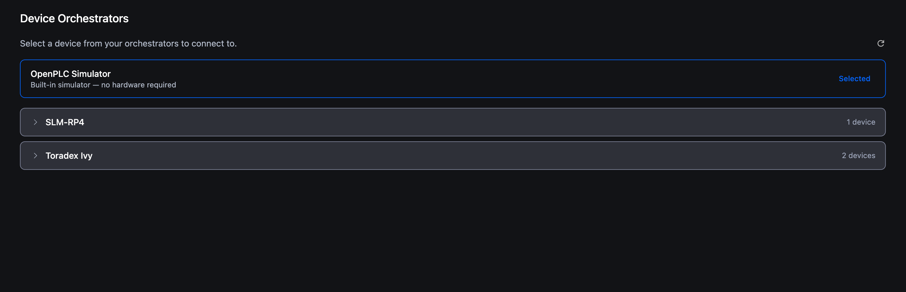

# Connecting to a vPLC

The editor opens with the built-in **OpenPLC Simulator** selected. Anything you build runs in the browser sandbox until you point it at a real (or virtual) PLC.

When you're ready to run on a vPLC, use the **Device Orchestrators** screen to pick one and connect. This page walks through that flow: picking a vPLC, logging in (or creating the first user), and what changes once you're connected.

> If you don't yet have an orchestrator or a vPLC, see **[Orchestrators](../platform/orchestrators/overview)** and **[Creating a vPLC](../platform/vplcs/creating-a-vplc)** in the platform docs. Until then, the **[Simulator](building-deploying/simulator)** is the fast lane.

## Open the Orchestrators screen

In the project tree, expand **Device** and click **Orchestrators**. The Orchestrators editor opens as a tab in the central editing area.

**OpenPLC Simulator** sits at the top with a **Selected** badge. It's a browser-side AVR emulator. Anything you build with it as the target runs in the browser sandbox, no hardware required. See **[Running with the Simulator](building-deploying/simulator)**.

Below the Simulator, each card represents one orchestrator: its name, its online status, and a chevron to expand the list of vPLCs hosted on it.

## Pick a vPLC

Expand the orchestrator. The vPLCs running on it appear as child rows, each with its name and status.

Click a vPLC to select it. The **Connect** button activates on the right.

Click **Connect**.

## First connection: create a user

Brand-new vPLCs have no users. The first time you connect, the editor opens a **Create First User** dialog instead of the login dialog.

Enter a username and password, confirm the password, and click **Create User**. The user lives **on the vPLC itself**, not in your Autonomy Edge account, keep the credentials somewhere safe. If you forget them, you have to recreate the vPLC from the platform.

## Subsequent connections: log in

After the first user exists, connecting opens a standard **Login** dialog. Use the credentials you created. The session lasts until you log out or close the editor tab.

## What changes once you're connected

- The orchestrator card now shows the vPLC with a **Connected** status badge.

  

- The activity-bar **Play** button is enabled. Pressing it calls `runtime.startPlc` on the connected vPLC.
- The activity-bar **Debugger** becomes available (it needs a connected runtime to talk to).
- The **PLC Logs** tab appears in the console, streaming the runtime's log feed.
- **Build options** offers **Build & Upload** and **Clean Upload** in addition to **Build only**.
- The Orchestrators card shows live runtime stats (CPU, memory, uptime) for the connected vPLC.

## Status polling

The editor polls the runtime in the background for:

- PLC running / stopped / error state.
- Runtime log entries.
- Task execution timing.

You don't refresh anything by hand. Updates land in the console and on the Orchestrators card automatically.

## Disconnecting

Click **Logout** in the Orchestrators card. The vPLC keeps running, disconnecting only ends your editor's session with it. Stop the PLC explicitly with the **Stop** button if you want it offline.

## Troubleshooting

**The Orchestrators screen is empty.**
Verify the orchestrator is online in the platform dashboard. The card only appears if the platform reports it as reachable.

**The vPLC shows offline / stopped.**
Open the vPLC in the platform dashboard and start it there. Allow about a minute for it to initialise before retrying.

**Login fails.**
The credentials are **runtime-side**, not your Autonomy Edge login. If you've forgotten them, recreate the vPLC.

**Upload fails after compilation succeeded.**
The connection may have dropped during the build. Confirm the orchestrator is still online, then retry. The console will carry the specific transport error.

## What's next

- **[Build options](building-deploying/project-compilation)**: what each build mode does.
- **[Debugger](building-deploying/debugger)**: live variable inspection on a connected vPLC.
- **[Console & PLC Logs](workspace-overview/console-debugging)**: reading the streams from your runtime.
