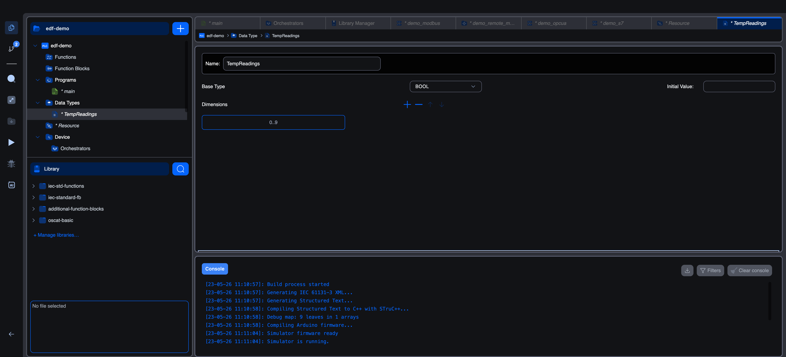

# Array data types

An array is an ordered collection of elements that all share the same base type. Instead of declaring ten variables for ten temperature sensors, you define a single array type and declare one variable that holds all ten readings.

## The array editor

Creating a type with **Array** as the derivation opens this editor:



Three things to fill in:

| Field | Notes |
|---|---|
| **Name** | The type's identifier (set when you created it; editable here). |
| **Base Type** | The type of each element. Pick from base IEC types or any other user-defined type (yes, you can have an array of structures, or an array of arrays). |
| **Initial Value** | Optional. Cold-start value for the whole array. For simple cases, leave it blank; the elements default to their base type's zero (`FALSE` / `0` / `0.0`). |

Below that, the **Dimensions** section is where the actual size lives.

## Dimensions

A dimension is a range, written `LOW..HIGH`:

| Dimension | Element count | Indices |
|---|---|---|
| `0..9` | 10 | 0, 1, 2, 3, 4, 5, 6, 7, 8, 9 |
| `1..5` | 5 | 1, 2, 3, 4, 5 |
| `0..99` | 100 | 0–99 |

Click the **`+`** in the Dimensions toolbar to add a new dimension. For a multi-dimensional array, add more rows. The array's full shape is the cross-product of every dimension you list.

| Dimensions | Resulting array | Total elements |
|---|---|---|
| `0..9` | 1-D array of 10 elements | 10 |
| `0..2`, `0..3` | 2-D array (3 rows × 4 columns) | 12 |
| `0..9`, `0..9`, `0..9` | 3-D array (10×10×10) | 1000 |

The IEC declaration syntax for the type, shown in code mode, looks like this:

```iec
TYPE
    TempReadings : ARRAY[0..9] OF REAL;
END_TYPE
```

Or, for a 2-D array:

```iec
TYPE
    RecipeTable : ARRAY[0..2, 0..3] OF INT;
END_TYPE
```

## Picking a base type

Click **Base Type** to open the picker. Same categories as the variables editor:

- **Base types**: any IEC scalar (`BOOL`, `INT`, `REAL`, `TIME`, `STRING`, …).
- **User data types**: any other custom type you've defined, including other arrays or structures.

`ARRAY[0..9] OF SensorReading` is a perfectly legal type, ten copies of a structure. The same goes for `ARRAY[0..9] OF SomeEnum`, a fixed-size column of enum values.

## Using an array in your code

Declare a variable of the array type just like any other:

```iec
VAR
    temperatures : TempReadings;
END_VAR
```

Then index into it. Both ST text and graphical block calls accept array variables; element access uses square brackets:

```iec
(* Read element at index 3 *)
current := temperatures[3];

(* Write element at index 0 *)
temperatures[0] := 22.5;

(* Loop over the whole array *)
FOR i := 0 TO 9 DO
    temperatures[i] := 0.0;
END_FOR;
```

For multi-dimensional arrays, separate indices with commas:

```iec
recipe : RecipeTable;       (* 3 rows × 4 columns *)
recipe[1, 2] := 100;        (* row 1, column 2 *)
```

## Initial values

To pre-fill the array, type a comma-separated list into the **Initial Value** field. The syntax is `[v0, v1, v2, ...]` with one value per element, in index order:

```iec
TempReadings : ARRAY[0..4] OF REAL := [20.0, 21.0, 22.0, 23.0, 24.0];
```

Use the repeat-count form `n(v)` for runs of the same value:

```iec
ZerosAndOnes : ARRAY[0..7] OF INT := [4(0), 4(1)];   (* 0,0,0,0,1,1,1,1 *)
```

For multi-dimensional arrays, the initial value is a comma-separated list of all elements in row-major order:

```iec
TwoByTwo : ARRAY[0..1, 0..1] OF INT := [1, 2, 3, 4];   (* [0,0]=1, [0,1]=2, [1,0]=3, [1,1]=4 *)
```

## Bounds-checking

In this build, **array accesses are not bounds-checked at runtime**. Indexing past the declared range is undefined behaviour (typically reads/writes adjacent memory, sometimes wraps around, depending on the compiler). Use ST `IF` guards or careful loop bounds to keep accesses inside the declared range.

## What's next

- **[Enumerated data types](enumerated-datatypes)**: for fixed sets of named values.
- **[Structure data types](structure-datatypes)**: for grouped fields of mixed types.
- **[Using custom types in code](using-custom-types)**: declaring variables of custom types, accessing fields and elements.
