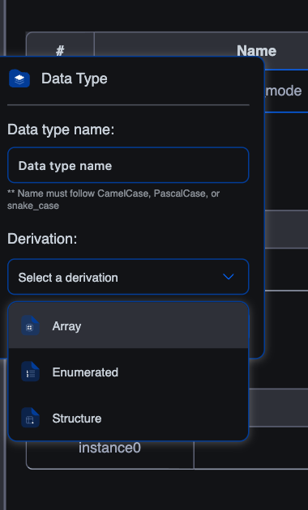

# Creating data types

The built-in IEC types (`BOOL`, `INT`, `REAL`, `TIME`, …) cover the basics, but most real projects quickly outgrow them. A program that tracks 20 temperature sensors, each with a value, a validity flag, and a timestamp, becomes a swamp of `temp_1`, `temp_1_valid`, `temp_1_ts`, `temp_2`, … without **user-defined data types**.

The editor supports three derivations: **Array**, **Enumeration**, and **Structure**. Once you've defined a custom type, it shows up in the variables editor's type picker alongside the base types, you declare variables of it like any other type.

## The three derivations

| Derivation | What it gives you | Use when |
|---|---|---|
| **Array** | An ordered collection of elements of the same base type | Sensor banks, recipe tables, ring buffers, lookup tables |
| **Enumeration** | A small set of named symbolic values; one variable holds one | State machines (`IDLE / RUNNING / FAULTED`), modes, opcodes |
| **Structure** | A composite type with named fields of different types | A sensor record (`value : REAL; valid : BOOL; ts : DATE_AND_TIME`), a recipe, a TCP frame header |

## Creating a custom type

In the project tree, click the **`+`** button at the top → **Data Type**. A small dialog opens:



Fill in the form:

1. **Data type name**: a CamelCase / PascalCase / snake_case identifier, minimum three characters. The same naming rules as POUs and variables.
2. **Derivation**: pick Array, Enumerated, or Structure.
3. Click **Create**.

The new type appears under **Data Types** in the project tree and opens in its own editor tab. The editor varies by derivation, covered on the next three pages.

## Where custom types live

Each custom type lives as an entry under the **Data Types** branch of the project tree. It's project-scoped: anywhere in this project that the type picker is available (variables editor in any POU, the Resource's Global Variables table, even inside another structure's field list), your custom types appear alongside the base types.

A custom type doesn't ship with any data on its own. It's a **type**, like `INT` is a type. You declare variables **of** that type, and those variables hold the data.

```iec
VAR
    sensor_1 : SensorReading;       (* a Structure-typed variable *)
    sensors  : TempReadings;        (* an Array-typed variable *)
    mode     : MachineMode := IDLE; (* an Enumeration-typed variable *)
END_VAR
```

## Editing an existing type

Click the type's entry in the project tree to re-open its editor. Changes apply immediately to every variable declared of that type, adding a field to a structure, expanding an array's dimensions, adding a new enum value. Be careful: removing a field that's referenced from a body produces compile errors against every use site.

## Renaming and deleting

- **Rename**: right-click the entry in the tree → Rename. The editor walks every reference (variable declarations and body code) and updates them.
- **Delete**: right-click → Delete. Anything that references the type will fail to compile until you fix the references.

## What's next

- **[Array data types](array-datatypes)**: defining ordered collections of the same type.
- **[Enumerated data types](enumerated-datatypes)**: a fixed set of named values.
- **[Structure data types](structure-datatypes)**: named fields grouped under one type.
- **[Using custom types in code](using-custom-types)**: declaring variables, accessing fields, iterating arrays.
