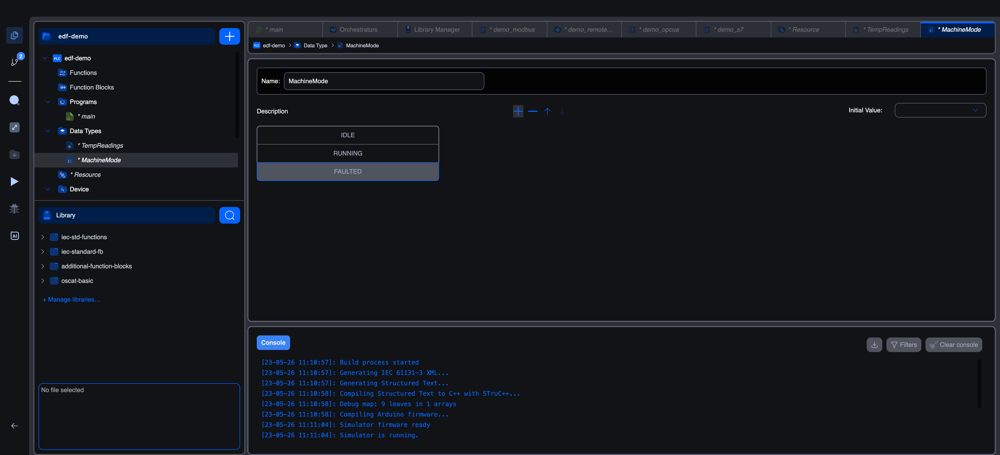

# Enumerated data types

An enumeration is a type with a fixed set of named values. A variable of the enum type can hold exactly one of those names at a time. Enums make state-machine code, mode flags, and command codes vastly more readable than raw integers.

## The enumeration editor

Creating a type with **Enumerated** as the derivation opens this editor:



The editor has three regions:

- **Name** at the top.
- A list of **values** with `+ − ↑ ↓` controls for adding, removing, and reordering.
- An **Initial Value** dropdown that lets you pick which value the type defaults to.

Each row in the list is one named value. The order matters: the value at index 0 is the first one in the list, and most clients (including the runtime debugger) display the values in declared order.

The IEC text equivalent, shown in code mode, looks like:

```iec
TYPE
    MachineMode : (IDLE, RUNNING, FAULTED);
END_TYPE
```

## Naming conventions

Each value must be a valid IEC identifier (letters, digits, underscore; no leading digit; case-insensitive in IEC matching). A common convention is `UPPER_SNAKE_CASE` for enum values, the same convention C uses for constants, since enum values feel like constants in code:

- `IDLE`, `RUNNING`, `FAULTED`
- `MANUAL`, `AUTO`, `OFF`
- `RECIPE_BREAD`, `RECIPE_CAKE`, `RECIPE_COOKIE`

Names are **shared across the project**, two enum types can't both have a value called `IDLE`. The editor flags the conflict on the next save.

## Initial value

Pick one of the declared values from the **Initial Value** dropdown. Any variable declared of this type that doesn't override the initial value starts at the chosen one.

```iec
TYPE
    MachineMode : (IDLE, RUNNING, FAULTED) := IDLE;
END_TYPE
```

For a state machine, defaulting to the "safe" or "off" state is usually right.

## Using an enum in your code

Declare a variable of the enum type:

```iec
VAR
    current_mode : MachineMode;    (* defaults to IDLE *)
    next_mode    : MachineMode := RUNNING;
END_VAR
```

Compare against enum names directly:

```iec
IF current_mode = IDLE THEN
    (* set up to start *)
    current_mode := RUNNING;
ELSIF current_mode = RUNNING THEN
    IF error_detected THEN
        current_mode := FAULTED;
    END_IF;
END_IF;
```

In graphical languages, an enum-typed variable behaves like an `INT` for comparison purposes. Drop a `EQ` block, wire your variable to one input and the enum constant to the other, and the output is `BOOL`.

## Choosing enum over INT

The temptation to model modes as a raw `INT` (`0 = IDLE, 1 = RUNNING, 2 = FAULTED`) is real but worth resisting. The cost of switching to an enum is one type declaration; the savings are:

- **Readable comparisons.** `IF mode = IDLE THEN` beats `IF mode = 0 THEN` every time.
- **Exhaustiveness pressure.** Adding a new value (`PAUSED`) makes every place in the code that compares against the enum more visible to review, `IF mode = ... THEN` chains either handle the new value or get caught at compile time when the value is referenced.
- **Debugger clarity.** The runtime debugger displays the value's *name*, not just an integer.

Use INT for modes only when you need arbitrary numbers (an opcode bus, an external API that hands you numbers). Use enums for everything else.

## What's next

- **[Array data types](array-datatypes)**: for ordered collections.
- **[Structure data types](structure-datatypes)**: for grouped fields of mixed types.
- **[Using custom types in code](using-custom-types)**: declaring variables of custom types and using them in bodies.
