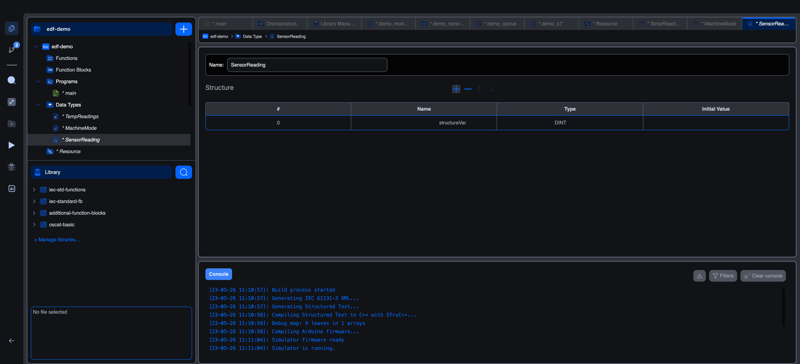

# Structure data types

A structure is a composite type that groups multiple named fields, each of its own type, under one type name. Where an array gives you "10 of the same thing", a structure gives you "a record with these named pieces".

## The structure editor

Creating a type with **Structure** as the derivation opens this editor:



The editor has:

- **Name** at the top.
- A **Structure** section listing each field as a row with `#`, Name, Type, and Initial Value columns.
- `+ − ↑ ↓` controls for adding, removing, and reordering fields.

Add a row, give the field a name, pick its type, optionally set an initial value, and repeat for each field. A typical "sensor reading" structure might end up looking like:

| # | Name | Type | Initial Value |
|---|---|---|---|
| 0 | `value` | REAL | 0.0 |
| 1 | `valid` | BOOL | FALSE |
| 2 | `timestamp` | DATE_AND_TIME | |
| 3 | `range_high` | REAL | 100.0 |
| 4 | `range_low` | REAL | 0.0 |

The IEC text equivalent, shown in code mode:

```iec
TYPE
    SensorReading : STRUCT
        value : REAL := 0.0;
        valid : BOOL := FALSE;
        timestamp : DATE_AND_TIME;
        range_high : REAL := 100.0;
        range_low : REAL := 0.0;
    END_STRUCT;
END_TYPE
```

## Field types

The Type picker on each row offers the same categories as anywhere else in the editor:

- **Base types**: IEC scalars.
- **User data types**: any other structure, enumeration, or array you've defined.

That last bullet is the most useful: structures can contain other structures, arrays of structures, and any nesting you want. Common patterns:

| Outer type | Inner type | When to use |
|---|---|---|
| `Recipe : STRUCT temp : REAL; time : TIME; steps : ARRAY[0..9] OF Step; END_STRUCT;` | `Step` is another struct | Recipe with a fixed-size list of step records |
| `Sensors : STRUCT temp : SensorReading; pressure : SensorReading; END_STRUCT;` | `SensorReading` (struct) reused | Named bundle of sensor records |
| `History : ARRAY[0..99] OF SensorReading;` | array of struct | Time-series buffer |

You can mix and match freely. The runtime allocates the storage exactly as declared.

## Using a structure in your code

Declare a variable of the structure type:

```iec
VAR
    temp_sensor : SensorReading;
    pressure_sensor : SensorReading;
END_VAR
```

Access fields with dot notation:

```iec
temp_sensor.value := raw_input * 0.01;
temp_sensor.valid := TRUE;

IF temp_sensor.valid AND temp_sensor.value > temp_sensor.range_high THEN
    over_temperature := TRUE;
END_IF;
```

Pass whole structures into function blocks via the `In Out` class to mutate them in place, or `Input` to pass a copy:

```iec
my_fb(reading := temp_sensor);   (* Input: caller passes a copy *)
update_fb(reading := temp_sensor); (* In Out: function block can write back into temp_sensor *)
```

## Initial values

Per-field initial values live in the Initial Value column. The structure type doesn't have a single "structure-level" initial value; each variable declared of the structure picks up the per-field defaults unless overridden at declaration:

```iec
VAR
    temp_sensor : SensorReading := (value := 25.0, valid := TRUE);
    (* unspecified fields use their per-field defaults *)
END_VAR
```

## When to use a structure vs an array

| You want | Reach for |
|---|---|
| 10 of the same thing, indexed by number | **Array** |
| A record with a fixed set of named pieces | **Structure** |
| A bunch of records of the same shape | **Array of Structure** |
| A record where some pieces are themselves indexed collections | **Structure with Array fields** |

If your fields' names start to feel arbitrary (`item1`, `item2`, `item3`), it's probably an array. If your indices start to feel meaningful (`temperatures[TEMP]`, `temperatures[PRESSURE]`), it's probably a structure.

## What's next

- **[Array data types](array-datatypes)**: for ordered collections of the same type.
- **[Enumerated data types](enumerated-datatypes)**: for fixed sets of named values.
- **[Using custom types in code](using-custom-types)**: declaring variables of custom types, accessing fields, looping arrays.
