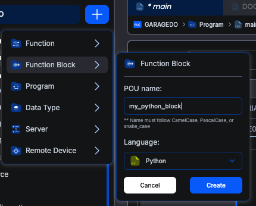

# Python Function Blocks

Python function blocks let you write automation logic in Python while integrating seamlessly with your IEC 61131-3 program. You get access to Python's rich standard library for tasks like math, string processing, data conversion, and more. All within the Autonomy Edge platform.

## Why Python Function Blocks?

Standard IEC 61131-3 languages are built for deterministic, cyclic control logic. They're great at reading sensors, driving outputs, and executing tightly timed sequences. But some tasks are easier in a general-purpose language:

- **Complex calculations**: Statistical analysis, advanced math, or data transformations
- **String processing**: Parsing messages, formatting data, or building protocol payloads
- **Data conversion**: Converting between units, encoding/decoding values, or mapping ranges
- **Algorithm prototyping**: Quickly testing ideas with Python's expressive syntax before deciding whether to reimplement in ST

Python function blocks handle these tasks without leaving the Autonomy Edge platform.

## How Python FBs Fit In

Python function blocks run differently from standard IEC function blocks. Here's how they compare:

| Aspect | Standard IEC Function Block | Python Function Block |
|--------|---------------------------|----------------------|
| **Execution** | Runs inside the PLC scan cycle | Runs as a separate process |
| **Timing** | Synchronized with the scan cycle | Asynchronous, ~100 ms loop |
| **State** | Managed by the runtime | Managed by the Python process |
| **Language** | ST, LD, FBD, IL | Python 3 |
| **Libraries** | IEC standard functions only | Python standard library |

The key point: Python function blocks are **not synchronized** with the PLC scan cycle. Your block exchanges input and output values with the PLC on a ~100 ms cadence, independently of the PLC scan. You write your logic in `block_init()` and `block_loop()` and reference variables by name.

## When to Use Python vs. IEC Languages

**Use Python function blocks when:**

- You need complex math that would be verbose in Structured Text (e.g., moving averages, statistical calculations)
- You want to process or format strings beyond what IEC string functions offer
- You need to work with data structures like lists or dictionaries
- You're prototyping logic quickly and Python's syntax helps you iterate faster

**Use standard IEC languages when:**

- You need deterministic, scan-cycle-synchronized execution
- You're implementing time-critical control logic (motor control, safety interlocks)
- You want guaranteed execution timing for real-time responsiveness
- Your logic is naturally expressed as relay logic (LD) or block connections (FBD)

> **Tip:** Python function blocks are only available as **Function Blocks**, not as Programs or Functions. When creating a new POU and choosing Python as the language, the POU type is always Function Block.

## Creating a Python Function Block

To create a Python function block in the Autonomy Edge IDE:

1. In the left panel, click the blue **+** button.
2. Hover over **Function Block** in the menu that appears.
3. In the dialog that opens, enter a name for your block (e.g., `my_python_block`). Names must follow CamelCase, PascalCase, or snake_case.
4. Select **Python** from the **Language** dropdown.
5. Click **Create**.



The IDE opens a code editor pre-populated with the Python function block template.

## The Template Code

Every new Python function block starts with this template:

```python
from multiprocessing import shared_memory
import struct
import time
import os

def block_init():
    print('Block was initialized')

def block_loop():
    print('Block has run the loop function')
```

This template defines the two required functions:

- **`block_init()`**: Called exactly once when the Python process starts. Use it for one-time setup, such as initializing persistent variables or preparing data structures.
- **`block_loop()`**: Called repeatedly, approximately every 100 milliseconds. This is where your main logic goes. Reading inputs, performing calculations, and writing outputs.

> **Note:** Keep the four `import` statements at the top of the template. They're required. Add your own imports below them.

## A Basic Example

Here's a simple Python function block that scales an analog input value from a raw integer range to engineering units. Suppose you declare the following variables in the Variables Table:

| Name | Type | Class |
|------|------|-------|
| `raw_value` | INT | Input |
| `scale_min` | REAL | Input |
| `scale_max` | REAL | Input |
| `scaled_output` | REAL | Output |

The Python code uses those names directly:

```python
from multiprocessing import shared_memory
import struct
import time
import os

def block_init():
    # No special initialization needed for this example
    pass

def block_loop():
    global scaled_output

    # Scale raw_value into engineering units (assuming raw range 0-32767)
    if scale_max != scale_min:
        scaled_output = scale_min + (raw_value / 32767.0) * (scale_max - scale_min)
    else:
        scaled_output = scale_min
```

A few notes on the example:

- `raw_value`, `scale_min`, and `scale_max` are inputs. Read them by name with their current value at the start of each cycle.
- `scaled_output` is an output. Assign it to send the new value back to the PLC.
- The `global scaled_output` line is a Python rule, not a block-specific one: in Python, you need `global` whenever you **assign** to a module-level variable from inside a function. Reads don't need it.

The pattern is the same as a C++ function block: declare inputs and outputs in the Variables Table, then use them by name in your code.

## What's Next?

Continue to [Python Function Block Structure](/docs/openplc-editor/custom-languages/python-blocks/python-structure) for a closer look at `block_init()` / `block_loop()`, the supported variable types, and a complete worked example.
