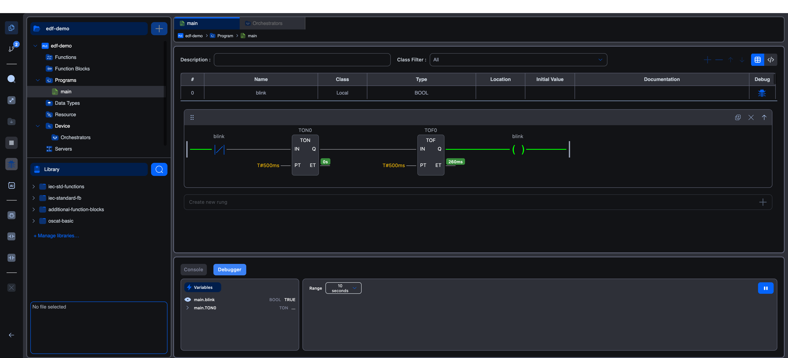

# Worked example: Blink

The simplest possible PLC program. A single `BOOL` variable, `blink`, toggles between `FALSE` and `TRUE` once per second using two timers.

This is what the **EDF Demo** project ships with, and it's a great smoke test that your editor connection, the Simulator, and the debugger all work end-to-end.

**Surfaces exercised:** Ladder Diagram editor, variables table, **TON** + **TOF** function blocks from `iec-standard-fb`, the Simulator, the live execution colouring, the debugger.

**Expected time:** about 3 minutes.

## The circuit

A normally-closed contact reading `blink` feeds a 500 ms on-delay timer (**TON**), which feeds a 500 ms off-delay timer (**TOF**), which drives the `blink` coil. The coil's value is read by the normally-closed contact at the start of the same rung, a self-feeding loop.

When `blink` is `FALSE`, the normally-closed contact passes current, the TON starts counting, and after 500 ms its output goes high. The TOF then starts its own count. After another 500 ms the coil sets `blink` to `TRUE`. The contact now blocks current and the cycle reverses. Net effect: `blink` toggles every second.

<LadderDiagramViewer src="/docs/diagrams/ladder/fb-ton-timer.json" />

## Step 1: Create the project

If the **EDF Demo** project is already open, skip ahead. Otherwise:

1. From the Autonomy Edge dashboard, create a new project. Pick **Ladder Diagram (LD)** as the main language, leave the task interval at the default `T#20ms`.
2. Click **Open in editor**. The editor loads on the project's empty `main` program.

## Step 2: Declare the variable

In the variables table above the body, add one row:

| Name | Class | Type |
|---|---|---|
| `blink` | Local | BOOL |

Tick the **Debug** column so you can watch it in the debugger later.

## Step 3: Draw the rung

Drag elements from the activity-bar toolbox (Block, Coil, Contact) into the empty rung.

The element sequence, left to right:

1. **Contact** named `blink`, variant `negated` (normally-closed).
2. **Block** named `TON`. Set its `PT` input to `T#500ms`.
3. **Block** named `TOF`. Set its `PT` input to `T#500ms`.
4. **Coil** named `blink`, variant `default`.

Wire the contact's output to TON's `IN`, TON's `Q` to TOF's `IN`, and TOF's `Q` to the coil.

Save with `Cmd / Ctrl + S`.

## Step 4: Run it on the Simulator

The Simulator is the default target. Click the **Start Simulator** button in the activity bar (the Play triangle).

After a few seconds of compile, the bottom panel switches from Console to Debugger and the LD rung lights up with green wires showing live power flow. The TON's `ET` value updates inline as it counts.

## Step 5: Watch the variable

In the Debugger panel at the bottom, click `main.blink` to add it to the chart. The trace square-waves between 0 and 1 every second.

If `main.blink` doesn't appear in the list, you didn't tick the Debug column in step 2. Tick it, save, and the variable appears on the next poll.

## What you've shown

- IEC bodies are wired top-to-bottom in source files and compile through STruC++ to AVR-targeted C++.
- A single variable can be both written (by the coil) and read (by the contact) within the same rung. The execution order is left-to-right per rung, top-to-bottom across rungs.
- The Simulator's polling latency is well under a second: the live colouring keeps up with a 1 Hz blink with no noticeable lag.

## Where to next

- Add a second rung. A counter (`CTU`) that counts every rising edge of `blink` shows you 1-per-second on its `CV` output.
- Try the same circuit on a real vPLC. See **[Connecting to a vPLC](../connecting-to-runtimes)**, the rung's behaviour is identical.
- Move on to **[Motor start / stop with seal-in](start-stop-seal-in)**: the next-simplest pattern after blink.
