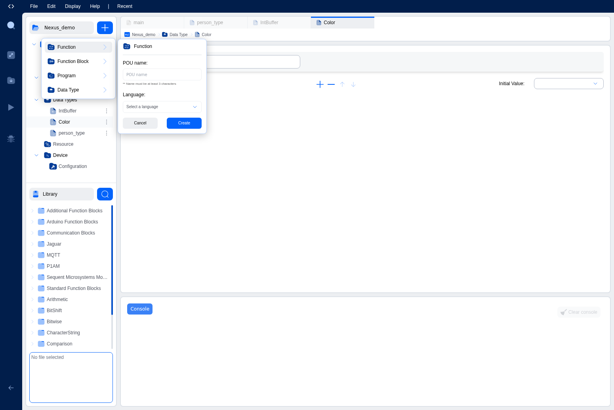
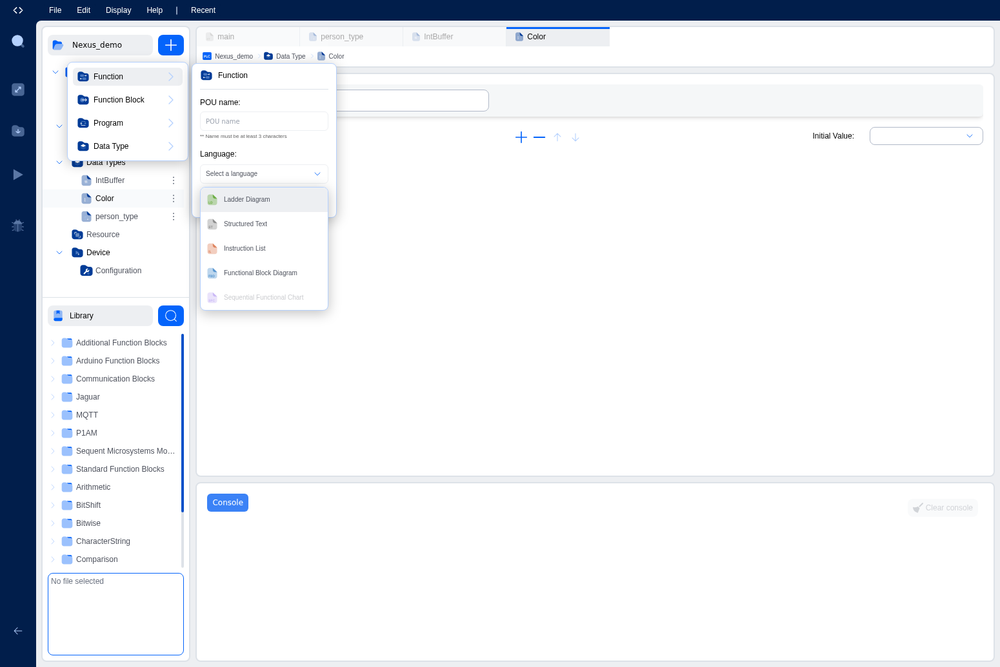

# Program Organization Units (POUs)

Program Organization Units. Commonly called POUs. Are the building blocks of any IEC 61131-3 PLC program. A POU is a self-contained unit of code with its own variables and logic. The standard defines three types: **Programs**, **Functions**, and **Function Blocks**. Understanding the differences between them is key to writing well-structured projects.

## The Three POU Types

### Program

A **Program** is the top-level POU that serves as the entry point for execution. This is where your main control logic lives. Programs are the POUs that get assigned to **tasks**: a task calls a program on a periodic or event-driven schedule.

Key characteristics:

- **Stateful**: A program retains its variable values between execution cycles. When a task triggers a program, its variables still hold the values from the previous cycle.
- **Single instance**: You don't instantiate a program like a function block. Instead, you create an **instance** in the Resource configuration that binds the program to a task.
- **Direct I/O access**: Programs can declare variables with I/O locations (e.g., `%IX0.0`, `%QW2`) to directly read physical inputs and write physical outputs.
- **Languages**: Programs can be written in Structured Text (ST), Ladder Diagram (LD), Function Block Diagram (FBD), or Instruction List (IL).

Use a Program when you need a top-level routine that runs on a schedule and interacts with the PLC's I/O.

### Function

A **Function** is a POU that computes and returns a single value. Functions are purely computational. They take inputs, process them, and produce an output.

Key characteristics:

- **Stateless**: Functions don't retain any data between calls. Every time you call a function, it starts fresh with only the input values you provide. Local variables are re-initialized on each call.
- **Return value**: Every function has a return type. When you create a function, you specify its return type (e.g., BOOL, INT, REAL, or a user-defined type). The function's name acts as the return variable. Assigning a value to the function name inside its body sets the return value.
- **No instances**: Functions are called directly by name, not instantiated.
- **Languages**: Functions support ST, LD, FBD, and IL.

Use a Function when you need a reusable calculation. Converting units, computing a checksum, applying a formula, or any operation that depends only on its inputs.

**Example:** A function `CELSIUS_TO_FAHRENHEIT` with an input `TEMP_C : REAL` and return type `REAL`:

```
CELSIUS_TO_FAHRENHEIT := TEMP_C * 9.0 / 5.0 + 32.0;
```

### Function Block

A **Function Block** is a reusable POU that maintains internal state. Function blocks are the workhorses of IEC 61131-3. They combine the reusability of functions with the statefulness of programs.

Key characteristics:

- **Stateful**: A function block retains its variable values between calls. This makes it suitable for logic that needs memory: timers, counters, state machines, PID controllers, etc.
- **Instantiable**: Function blocks must be **instantiated** before use. You create an instance as a variable in a program or another function block. Each instance has its own independent copy of all local variables.
- **Input/Output interface**: Function blocks communicate through input, output, and in/out variables. The caller sets inputs, calls the function block, and then reads outputs.
- **Extended language support**: In addition to the five standard languages, the IDE supports function blocks written in **Python** and **C/C++**.
- **No return value**: Unlike functions, function blocks don't return a single value. Instead, they expose output variables.

Use a Function Block when you need reusable logic with memory. Timers (TON, TOF), counters (CTU, CTD), PID loops, motor control sequences, communication handlers, or any stateful algorithm.

**Example:** A function block `MOTOR_CONTROL` with inputs `START : BOOL`, `STOP : BOOL`, and outputs `RUNNING : BOOL`, `FAULT : BOOL`. Each motor in your plant gets its own instance:

```
Motor1 : MOTOR_CONTROL;
Motor2 : MOTOR_CONTROL;
```

## Creating POUs in the IDE

To create a new POU:

1. Click the **+** button next to the project name in the Project Explorer.
2. Enter a **name** for the POU.
3. Select the **POU type**: Program, Function, or Function Block.
4. Select the **programming language**.
   - For Programs: ST, LD, FBD, or IL.
   - For Functions: ST, LD, FBD, or IL.
   - For Function Blocks: ST, LD, FBD, IL, Python, or C/C++.
5. If creating a Function, specify the **return type** (e.g., BOOL, INT, REAL).
6. Click **Create**.





The new POU appears in the Project Explorer tree under Functions, Function Blocks, or Programs. Click it to open its editor.

## Editing a POU

When you open a POU, the editor shows two sections:

1. **Variables Table** (top): Lists all variables declared for this POU. You can add, remove, and edit variables here. Each variable has a name, class (input, output, local, etc.), type, location, initial value, and documentation field. The table is collapsible and resizable.

2. **Code/Graphical Editor** (bottom): Where you write the POU's logic.
   - For textual languages (ST, IL, Python, C++): A code editor with syntax highlighting.
   - For graphical languages (LD, FBD): A visual canvas where you place and connect elements.

## POU Naming Rules

POU names must be valid IEC 61131-3 identifiers:

- Start with a letter or underscore.
- Contain only letters, digits, and underscores.
- Cannot conflict with reserved words or existing POU names in the project.

The IDE validates names when you create or rename a POU.

## How POUs Work Together

In a typical project:

1. You define **Functions** for reusable calculations (e.g., unit conversions, setpoint calculations).
2. You define **Function Blocks** for reusable stateful logic (e.g., PID controllers, motor sequences, timers).
3. You define **Programs** as top-level entry points. Inside a program, you call functions directly and declare instances of function blocks.
4. In the **Resource configuration**, you create tasks and bind programs to those tasks through instances.

This layered approach keeps your code modular, reusable, and organized.

## Standard Library

The IDE provides access to a library of standard IEC 61131-3 function blocks. You can browse these in the Library panel of the explorer. Standard FBs include:

- **Timers**: TON (on-delay), TOF (off-delay), TP (pulse)
- **Counters**: CTU (count up), CTD (count down), CTUD (count up/down)
- **Bistable**: SR (set-dominant), RS (reset-dominant)
- **Edge detection**: R_TRIG (rising edge), F_TRIG (falling edge)
- **Type conversions**: Various type conversion functions

These are available in any POU without needing to define them yourself.

> **Tip:** Start with Programs for your main logic, and extract reusable pieces into Functions and Function Blocks as your project grows. Don't try to design the perfect POU hierarchy upfront.

---

## What's Next?

Learn about the variable system and data types that POUs use: [Variables & Data Types](variables-datatypes).
