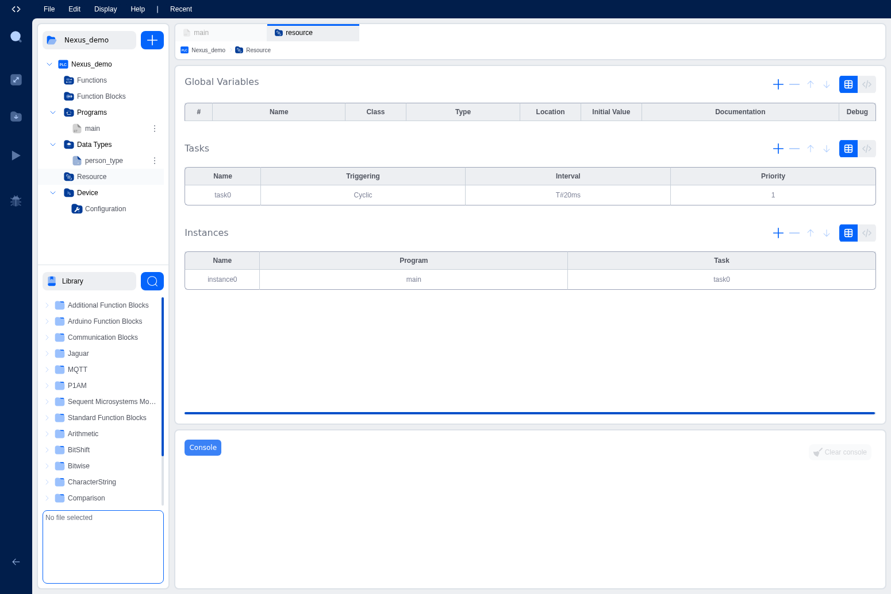

# Tasks and Instances

Tasks and instances are essential concepts in IEC 61131-3 that control how and when your programs execute. Understanding these concepts is crucial for creating real-time control systems that respond predictably to events and timing requirements.

## What are Tasks?

Tasks are execution schedulers that control when and how often programs run on the PLC. They define the timing behavior of your control system, ensuring that programs execute at the right intervals or in response to specific events.

### Key Concepts:

- **Tasks define execution timing**: They specify when programs should run
- **Programs are assigned to tasks**: Each program must be assigned to a task to execute
- **Multiple programs per task**: A single task can execute multiple programs
- **Deterministic execution**: Tasks ensure predictable, real-time behavior

## Task Types

IEC 61131-3 defines two main types of tasks:

### 1. Cyclic Tasks

Cyclic tasks execute programs repeatedly at fixed time intervals. This is the most common type of task in PLC programming.

**Characteristics:**
- Execute at regular intervals (e.g., every 10ms, 100ms, 1 second)
- Provide predictable, periodic execution
- Ideal for continuous control loops
- Timing is specified using TIME data type

**Example Use Cases:**
- Motor speed control (every 20ms)
- Temperature monitoring (every 100ms)
- Production counting (every 1 second)
- Safety monitoring (every 10ms)

**Timing Format:**
```
T#10ms      // 10 milliseconds
T#100ms     // 100 milliseconds
T#1s        // 1 second
T#500ms     // 500 milliseconds
```

### 2. Interrupt Tasks (Future Feature)

Interrupt tasks execute programs in response to specific events rather than on a fixed schedule.

**Characteristics:**
- Triggered by external events (hardware interrupts, software signals)
- Execute immediately when triggered
- Higher priority than cyclic tasks
- Ideal for event-driven control

**Example Use Cases:**
- Emergency stop handling
- High-speed counter events
- Communication interrupts
- Alarm conditions

*Note: Interrupt tasks are planned for future releases of the IDE.*

## Task Configuration

Tasks are configured in the Resource section of your project. Each task has several properties that define its behavior.


*The Resource editor showing Tasks and Instances configuration*

### Task Properties:

#### 1. Name
A unique identifier for the task. Use descriptive names that indicate the task's purpose.

**Examples:**
- `FastControl` - High-speed control loop
- `SlowMonitoring` - Slow monitoring task
- `MainTask` - Primary application task
- `SafetyTask` - Safety-critical operations

#### 2. Triggering
The type of task execution:
- **Cyclic**: Executes at regular intervals
- **Interrupt**: Executes on events (future feature)

#### 3. Interval
For cyclic tasks, this specifies how often the task executes. The interval is specified using the TIME data type.

**Common Intervals:**
- `T#10ms` - Very fast control (100 Hz)
- `T#20ms` - Fast control (50 Hz)
- `T#50ms` - Medium speed control (20 Hz)
- `T#100ms` - Standard control (10 Hz)
- `T#1s` - Slow monitoring (1 Hz)

**Choosing the Right Interval:**
- **Faster intervals** (10-20ms): For motion control, high-speed I/O, safety functions
- **Medium intervals** (50-100ms): For process control, temperature regulation
- **Slower intervals** (1s or more): For monitoring, data logging, user interface updates

#### 4. Priority
A numeric value (0-99) that determines task execution order when multiple tasks are ready to run.

**Priority Rules:**
- **Higher numbers = Higher priority**: Priority 10 runs before Priority 5
- **Range**: 0 (lowest) to 99 (highest)
- **Default**: Most tasks use priority 1-10
- **Safety tasks**: Should have higher priority (e.g., 50-99)

**Example Priority Scheme:**
```
Safety monitoring:    Priority 90
Fast control loop:    Priority 50
Standard control:     Priority 10
Slow monitoring:      Priority 5
Data logging:         Priority 1
```

## What are Instances?

Instances are the link between programs and tasks. An instance assigns a specific program to a specific task, telling the PLC runtime which programs to execute and when.

### Key Concepts:

- **Instances connect programs to tasks**: They specify which program runs on which task
- **One instance per program**: Each program needs at least one instance to execute
- **Multiple instances possible**: The same program can have multiple instances on different tasks
- **Unique names**: Each instance must have a unique name

## Instance Configuration

Instances are also configured in the Resource section, below the Tasks table.

### Instance Properties:

#### 1. Name
A unique identifier for the instance. Typically describes the program and its purpose.

**Examples:**
- `MainInstance` - Primary program instance
- `MotorControl1` - First motor control instance
- `SafetyMonitor` - Safety monitoring instance

#### 2. Program
The name of the program to execute. This must be a program defined in your project (from the Programs section of the Project Explorer).

**Selection:**
- Choose from a dropdown list of available programs
- Only programs (not functions or function blocks) can be assigned
- The program must exist before creating the instance

#### 3. Task
The name of the task that will execute this program. This must be a task defined in the Tasks table above.

**Selection:**
- Choose from a dropdown list of available tasks
- The task determines when and how often the program runs
- Multiple instances can share the same task

## Creating Tasks and Instances

### Step-by-Step: Creating a Task

1. **Open Resource Configuration**: Click on "Resource" in the Project Explorer
2. **Navigate to Tasks Table**: The Tasks table is in the upper section
3. **Click Add (+) Button**: Above the Tasks table
4. **Enter Task Name**: Provide a descriptive name (e.g., `MainTask`)
5. **Select Triggering**: Choose "Cyclic" (Interrupt is not yet available)
6. **Set Interval**: Enter the execution interval (e.g., `T#20ms`)
7. **Set Priority**: Enter a priority value (e.g., `1`)

### Step-by-Step: Creating an Instance

1. **Ensure Program Exists**: Create your program first in the Programs section
2. **Ensure Task Exists**: Create the task as described above
3. **Navigate to Instances Table**: Below the Tasks table in Resource
4. **Click Add (+) Button**: Above the Instances table
5. **Enter Instance Name**: Provide a descriptive name (e.g., `MainInstance`)
6. **Select Program**: Choose the program from the dropdown
7. **Select Task**: Choose the task from the dropdown

## Task Execution Model

Understanding how tasks execute is important for designing effective control systems.

### Execution Cycle

For a cyclic task with interval T#20ms:

1. **Task Timer Expires**: Every 20ms, the task becomes ready to execute
2. **Priority Check**: If multiple tasks are ready, the highest priority task runs first
3. **Execute All Instances**: All program instances assigned to the task execute in order
4. **Complete Cycle**: Task execution completes
5. **Wait for Next Cycle**: Task waits until the next 20ms interval

### Execution Order

When a task executes, it runs all its assigned program instances in the order they appear in the Instances table.

**Example:**
```
Task: FastControl (T#20ms, Priority 10)
Instances:
  1. SafetyCheck (Program: SafetyMonitor)
  2. MotorCtrl (Program: MotorControl)
  3. DataLog (Program: DataLogger)

Execution order: SafetyCheck → MotorCtrl → DataLog
```

### Task Timing Considerations

#### Cycle Time vs. Execution Time

- **Cycle Time**: The interval specified for the task (e.g., T#20ms)
- **Execution Time**: The actual time it takes to run all programs in the task
- **Rule**: Execution time must be less than cycle time

**Example:**
```
Task interval: T#20ms (20 milliseconds available)
Program execution: 15ms (actual time used)
Result: OK - 5ms margin remaining
```

#### Overrun Conditions

If a task's execution time exceeds its cycle time, this is called an "overrun":

**Consequences:**
- The next cycle may be delayed
- Real-time behavior is compromised
- Console will show warnings

**Solutions:**
- Optimize program code to run faster
- Increase task interval (e.g., T#20ms → T#50ms)
- Move some programs to a slower task
- Split complex programs into smaller, simpler programs

## Common Task Patterns

### Pattern 1: Single Task System

The simplest configuration with one task running one program:

```
Task: MainTask
  - Interval: T#100ms
  - Priority: 1

Instance: MainInstance
  - Program: main
  - Task: MainTask
```

**Use Case:** Simple applications with one control loop

### Pattern 2: Multi-Speed System

Different tasks for different timing requirements:

```
Task: FastTask
  - Interval: T#10ms
  - Priority: 10
  
Task: SlowTask
  - Interval: T#1s
  - Priority: 1

Instance: MotorControl
  - Program: MotorController
  - Task: FastTask

Instance: Monitoring
  - Program: SystemMonitor
  - Task: SlowTask
```

**Use Case:** Systems with both fast control and slow monitoring

### Pattern 3: Priority-Based System

Multiple tasks with different priorities:

```
Task: SafetyTask
  - Interval: T#10ms
  - Priority: 90

Task: ControlTask
  - Interval: T#20ms
  - Priority: 50

Task: UITask
  - Interval: T#100ms
  - Priority: 1

Instances:
  - SafetyMonitor → SafetyTask
  - MotorControl → ControlTask
  - DisplayUpdate → UITask
```

**Use Case:** Safety-critical systems with multiple control levels

### Pattern 4: Multiple Programs Per Task

One task executing multiple programs:

```
Task: MainTask
  - Interval: T#50ms
  - Priority: 1

Instances:
  - InputProcessing → MainTask
  - ControlLogic → MainTask
  - OutputProcessing → MainTask
```

**Use Case:** Related programs that should execute together

## Best Practices

### 1. Choose Appropriate Task Intervals

Match task intervals to your control requirements:
- **Too fast**: Wastes CPU resources, may cause overruns
- **Too slow**: Poor control response, missed events
- **Just right**: Meets control requirements with margin for execution

### 2. Use Priority Wisely

Assign priorities based on criticality:
- **High priority** (50-99): Safety, emergency handling
- **Medium priority** (10-49): Normal control loops
- **Low priority** (1-9): Monitoring, logging, UI updates

### 3. Monitor Task Timing

Watch the console for timing warnings:
- Task overrun warnings indicate execution time problems
- Adjust intervals or optimize code if warnings appear
- Leave margin for worst-case execution time

### 4. Group Related Programs

Programs that work together should typically run on the same task:
- Input processing → Control logic → Output processing
- This ensures they execute in the correct order
- Avoids timing issues between related operations

### 5. Keep Programs Simple

Each program should have a clear, focused purpose:
- Easier to understand and maintain
- Faster execution time
- Easier to assign to appropriate tasks

### 6. Document Task Configuration

Add comments explaining your task structure:
- Why specific intervals were chosen
- Why specific priorities were assigned
- Which programs depend on each other

### 7. Test Timing Under Load

Test your task configuration under realistic conditions:
- Run all tasks simultaneously
- Monitor for overruns or timing issues
- Verify control performance meets requirements

## Advanced Concepts

### Task Synchronization

When multiple tasks access shared data (global variables), synchronization becomes important:

**Potential Issues:**
- Race conditions: Multiple tasks modifying the same variable
- Inconsistent data: Reading data while another task is writing it
- Timing dependencies: One task depending on another's completion

**Solutions:**
- Minimize shared data between tasks
- Use appropriate variable types (atomic operations)
- Design tasks to avoid conflicts
- Use semaphores or locks (advanced feature, future release)

### Task Watchdog

A watchdog monitors task execution and detects failures:

**Features:**
- Detects tasks that stop executing
- Detects tasks that take too long
- Can trigger safety responses

*Note: Watchdog features are planned for future releases.*

### Task Statistics

The IDE can display task execution statistics:
- Average execution time
- Maximum execution time
- Number of overruns
- CPU utilization per task

*Note: Task statistics are planned for future releases.*

## Troubleshooting

### Problem: Task Overrun Warnings

**Symptoms:** Console shows "Task exceeded cycle time" warnings

**Solutions:**
1. Increase task interval (e.g., T#20ms → T#50ms)
2. Optimize program code (remove unnecessary calculations)
3. Move some programs to a slower task
4. Split complex programs into simpler ones

### Problem: Poor Control Response

**Symptoms:** Control system responds slowly or erratically

**Solutions:**
1. Decrease task interval for control loops
2. Increase priority of control tasks
3. Ensure control programs execute frequently enough
4. Check for task overruns affecting timing

### Problem: Programs Not Executing

**Symptoms:** Program doesn't seem to run

**Solutions:**
1. Verify instance exists in Resource configuration
2. Check that instance references correct program and task
3. Ensure task has valid interval and triggering
4. Check console for error messages

## Example Configuration

Here's a complete example of a typical task and instance configuration:

```
PROJECT: MotorControlSystem

TASKS:
  Name: SafetyTask
    Triggering: Cyclic
    Interval: T#10ms
    Priority: 90

  Name: ControlTask
    Triggering: Cyclic
    Interval: T#20ms
    Priority: 50

  Name: MonitorTask
    Triggering: Cyclic
    Interval: T#100ms
    Priority: 10

INSTANCES:
  Name: SafetyCheck
    Program: EmergencyStop
    Task: SafetyTask

  Name: Motor1Control
    Program: MotorController
    Task: ControlTask

  Name: Motor2Control
    Program: MotorController
    Task: ControlTask

  Name: SystemMonitor
    Program: StatusMonitor
    Task: MonitorTask

  Name: DataLogger
    Program: LogData
    Task: MonitorTask
```

This configuration provides:
- Fast safety monitoring (10ms)
- Medium-speed motor control (20ms)
- Slow monitoring and logging (100ms)
- Appropriate priorities for each function
- Multiple programs on the same task where appropriate

## Next Steps

Now that you understand Tasks and Instances, you have completed the core IEC 61131-3 concepts. You can now explore the programming languages section to learn how to write code in Structured Text, Ladder Diagram, Function Block Diagram, Instruction List, and Sequential Function Chart. You can also learn about custom languages like Python and C++ for advanced function blocks.
