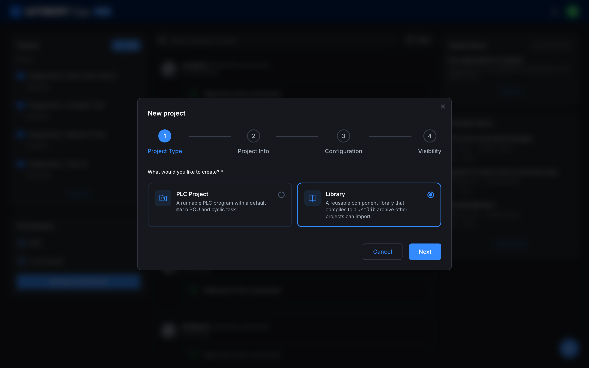
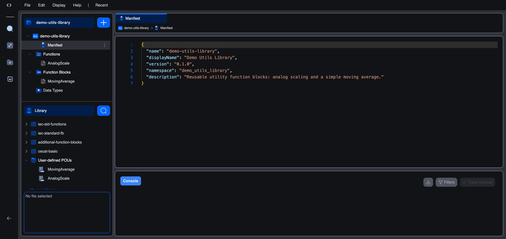
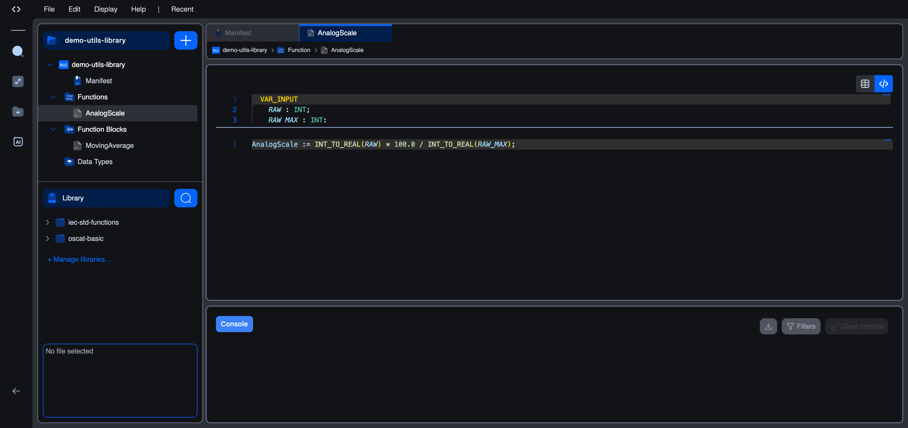
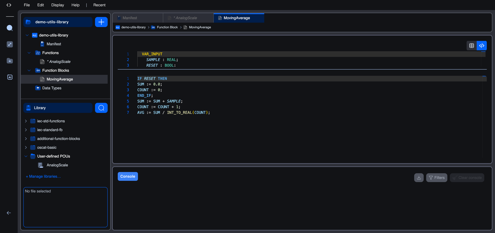
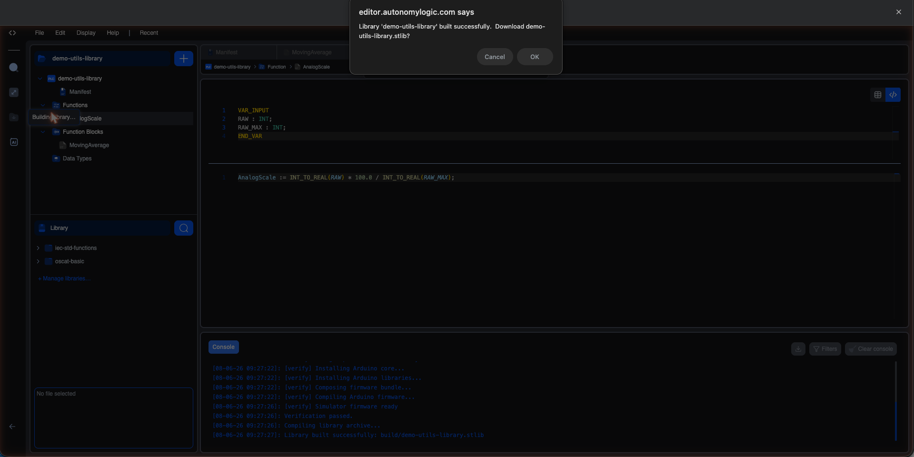

# Creating a Library

Beyond using the libraries that ship with the editor, you can **author your own** and share it with other projects (and other people). A library is a special kind of project: instead of a runnable PLC program, it is a collection of reusable **functions**, **function blocks**, and **data types** that compiles into a single `.stlib` archive. Any other project can then install that archive and drop your blocks straight into its logic.

This page walks through the full authoring flow end to end: creating the library project, filling in its manifest, adding a function and a function block, and compiling the `.stlib`. The example library, **Demo Utils Library**, contains two reusable blocks: an `AnalogScale` function and a `MovingAverage` function block.

## 1. Create a library project

From the dashboard, click **+ New**. The New Project wizard opens on the **Project Type** step. Choose **Library** (the second card) rather than **PLC Project**, then click **Next**.



A library skips the **Configuration** step a PLC project has (there is no board, cycle time, or programming language to choose, because a library is never run on its own). You only fill in:

- **Project Info**: the project name, the folder it lives in, and an optional description.
- **Visibility**: **Private** (only you and invited collaborators) or **Public** (anyone with the link). Visibility controls who can see the **project**; it is independent of publishing the compiled library to the catalogue, which is a separate, explicit step described in [Publishing a Library](publishing-a-library).

Click **Create Project**. The project page opens with a small set of files already in place: a `functions/` folder, a `function-blocks/` folder, a `devices/` folder, and a **`library.json`** manifest.

## 2. Open the library in the editor

Click **Open in editor** on the project page. The library workspace looks like a trimmed-down version of a normal PLC project:



The project tree has four nodes and **no Resource section** (a library has no tasks or instances, because it is never executed directly):

| Node | What it holds |
|------|---------------|
| **Manifest** | The `library.json` metadata file (name, version, description). |
| **Functions** | Stateless functions the library exposes. |
| **Function Blocks** | Stateful function blocks the library exposes. |
| **Data Types** | Custom structures, enumerations, and arrays the blocks use. |

## 3. Fill in the manifest

Click **Manifest** to open `library.json`. It is a small JSON file that describes the library:

```json
{
  "name": "demo-utils-library",
  "displayName": "Demo Utils Library",
  "version": "0.1.0",
  "namespace": "demo_utils_library",
  "description": "Reusable utility function blocks: analog scaling and a simple moving average."
}
```

| Field | Meaning |
|-------|---------|
| `name` | The library's machine identifier (lower-case, hyphenated). Used to match and de-duplicate libraries. |
| `displayName` | The friendly name shown in the catalogue and the Library Manager. |
| `version` | The library's [semantic version](https://semver.org). **This is the version that is published**; bump it before each new publication. |
| `namespace` | A prefix that keeps this library's types from clashing with identically named types in other libraries. |
| `description` | A one-line summary shown in the public catalogue. |

Edit the values to suit your library, then save the whole project with **File → Save Project** (Ctrl/Cmd + Shift + S).

> **Tip:** Save the library with **Save Project** (Ctrl/Cmd + Shift + S), which commits every file (the manifest, the functions, and the function blocks) in one step.

## 4. Add functions and function blocks

Click the **+** button at the top of the project tree. The menu offers **Function**, **Function Block**, and **Data Type**. There is no Program option, because a library does not run.

Choosing **Function** or **Function Block** opens a small form: give the POU a name (CamelCase, PascalCase, or snake_case) and pick a language. Functions can be written in Ladder, Structured Text, Instruction List, or Function Block Diagram. Function blocks add **Python** and **C/C++** to that list.

### Function vs. function block: which to use?

The difference matters when you design a library:

- A **function** is **stateless**. It takes inputs, returns a single value, and remembers nothing between calls. Use it for pure calculations. A function declares a **return type** (shown as the **Return type** selector at the top of its editor).
- A **function block** is **stateful**. It can keep **local variables** that persist from one call to the next, and it exposes named outputs instead of a single return value. Use it for anything that accumulates, counts, times, or filters.

#### Example: the `AnalogScale` function

`AnalogScale` converts a raw integer reading into a percentage. It is a pure calculation, so it is a **function** with a `REAL` return type:



```iecst
VAR_INPUT
    RAW : INT;
    RAW_MAX : INT;
END_VAR
```

```iecst
AnalogScale := INT_TO_REAL(RAW) * 100.0 / INT_TO_REAL(RAW_MAX);
```

A function returns its result by assigning to its **own name** (`AnalogScale := ...`).

#### Example: the `MovingAverage` function block

`MovingAverage` keeps a running average across calls. Because it has to remember the running sum and the sample count between scans, it is a **function block** with `SUM` and `COUNT` as **local** variables:



```iecst
VAR_INPUT
    SAMPLE : REAL;
    RESET : BOOL;
END_VAR
VAR_OUTPUT
    AVG : REAL;
END_VAR
VAR
    SUM : REAL;
    COUNT : INT;
END_VAR
```

```iecst
IF RESET THEN
    SUM := 0.0;
    COUNT := 0;
END_IF;
SUM := SUM + SAMPLE;
COUNT := COUNT + 1;
AVG := SUM / INT_TO_REAL(COUNT);
```

The `SUM` and `COUNT` locals are what make this a function block rather than a function: they survive between calls, so the average builds up over time.

Save the project (Ctrl/Cmd + Shift + S) whenever you finish editing.

## 5. Compile the library

When the blocks are ready, compile the library into its `.stlib` archive. Click the **Build** icon in the activity bar on the left. For a library the Build menu offers exactly two actions (there is no upload, because a library is not deployed to a runtime):

| Action | What it does |
|--------|--------------|
| **Build Library** | Verifies the library and compiles it into a `.stlib` archive. |
| **Clean Build** | The same, but discards the verification cache and re-verifies from scratch. |

Choose **Build Library**. The editor first **verifies** the library by compiling it against the simulator, then packages the archive. The Console reports each step:

```text
[verify] Installing Arduino core...
[verify] Installing Arduino libraries...
[verify] Composing firmware bundle...
[verify] Compiling Arduino firmware...
[verify] Simulator firmware ready
Verification passed.
Compiling library archive...
Library built successfully: build/demo-utils-library.stlib
```

When the build finishes, the editor confirms success and offers to download the `.stlib` to your computer:



The compiled archive is also saved inside the project under `build/demo-utils-library.stlib`, so it travels with the project and is the exact file that gets published.

## What's next

- **[Publishing a Library](publishing-a-library)**: share the compiled `.stlib` on the Autonomy Edge public catalogue.
- **[Installing a Library](installing-a-library)**: pull a published library into another project from the catalogue.
- **[Library Manager](overview)**: how installed libraries are organised and enabled per project.
