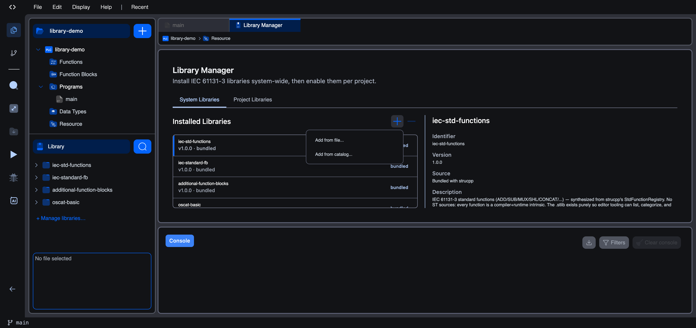
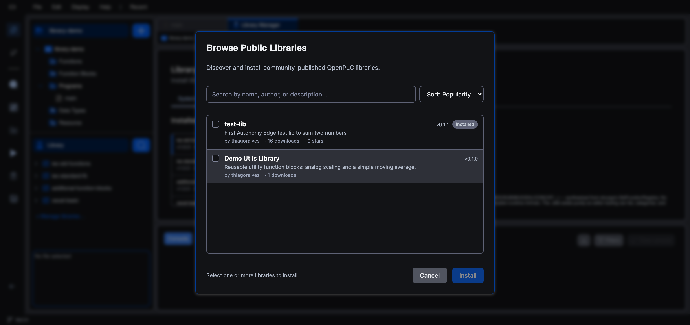
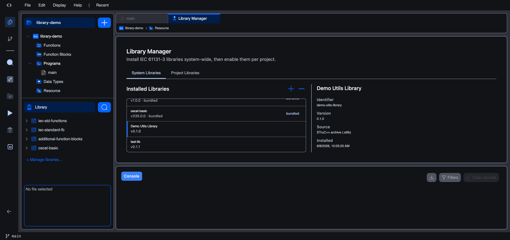
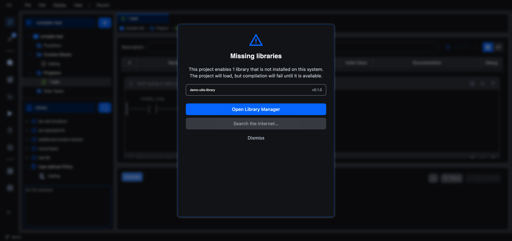

# Installing a Library

Once a library has been [published to the catalogue](publishing-a-library), any project can install it and use its blocks. Installing a library is a **two-step** process that mirrors how the [Library Manager](overview) is organised:

1. **Install it system-wide** so the editor knows about it (the **System Libraries** tab).
2. **Enable it for your project** so its blocks appear in the side panel (the **Project Libraries** tab).

Open the Library Manager from the bottom of the side panel: click **+ Manage libraries…**.

## 1. Install the library system-wide

On the **System Libraries** tab, click the **+** (Add) button above the installed-library list. A small menu offers two sources:

| Source | Use it when |
|--------|-------------|
| **Add from catalog…** | You want a library that has been published to the Autonomy Edge public catalogue. |
| **Add from file…** | You have a `.stlib` archive on disk, for example one you built yourself, or a CoDeSys `.lib` / `.library` to import. |

### Add from catalog

Choosing **Add from catalog…** opens the **Browse Public Libraries** dialog. Search by name, author, or description, sort the results, and tick one or more libraries to install. Libraries already installed are marked with an **Installed** badge:

Tick **Demo Utils Library**, click **Install**, and confirm. When the download finishes, the dialog reports `1 succeeded` and the library appears in the installed list. Selecting it shows its full details (identifier, version, source, and the blocks it contributes):

### Add from file

Choosing **Add from file…** opens a file picker. Select a `.stlib` archive (the native format) or a CoDeSys `.lib` / `.library` package, which the editor converts on import. This is the way to install a library you built yourself but have not published, or one shared with you directly.

## 2. Enable the library for your project

Installing a library system-wide adds it to the editor's pool, but it does **not** automatically switch it on for the project you have open. Switch to the **Project Libraries** tab. Your newly installed library appears under **Available Libraries** on the left. Click its **+** to add it to the project. It moves to **Project Libraries** on the right, and its blocks immediately show up in the **Library** section of the side panel:

With the library enabled, its functions and function blocks are:

- listed in the **Library** section of the side panel,
- available in the variables editor's type picker, and
- drag-and-droppable into Ladder and Function Block Diagram bodies.

## The "Missing libraries" prompt

If you open a project that **enables** a library which is **not installed** on your system, for example a project a colleague shared, the editor warns you up front:

The project still opens, but compilation will fail until the library is available. Click **Open Library Manager** to install it (from the catalogue or a file), or **Dismiss** to deal with it later.

## What's next

- **[Library Manager](overview)**: how system and project libraries fit together.
- **[Creating a Library](creating-a-library)**: author your own library to install elsewhere.
- **[Publishing a Library](publishing-a-library)**: put a library on the public catalogue.
