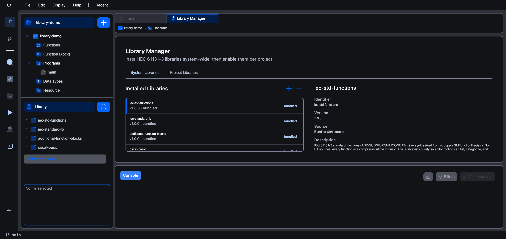
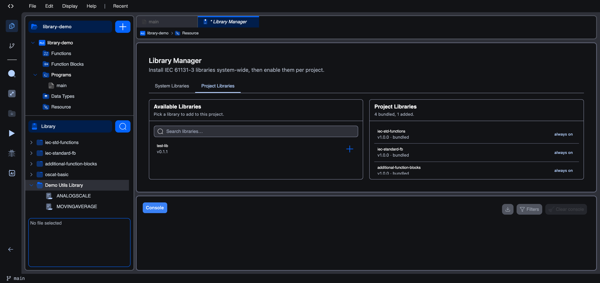

# Library Manager

The **Library Manager** is where you add, remove, and enable libraries, both the ones bundled with the editor and the ones you install from the public catalogue or author yourself.

Open it from the bottom of the side panel: click **+ Manage libraries…** under the **Library** section. It opens as a tab in the central editor area with two sub-tabs: **System Libraries** and **Project Libraries**.

The Library Manager works on two levels, which is why it has two tabs:

- **System Libraries**: the **pool** of libraries installed at the editor level. Every project on this editor can opt into any library in this pool.
- **Project Libraries**: which libraries from that pool are actually **enabled in the project** you have open.

A library has to be in the system pool *and* enabled for the project before its blocks show up in your logic.

## System libraries

The **System Libraries** tab lists the installed pool. Each row shows the library's name, version, origin, and a count of the POUs it contributes; selecting a row shows its full details on the right.

- **Add a library**: click the **+** button and choose a source:
  - **Add from catalog…** installs a library published to the Autonomy Edge public catalogue.
  - **Add from file…** imports a `.stlib` archive (the native format) or a CoDeSys `.lib` / `.library` package, which the editor runs through its importer.

  See [Installing a Library](installing-a-library) for the full walkthrough.
- **Remove a library**: uninstall an entry from the pool. Bundled libraries (with a `bundled` badge) cannot be uninstalled.

The bundled set is always present:

| Library | What it contains |
|---|---|
| `iec-std-functions` | The IEC standard function catalogue (type conversion, arithmetic, time, bit, comparison, string). |
| `iec-standard-fb` | IEC standard function blocks: SR, RS, SEMA, R_TRIG, F_TRIG, CTU/CTD/CTUD (+ type variants), TP, TON, TOF. |
| `additional-function-blocks` | Process-control extras: RTC, INTEGRAL, DERIVATIVE, PID, RAMP, HYSTERESIS. |
| `oscat-basic` | The OSCAT Basic library (see [oscat.de](https://www.oscat.de) for upstream documentation). |

## Project libraries

The **Project Libraries** tab shows what's enabled **in this project specifically**. Bundled libraries are always on (and labelled as such). You add the others to the project from the **Available Libraries** list on the left:

When a library is enabled for the project:

- Its function blocks and functions show up in the **Library** section of the side panel.
- Its types are available in the variables editor's type picker under **Library types**.
- Its blocks become drag-and-droppable into Ladder and Function Block Diagram bodies.

When a library is disabled, none of the above happens: the library stays in the system pool but doesn't affect this project's surface.

## Authoring your own library

Beyond installing external libraries, you can **author your own**. Create a project of type **Library**, populate it with functions, function blocks, and data types, then build it into a `.stlib` archive that anyone can install through this Library Manager, or publish to the public catalogue.

Library projects have no Resource section (no tasks, no instances), and the Build menu offers only **Build Library** and **Clean Build**, never an upload.

See **[Creating a Library](creating-a-library)** for the authoring walkthrough and **[Publishing a Library](publishing-a-library)** to share it.

## What's next

- **[Installing a Library](installing-a-library)**: install and enable a published library.
- **[Creating a Library](creating-a-library)**: author functions and function blocks and compile a `.stlib`.
- **[Publishing a Library](publishing-a-library)**: publish your library to the public catalogue.
