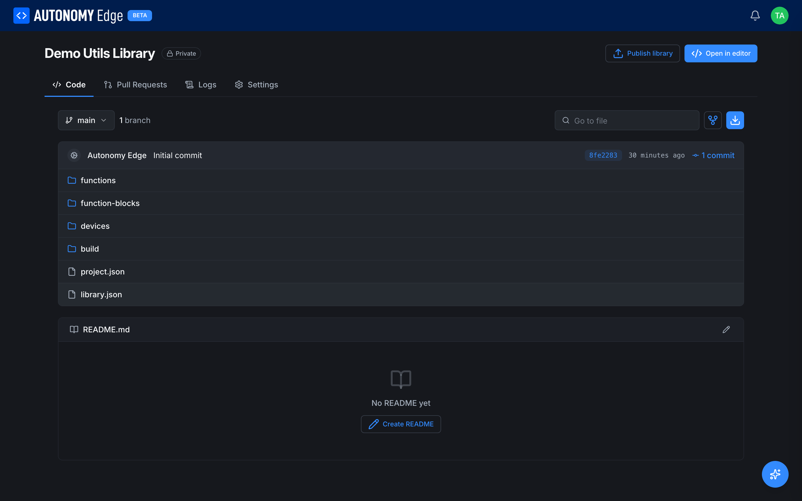
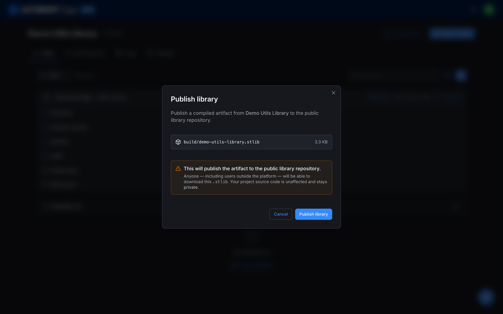
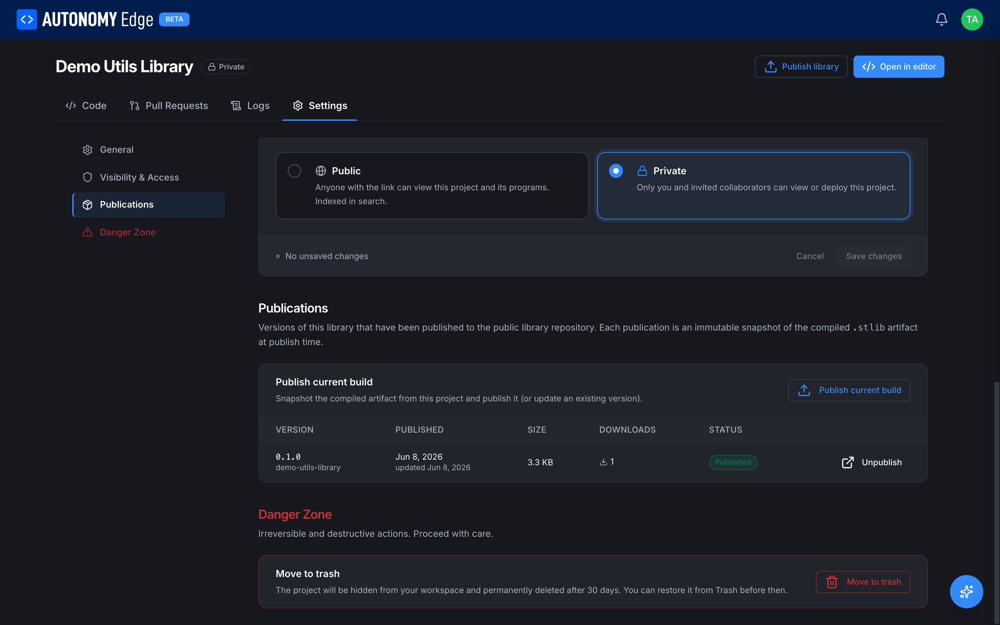

# Publishing a Library

Once you have [created and compiled a library](creating-a-library), you can **publish** it to the Autonomy Edge public library catalogue so other people, and your own other projects, can install it straight from the editor.

Publishing uploads **only the compiled `.stlib` artifact**. Your project's source code is never published and keeps whatever visibility you set on the project. A private library project can publish a public `.stlib` without exposing a single line of its source.

> **Tip:** The publish controls only appear once the library has been built at least once: there has to be a `build/<name>.stlib` artifact to publish. If you don't see them, open the library in the editor and run **Build Library** first (see [Creating a Library](creating-a-library)).

## Two ways to publish

There are two entry points, and they open the same dialog.

### From the project page

Open the library's project page on Autonomy Edge. A **Publish library** button sits in the top-right corner, next to **Open in editor**. The file list shows the compiled archive under `build/`:

Click **Publish library**.

### From the project settings

Alternatively, open the project's **Settings** tab and choose **Publications** in the left menu, then click **Publish current build**. This is the place to manage publications over time (see [Managing publications](#managing-publications) below).

## The publish dialog

Both buttons open the same confirmation dialog. It names the exact artifact that will be published, its size, and a clear warning that the archive becomes publicly downloadable:

Review the artifact and click **Publish library**. The editor confirms with a toast such as `Published demo-utils-library@0.1.0`. The version comes straight from the `version` field in your [manifest](creating-a-library#3-fill-in-the-manifest).

## Versions are immutable snapshots

Each publication is a **frozen snapshot** of the compiled `.stlib` at the moment you published it. You cannot overwrite a published version in place. To ship changes:

1. Edit your functions or function blocks in the editor.
2. Bump the `version` field in `library.json` (for example `0.1.0` → `0.2.0`).
3. **Build Library** again.
4. Publish again.

The new version is added alongside the existing one, so projects pinned to an older version keep working.

## Managing publications

The **Publications** panel under **Settings** lists every version you have published, with its publish date, size, download count, and status. This is also where you publish a fresh build or remove an existing publication:

## Removing a publication

To take a version off the public catalogue, click **Unpublish** on its row. The button turns into a **Cancel / Confirm** prompt in place. Click **Confirm** to remove it. Once unpublished, the version no longer appears in the catalogue and can no longer be installed, though anyone who already installed it keeps their local copy.

Unpublishing affects only the public listing; it does not touch your project, its source, or the compiled artifact in `build/`.

## What's next

- **[Installing a Library](installing-a-library)**: install a published library into another project.
- **[Creating a Library](creating-a-library)**: the authoring and build flow that produces the `.stlib`.
