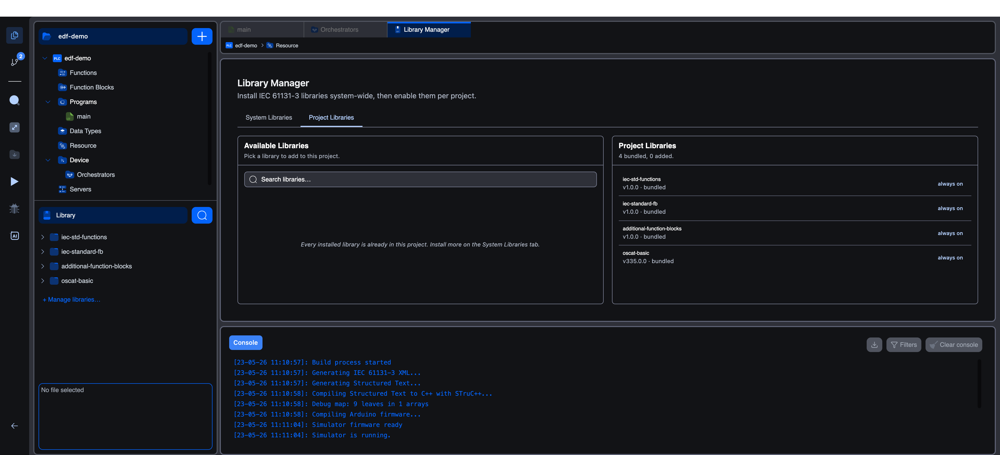

# Library Manager

The **Library Manager** is where you add, remove, and enable libraries for the editor and for your project.

Open it from the bottom of the side panel: click **+ Manage libraries…** under the **Library** section. It opens as a tab in the central editor area with two sub-tabs: **System Libraries** and **Project Libraries**.

## System libraries

The **System Libraries** tab shows the **pool** of libraries installed at the editor level. Every project on this editor can opt into any library in this pool.

- **Add a library**: click the **Add** button and pick a `.stlib`, `.lib`, or `.library` file. The editor recognises:
  - `.stlib`: a STruC++ archive (the native format).
  - `.lib` / `.library`: CoDeSys library packages. The editor runs them through the **codesys importer** to convert them into the internal format.
- **Remove a library**: uninstall an entry from the pool. Bundled libraries (with a `bundled` badge) cannot be uninstalled.

The bundled set is:

| Library | What it contains |
|---|---|
| `iec-std-functions` | The 89-function IEC standard library catalogue (type conversion, arithmetic, time, bit, comparison, string). |
| `iec-standard-fb` | IEC standard function blocks: SR, RS, SEMA, R_TRIG, F_TRIG, CTU/CTD/CTUD (+ type variants), TP, TON, TOF. |
| `additional-function-blocks` | Process-control extras: RTC, INTEGRAL, DERIVATIVE, PID, RAMP, HYSTERESIS. |
| `oscat-basic` | The OSCAT Basic library (see [oscat.de](https://www.oscat.de) for upstream documentation). |

Each library row shows: name, version, author, origin, and a count of POUs it contributes.

## Project libraries

The **Project Libraries** tab shows what's enabled **in this project specifically**. Bundled libraries are always on (and labelled as such). You toggle the others on or off per project.

When a library is enabled for the project:

- Its function blocks and functions show up in the **Library** section of the side panel.
- Its types are available in the variables editor's type picker under **Library types**.
- Its blocks become drag-and-droppable into LD and FBD bodies.

When a library is disabled, none of the above happens, the library stays in the system pool but doesn't affect this project's surface.

## Library projects (advanced)

Beyond enabling external libraries, you can **author your own**. Create a project of type **Library** (the New Project wizard's two-step form), populate it with functions, function blocks, and data types, then build it. The result is a `.stlib` archive that anyone else can import via this Library Manager.

Library projects don't have a Resource section (no tasks, no instances), and the Build Options popover gives you only **Build** and **Clean Build**, no upload.

See **[Library projects](library-projects)** for the authoring walkthrough.

## What's next

- **[iec-std-functions](timer-blocks)**: the standard IEC function catalogue (use the sub-pages for individual block references).
- **[iec-standard-fb](timer-blocks)**: the standard IEC function blocks (timers, counters, edge triggers, bistables).
- **[additional-function-blocks](other-blocks)**: process-control blocks.
