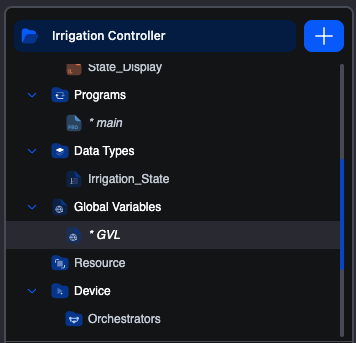

# Global Variable Lists

A **Global Variable List** (GVL) is a named group of global variables that you create as its own element in the project tree. It is the same object CODESYS calls a GVL, and it behaves the same way: the list has a name, it holds a `VAR_GLOBAL … END_VAR` block, and a POU reaches a member by qualifying it with the list name.

```iec
Plant.tank_level := 42;
```

That dotted form is the whole difference in day-to-day use. A [Resource global](global-variables) is a bare name that each POU has to re-declare as `External` before it can touch it. A GVL member needs no declaration anywhere: you write `Plant.tank_level` and the editor arranges the rest at build time.

Both mechanisms work, and a project can use both. Reach for a GVL when you have a set of related globals that deserve a name of their own (`Plant`, `Recipe`, `Alarms`), or when you are moving a project over from CODESYS and want its globals to keep working unchanged.

## Creating a list

1. Click the **`+`** button at the top of the project tree.
2. Choose **Global Variable List**.
3. The **Name** field is pre-filled with `GVL`. Replace it with something meaningful.
4. Click **Create**.


The list opens in its own editor tab straight away, and a **Global Variables** branch appears in the project tree holding it. Every list you create lands in that branch.



The name matters more than a POU name does, because it becomes the prefix on every reference to the list. Short and specific reads best at the call site: `Plant.tank_level` over `PlantWideGlobals.tank_level`.

## The list editor


The header carries the list's **Name** and its **Qualifier**. Below it, the members, in either of two views you switch with the pair of icons at the top right.

### Table view

The default. One member per row, edited cell by cell, exactly like the [per-POU variables editor](variables-editor):

| Column | Notes |
|---|---|
| **#** | Row number. Reorder with the up and down arrows. |
| **Name** | The member's identifier. This is the part after the dot at every call site. |
| **Class** | Always `Global`, and not editable. Everything in a list is a global by definition. |
| **Type** | Any base type, user-defined type, array or structure. |
| **Initial Value** | Optional cold-start value. |
| **Documentation** | Free-text note. |

Use the **`+`** button to add a member and **`−`** to remove the selected one. The first member you add is a `DINT` named `GlobalVar`; each one after that copies the row you have selected, which makes a run of similar members quick to enter.

Removing a member asks for no confirmation, unlike removing a Resource global. There is no cascade to warn you about, because no POU declares the member: it is reached through the list.

### Declaration view

The same members as the IEC text CODESYS shows and the editor stores:

```iec
VAR_GLOBAL
  tank_level : REAL := 0.0;
  pump_running : BOOL;
  recipe_id : DINT := 1;
END_VAR
```

Use it to enter or paste many members at once. Edits are committed when you leave the editor, and **the block has to parse before you can leave it**. If it does not, nothing is committed and a message tells you what is wrong, so a typo halfway down cannot silently discard every declaration below it. Fix the text, and the table becomes available again.

A list whose declaration could not be read when the project was opened starts in this view, showing the text as saved, because that text is what needs fixing.

## Using a member in a POU

Write `<list>.<member>` wherever you would write a variable:

```iec
IF Plant.tank_level > 80.0 THEN
    Plant.pump_running := FALSE;
END_IF;
```

In Ladder and FBD, type the same qualified name into the variable field on a contact, coil or block pin.

**No `VAR_EXTERNAL` is needed.** This is the practical difference from Resource globals, and the reason a CODESYS project keeps compiling after an import. The editor works out which POUs mention which lists and declares the externals for you when it builds.

Because that scan looks for the qualified form, a bare mention of the list name on its own is not a use of it. Only `Plant.` counts, which is also what stops a list called `Plant` from being dragged into a POU that only ever mentions `Plant_Config`.

## Renaming a list

Rename the list from the project tree, not from the editor: the editor shows the name but does not let you edit it.

Renaming rewrites every `<oldname>.<member>` reference throughout the project, in ST and IL bodies and in the variable names on Ladder and FBD elements alike. The POUs it touches are marked unsaved so you can see what moved.

Renaming a **member** is different, and narrower: it changes the declaration only. References to the old member name are not rewritten, so search the project for them if you rename one.

## Two things a list does not do

These both come from how a list is compiled, and both are worth knowing before you rely on them.

**A qualifier is preserved but not applied.** The **Qualifier** field takes the modifier that follows `VAR_GLOBAL` in the declaration (`CONSTANT`, `RETAIN`, `PERSISTENT`, `NON_RETAIN`). It is kept with the list, so it survives a save and a round trip back to CODESYS, and it appears in the declaration view. **It has no effect when you build**: it does not make the list's members constant or retained. If you need a variable to be retained, declare it in a POU or the Resource and set its flag there. See **[Persistent storage](../building-deploying/persistent-storage)**.

**A member address is preserved but not bound.** You can write `AT %QX0.0` on a member in the declaration view and the editor keeps it, again for the round trip. It produces no I/O mapping. To bind a variable to a physical address, use the `Location` column on a Resource global or a POU variable, where the address is honoured. See **[Global variables](global-variables)** and **[the variables editor](variables-editor)**.

## Deleting a list

Delete it from the project tree. You are asked to confirm.

References to the deleted list are not removed from your POUs. They stop resolving, and the build reports them, which is the point at which you will find any you missed.

## An empty list is skipped

A list with no members produces nothing at build time. It is not an error and needs no attention; there is simply nothing to compile. Add a member and it starts being built in.

## GVL or Resource globals?

| | **Global Variable List** | **[Resource globals](global-variables)** |
|---|---|---|
| Where it lives | Its own element, under **Global Variables** | The **Global Variables** table in the **Resource** |
| How a POU reaches it | `List.member`, nothing declared | `VAR_EXTERNAL` in every POU that uses it |
| Grouping | Named groups, as many as you like | One flat table |
| Physical `Location` | Kept, not applied | Applied, and the usual way to expose a variable to Modbus, OPC-UA or S7Comm |
| `RETAIN` / `CONSTANT` | Kept on the list, not applied | Set per variable and applied |
| Coming from CODESYS | Same object, same syntax | Needs rework |

The short version: a GVL is the better home for plain shared state, especially a lot of it, or anything arriving from CODESYS. Resource globals remain the place for a variable that needs an address, a retention flag, or exposure to a communication server.
