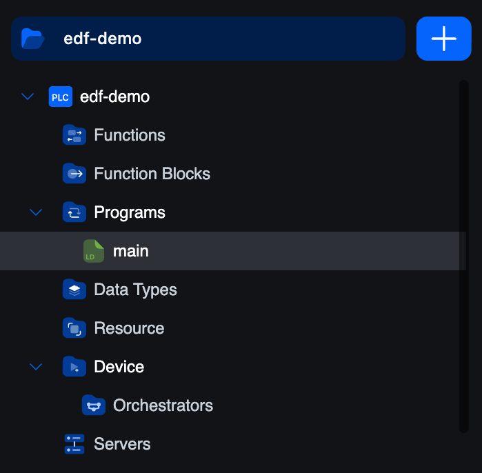
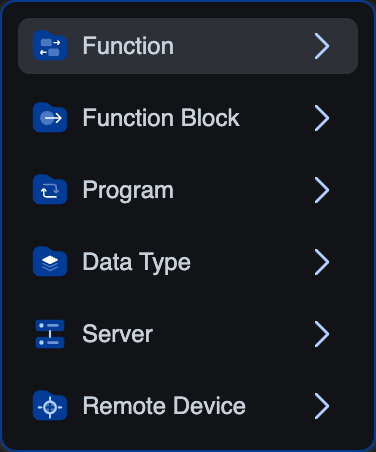

# Project Tree

The project tree is the top half of the editor's side panel. It lists every artefact in your project, grouped by kind.

## Header

The project name sits in a blue bar at the top. To the right, a **`+`** button opens the **Create Element** popover.

From it you can create:

- `function`: a stateless POU that returns a value
- `function-block`: a stateful POU you can instantiate
- `program`: a top-level POU bound to a task
- `data-type`: array, enumeration, or structure
- `server`: Modbus TCP, OPC-UA, or S7Comm
- `remote-device`: Modbus master, EtherCAT, or other supported remote protocols

Names must use **CamelCase**, **PascalCase**, or **snake_case** and be at least three characters long.

## Branches

### Functions
Function-type POUs. A function takes inputs, computes once, returns a value, and keeps no state between calls.

### Function Blocks
Function-block-type POUs. A function block can hold internal state. You declare an *instance* in a variable (or in the Resource editor as a global), and each instance keeps its own state. The language can be ST, LD, FBD, IL, **Python**, or **C/C++**.

### Programs
Program-type POUs. A program is the entry point, it only runs when an **instance** in the Resource editor binds it to a **task**. A project usually has one or a handful of programs.

### Data Types
Your user-defined types. Each one is one of:

- **Array**: fixed-shape collection of a base type.
- **Enumeration**: named symbolic values.
- **Structure**: named fields with their own types.

Click a type to edit its definition. Once defined, types appear in the variable table's type-picker alongside the built-in types.

### Resource
A single editor with three stacked sections:

1. **Global variables**: declared once, visible to every POU.
2. **Tasks**: execution schedules (Cyclic with an interval, or Interrupt with a source). Each carries a priority.
3. **Instances**: bind one **program** to one **task**. Until you have at least one instance, nothing actually runs on the vPLC.

See **[Tasks and Instances](../iec-concepts/tasks-instances)** for the conceptual model.

### Device
Lists the orchestrator and remote-device entries for this project.

- **Orchestrators**: opens the connection screen. From there you pick an orchestrator + a vPLC and log in. See **[Connecting to a vPLC](../connecting-to-runtimes)**.
- Below Orchestrators, any **remote devices** you've added live as siblings of the orchestrator entry. Each one (Modbus master, EtherCAT bus master) opens its own editor.

### Servers
The communication servers running on this vPLC.

- **Modbus TCP** slave: expose memory to SCADA / HMIs.
- **OPC-UA** server: publish a typed address space.
- **S7Comm** server: Siemens-S7-compatible endpoint.

You add servers through the same **`+`** popover at the top of the tree, picking `server` and then the protocol. Each server's editor is one tab in the central area.

## Working with the tree

- **Click** a leaf to open it as a tab.
- **Right-click** a POU for rename, delete, and duplicate actions.
- **Drag** items between branches to reorganise (where the project format allows).
- The active item is highlighted (the dark band you can see around `main` in the screenshot).
- The breadcrumb above the editor area always reflects the active tree path.

## Searching

The activity-bar **Search** opens a project-wide text search across POU names, variable names, comments, and body contents. Results render as a tree mirroring the project structure with the matched ranges highlighted, click a result to jump to it.

## What's next

- **[Console & PLC Logs](console-debugging)**: what's at the bottom of the editor.
- **[Working with Variables](../working-with-variables/variables-editor)**: the table editor above every POU body.
- **[Connecting to a vPLC](../connecting-to-runtimes)**: log in to a runtime and deploy.
