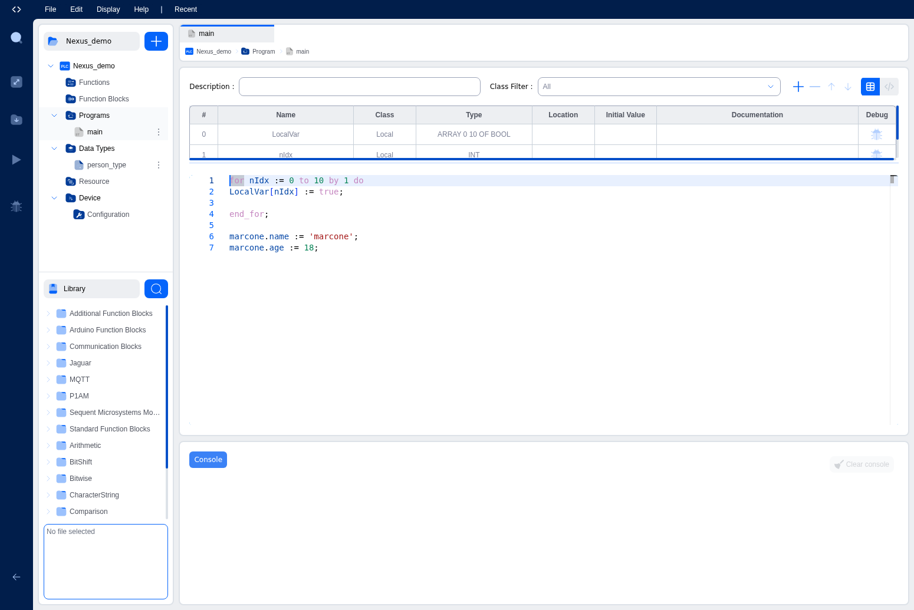

# Workspace Layout

The IDE workspace has four main areas: the **Activity Bar** on the left edge, the **Project Explorer** sidebar, the **Editor Area** in the center, and the **Console Panel** at the bottom. Here's a quick tour of each.

## Activity Bar

The Activity Bar is the narrow vertical strip on the far left. It contains icon buttons for global actions:

- **Search**: Find elements across your project. Results appear in the Console Panel's Search tab.
- **Open/Close Toolbox**: Toggle the Project Explorer sidebar. When a graphical editor (LD or FBD) is active, this also shows or hides the element toolbox.
- **Compile**: Build your project and (if connected to a device) deploy it. Progress appears in the Console Panel.
- **Start / Stop PLC**: Control the PLC program on the connected device. Only active when you're connected.
- **Debugger**: Reserved for future use.

The Activity Bar is always visible, so you always have quick access to compile and run controls.

## Project Explorer

The Project Explorer is the left sidebar, right next to the Activity Bar. It shows your entire project as a collapsible tree:

- **Project name**: Shown at the top. Click to rename.
- **Create element (+)**: Opens a dialog to create new POUs or Data Types.
- **Tree branches**: Your project is organized into:
  - **Functions**: Function-type POUs.
  - **Function Blocks**: Function block-type POUs.
  - **Programs**: Program-type POUs.
  - **Data Types**: User-defined arrays, enumerations, and structures.
  - **Resources**: Global variables, tasks, and instances.
  - **Devices**: Orchestrator connections and remote device configurations.
  - **Servers**: Communication server settings (Modbus, S7Comm, OPC-UA).

Click any item to open it as a tab in the Editor Area. You can resize the sidebar by dragging its right border.

For a detailed walkthrough, see [Project Explorer](project-explorer).

## Editor Area

The Editor Area is the main workspace in the center where you write and edit your PLC logic. It supports multiple open tabs. Click items in the Project Explorer to open them here.

### Editor Types

The editor adapts to what you're working on:

- **Textual editors**: For Structured Text (ST) and Instruction List (IL). Features syntax highlighting, autocomplete, undo/redo, and find/replace.
- **Graphical editors**: For Ladder Diagram (LD) and Function Block Diagram (FBD). A visual canvas where you place and connect elements.
- **Python / C++ editors**: For custom function blocks, with appropriate syntax highlighting.
- **Data Type editor**: A form for defining array dimensions, enumeration values, or structure fields.
- **Resource editor**: Three sections: Global Variables, Tasks, and Instances.
- **Device and Server editors**: Configuration panels for connections and communication protocols.

### Variables Table

When editing a POU, a **Variables Table** appears at the top of the editor. It shows all variables declared for that POU and lets you add, remove, or modify them. You can collapse it or drag the divider to resize.

## Console Panel

The Console Panel sits at the bottom. It has multiple tabs:

- **Console**: Build progress messages, compilation output, upload status, and errors. Every compilation step is logged here.
- **Search**: Appears when you perform a search. Shows results with links to matching elements.
- **PLC Logs**: Appears when connected to a device. Shows live logs from the running PLC program.

The Console includes filtering controls (by log level, search term, and timestamp format) and lets you export logs as TXT, CSV, or JSON. Use the Clear button to reset the output before a new build.

For a detailed guide, see [Console & Debugging](console-debugging).

## Resizing the Layout

All major panels are resizable:

- Drag the border between the **Project Explorer** and **Editor Area** to adjust sidebar width.
- Drag the border between the **Editor Area** and **Console Panel** to adjust the vertical split.
- Drag the border between the **Variables Table** and the code editor within a POU.

Both the Project Explorer and Console Panel can be collapsed entirely to maximize your editing space.

---

## What's Next?

Learn how to navigate your project structure in the [Project Explorer](project-explorer).
