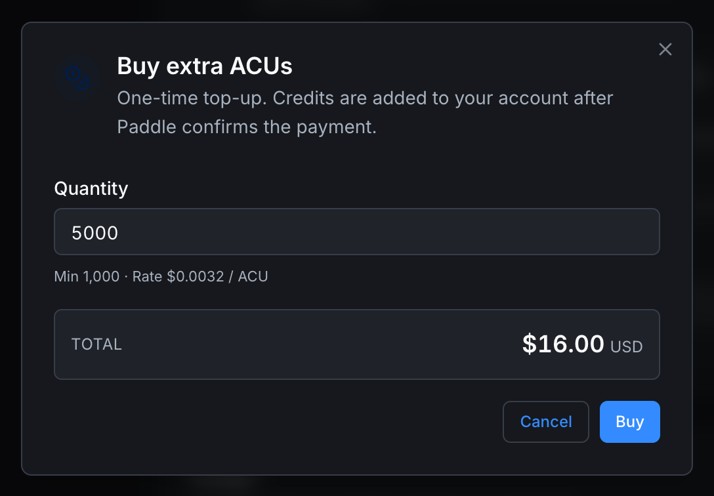

# AI Credit Units

**AI Credit Units (ACUs)** are the credits that power the **AI Engineer** features: multi-step automation jobs, deeper code generation, longer context windows. They are *not* required for the free **AI Chat** assistant in the Sparkle panel.

## The two pools (personal)

There are two separate ACU balances on your personal account:

### Monthly allowance

Refills with your billing cycle. Each plan includes a different amount:

| Plan | ACUs/month |
|---|---|
| Community | 0 |
| Education | 1,125 |
| Pro | 6,125 |
| Teams | 12,375 / seat |
| Enterprise | Custom (e.g. 123,113) |

The monthly pool **does not roll over.** Unused ACUs at the end of the cycle are lost.

### Extra credits

Top-ups you've bought. These **never expire**.

Use them when:

- You're approaching the end of the cycle and don't want to risk running out.
- You have a heavy month and need a one-time bump.
- You want to spread the cost of AI Engineer work across multiple cycles instead of upgrading a plan permanently.

## Consumption order

When an AI Engineer job runs:

1. **Personal monthly allowance is drained first.**
2. **Personal extra credits kick in only when the monthly pool is empty.**
3. **If you belong to an org and your admin granted you access to the org pool, that pool covers the rest.** See **[Org usage](../platform/organizations/usage)**.

This means casual usage never touches your extras or the org pool. You can stockpile them safely.

If all available pools combined still can't cover the job's estimate, the job is blocked and you'll see a "Plan limit reached" message.

## Buying more ACUs

From **[Settings → Usage](../account/settings/usage)** click **+ Buy more ACUs**. The Buy Extra ACUs dialog opens.

| Field | Notes |
|---|---|
| **Quantity** | How many ACUs to purchase. **Minimum 1,000.** Default is 5,000. |
| **Rate** | The per-ACU price. $0.0032 / ACU at the time of writing. |
| **Total** | Quantity × rate. Updates as you change quantity. |

Click **Buy** to start the checkout flow (handled by Paddle, the platform's payment processor). After confirmation, the credits land in your **Extra Credits** pool immediately. Click **Cancel** to dismiss.

## What ACUs are spent on

Concrete examples:

- **A short code generation request** in AI Engineer (e.g. "write a TON timer with a 2-second blink"): single-digit ACUs.
- **A guided refactor** of a function block: tens of ACUs.
- **A multi-step debug session** with long context: hundreds of ACUs.
- **A full project scaffold**: possibly thousands of ACUs.

Each job shows an estimate before it runs so you can decide whether to proceed.

## Checking your balance

**[Settings → Usage](../account/settings/usage)** is the canonical view. It shows:

- **This month**: used vs allowance, reset date.
- **Extra credits**: total available.
- Plan quotas (orchestrators, devices, private projects).

For organizations: the **[Org Usage tab](../platform/organizations/usage)** shows the shared **Organization ACU pool** and which members have access to it.

## ACUs and organizations

Organizations on Teams or Enterprise plans have their **own** ACU pool that members can be granted access to. Your personal ACUs are separate from any org's.

When you trigger an AI Engineer job:

- Personal ACUs are spent first (monthly, then extras).
- If you have a grant on the org pool, it covers the rest.
- Admins can cap how much each member can draw from the org pool.

You can see org-level ACU consumption on the org's Usage tab.

## What ACUs do **not** affect

- The **AI Chat** assistant (the sparkle panel). It's free on every plan, doesn't consume ACUs.
- Editor autocomplete, syntax checking, type checking. These are free and unmetered.
- Forum mentions of `@autonomy-ai` or any future bot interactions in the forum (governed separately).

## Where to next

- **See your current balance** → **[Settings → Usage](../account/settings/usage)**.
- **Org-shared ACUs** → **[Org Usage](../platform/organizations/usage)**.
- **Upgrade your plan for a bigger monthly allowance** → **[Pricing](pricing)**.
- **Free assistant** → **[Autonomy AI assistant](../platform/autonomy-ai-assistant)**.
